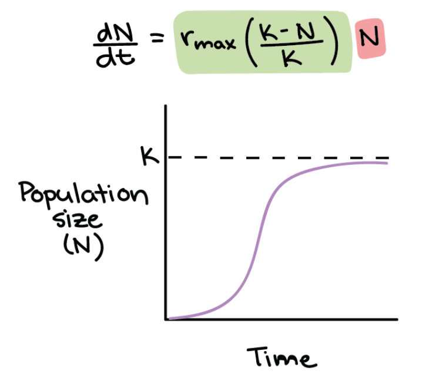

```{r setup, include=FALSE}
options(htmltools.dir.version = FALSE)
options(servr.daemon = TRUE)#para que no bloquee la sesión
```

```{r xaringan-themer, include=FALSE, warning=FALSE}
library(xaringanthemer)
library(ggplot2)
library(ggthemes)

xaringanExtra::use_share_again()
xaringanExtra::use_fit_screen()
xaringanExtra::use_tachyons()

style_solarized_light(
  title_slide_background_color = "#586e75",# base 3
  header_color = "#586e75",
  text_bold_color = "#cb4b16",
  background_color = "#fdf6e3", # base 3
  header_font_google = google_font("DM Sans"),
  text_font_google = google_font("Roboto Condensed", "300", "300i"),
  code_font_google = google_font("Fira Mono"), text_font_size = "28px"
)
# clipboard
htmltools::tagList(
  xaringanExtra::use_clipboard(
    button_text = "Copy code <i class=\"fa fa-clipboard\"></i>",
    success_text = "Copied! <i class=\"fa fa-check\" style=\"color: #90BE6D\"></i>",
    error_text = "Not copied 😕 <i class=\"fa fa-times-circle\" style=\"color: #F94144\"></i>"
  ),
  rmarkdown::html_dependency_font_awesome()
  )
## ggplot theme
theme_Publication <- function(base_size = 14, base_family = "helvetica") {
    (theme_foundation(base_size = base_size, base_family = base_family)
        + theme(plot.title = element_text(face = "bold",
                                          size = rel(1.2), hjust = 0.5),
                text = element_text(),
                panel.background = element_rect(colour = NA),
                plot.background = element_rect(colour = NA),
                panel.border = element_rect(colour = NA),
                axis.title = element_text(face = "bold",size = rel(1)),
                axis.title.y = element_text(angle=90,vjust =2),
                axis.title.x = element_text(vjust = -0.2),
                axis.text = element_text(), 
                axis.line = element_line(colour="black"),
                axis.ticks = element_line(),
                panel.grid.major = element_line(colour="#f0f0f0"),
                panel.grid.minor = element_blank(),
                legend.key = element_rect(colour = NA),
                legend.position = "bottom",
                legend.direction = "horizontal",
                legend.key.size= unit(0.2, "cm"),
                ##legend.margin = unit(0, "cm"),
                legend.spacing = unit(0.2, "cm"),
                legend.title = element_text(face="italic"),
                plot.margin = unit(c(10,5,5,5),"mm"),
                strip.background = element_rect(colour = "#f0f0f0",fill = "#f0f0f0"),
                strip.text = element_text(face="bold")
                ))
    
}

```

## Who we are (in order of appearance)
### A bunch of biologists ...

.pull-left[
```{r, out.width= "50%", echo=FALSE}
knitr::include_graphics("figs/sara.jpg")
```

**Sara**, Sara Mortara (she/her)
]


.pull-left[
```{r, out.width= "40%", echo=FALSE}
knitr::include_graphics("figs/PI.jpg")
```

**PI**, Paulo Inácio Prado (he/him)
]


</center>


---
## Who we are (in order of appearance)

<center>

.pull-left[

```{r, out.width= "50%", echo=FALSE}
knitr::include_graphics("figs/diogo.jpg")
```

**Diogro**, Diogo Melo (he/him)
]

.pull-right[

### ... trying to help you to learn statistical modelling faster and easier than we did 

]

</center>

---
## Who we are
### Professors who also have contributed to this course

<center>


.pull-left[
```{r,  out.width= "50%", echo=FALSE}
knitr::include_graphics("figs/paulinha.jpg")
```

**Paulinha**, Paula Lemos da Costa (she/her)
]


.pull-right[
```{r, out.width= "50%", echo=FALSE}
knitr::include_graphics("figs/andrea.jpg")
```

**Andrea**, Andrea Sánchez-Tapia (she/her)
]


---
## What we want

 - To help you to be good users of statistical models in ecological research;
 
 - To make you learn this faster and easier than we did;
 
 - In doing that, to improve our own knowledge on statistical models.


<center>
.left-column[
```{r, out.width= "100%", echo=FALSE}
knitr::include_graphics("figs/Painel.Paulo.Freire_cropped.JPG")
```
]
</center>

.right-column[
> "Ninguém educa ninguém, ninguém educa a si mesmo, os homens se educam entre si, mediatizados pelo mundo"
>
> Paulo Freire
]


---

## Overview of the course

<center>


```{r, echo=FALSE}

DiagrammeR::grViz("
digraph nicegraph {

  bgcolor = '#fdf6e3'

  # graph, node, and edge definitions
  graph [compound = true, nodesep = .5, ranksep = .25,
         color = '#dc322f']

  node [fontname = Helvetica, fontcolor = darkslategray,
        shape = rectangle, fixedsize = false, 
        color = '#586e75', fontsize = 30]

  edge [color = grey, arrowhead = none, arrowtail = none]

  # subgraph for fondation
  subgraph cluster0 {
    node [fixedsize = true, width = 4.3, fontsize = 22]
    '@@1-1' -> '@@1-2' -> '@@1-3' 
  }

  # subgraph for tools
  subgraph cluster1 {
    node [fixedsize = true, width = 4.3, fontsize = 22]
    '@@2-1' -> '@@2-2' -> '@@2-3' -> '@@2-4' 
  }
  
    # subgraph inference
  subgraph cluster2 {
    node [fixedsize = true, width = 4.3, fontsize = 22]
    '@@3-1' -> '@@3-2'
  }


  'Statistical modeling'             [width = 5, fontsize = 30, height = 0.75, style = filled, fillcolor = '#cb4b16', fontcolor = '#fdf6e3']
  'Foundation' [fontsize = 24, style = filled, fillcolor = dimgray, fontcolor = '#fdf6e3', width = 4.4, height = 0.6]
  'Toolkit' [fontsize = 24, style = filled, fillcolor = dimgray, fontcolor = '#fdf6e3', width = 4.4, height = 0.6]
  'Inference' [fontsize = 24, style = filled, fillcolor = dimgray, fontcolor = '#fdf6e3', width = 4.5, height = 0.6]

  'Statistical modeling' -> 'Foundation' 
  'Statistical modeling' -> 'Toolkit'
  'Statistical modeling' ->   'Inference' 
  'Foundation' -> '@@1-1'            [lhead = cluster0]
  'Toolkit' -> '@@2-1'        [lhead = cluster1]
  'Inference' -> '@@3-1'        [lhead = cluster2]

}

[1]: c('Presentation', 'Probability distributions', 'Bayesian statistics I')
[2]: c('Linear models', 'Multiple regression', 'Generalized linear models', 'Mixed and hierarchical models')
[3]: c('Bayesian statistics II', 'Causal thinking')


", width = 1280*0.8)
```

</center>


---

## Teaching strategies

 - Lectures and computer labs on each topic;
 
 - Labs: tutorials in R language;
 
 - Q&A (in your preferred language);
 
 - At least two instructors present in all lectures and labs;
 
 - Office hours if possible (and if interest you);
 
 - All resources at https://statistical-modeling.github.io/2024;
 
 - Learning resources will be available as we progress.


---

## What is a statistical model?
.bg-white.b--brblack.ba.bw2.br3.shadow-5.ph4.mt1[
A description of how **your data** should behave according to some theory. 

Thus, statistical models are hypotheses about how a given **data set** was generated.
]

--

## Why is this different from a mathematical model?
.bg-white.b--brblack.ba.bw2.br3.shadow-5.ph4.mt1[Mathematical
models describe the behavior of **theoretical quantities**.

Statistical models describe the behavior of **measurements** used to express 
theoretical quantities.]

---
class:middle

## Between theoretical quantities and the data lies the observer


.pull-left[

* $N(t)$ is theoretical: population size at any time $t$
* Examples of data used to express $N(t)$:
  * Number of earthworms counted in samples of soil taken weekly
  * Grass coverage measured yearly in permanent plots
]

.pull-right[
```{r, out.width= "75%", echo=FALSE}

```
]

---


## Where are we and what's ahead

 1. Overview (this lecture)
 2. Probability distributions
 3. Linear regression
 4. Multiple regression and model comparison
 4. Maximum likelihood fitting
 5. Bayesian statistics - I
 5. Bayesian statistics - II
 6. Causal thinking and model building
 7. Generalized linear models
 8. Mixed-effects and hierarchical linear models
 

 
 
---

## Further reading

* **Quantitative Reasoning in Ecology**: Chapter 1 in Schneider,
    D. 2009. Quantitative Ecology: Measurement, Models, and
    Scaling. New York, Academic Press, 2nd Ed.
    
    
* **Alternative views of scientific method and of modelling**:
    Chapter 2 in Hilborn, R & Mangel, M. 1997. The Ecological
    Detective - Confronting Models with Data. Princeton, Princeton
    University Press. 
