```{r setup, include=FALSE}
options(htmltools.dir.version = FALSE)
options(servr.daemon = TRUE)#para que no bloquee la sesión

area <- c(321000, 290000, 144000, 70000, 48000, 25000, 4500, 8870, 18000, 4600)
species <- c(540, 420, 368, 220, 337, 232, 111, 143, 137, 108)
island <- c("New \nGuinea", "Borneo", "Phillipines", "Celebes", 
            "Java", "Ceylon", "Palawan", "Flores", "Timor", "Sumba")


df <- data.frame(area = area, 
                 species = species, 
                 island = island)


```

```{r xaringan-themer, include=FALSE, warning=FALSE}
library(xaringanthemer)
library(ggplot2)
library(ggthemes)
library(knitr)
library(kableExtra)
library(dplyr)
library(tidyr)

xaringanExtra::use_share_again()
xaringanExtra::use_fit_screen()
xaringanExtra::use_tachyons()

style_solarized_light(
  title_slide_background_color = "#586e75",# base 3
  header_color = "#586e75",
  text_bold_color = "#cb4b16",
  background_color = "#fdf6e3", # base 3
  header_font_google = google_font("DM Sans"),
  text_font_google = google_font("Roboto Condensed", "300", "300i"),
  code_font_google = google_font("Fira Mono"), text_font_size = "28px"
)
# clipboard
htmltools::tagList(
  xaringanExtra::use_clipboard(
    button_text = "Copy code <i class=\"fa fa-clipboard\"></i>",
    success_text = "Copied! <i class=\"fa fa-check\" style=\"color: #90BE6D\"></i>",
    error_text = "Not copied 😕 <i class=\"fa fa-times-circle\" style=\"color: #F94144\"></i>"
  ),
  rmarkdown::html_dependency_font_awesome()
  )
## ggplot theme
theme_Publication <- function(base_size = 14, base_family = "helvetica") {
    (theme_foundation(base_size = base_size, base_family = base_family)
        + theme(plot.title = element_text(face = "bold",
                                          size = rel(1.2), hjust = 0.5),
                text = element_text(),
                panel.border = element_rect(colour = NA),
                panel.background = element_rect(fill = 'transparent'),
                plot.background = element_rect(fill = 'transparent', color = NA),
                axis.title = element_text(face = "bold",size = rel(1)),
                axis.title.y = element_text(angle=90,vjust =2),
                axis.title.x = element_text(vjust = -0.2),
                axis.text = element_text(), 
                axis.line = element_line(colour="black"),
                axis.ticks = element_line(),
                panel.grid.major = element_line(colour=NA),
                panel.grid.minor = element_blank(),
                legend.key = element_rect(colour = NA),
                legend.position = "bottom",
                legend.direction = "horizontal",
                legend.key.size= unit(0.2, "cm"),
                ##legend.margin = unit(0, "cm"),
                legend.spacing = unit(0.2, "cm"),
                legend.title = element_text(face="italic"),
                plot.margin = unit(c(10,5,5,5),"mm"),
                strip.background = element_rect(colour = NA,fill = "transparent"),
                strip.text = element_text(face="bold")
                ))
    
}

```

## Who we are (in order of appearance)
### A bunch of biologists ...

<center>

.pull-left[
```{r sara, out.width= "50%", echo=FALSE}

```

**Sara**, Sara Mortara (she/her)
]


.pull-left[
```{r pi, out.width= "40%", echo=FALSE}

```

**PI**, Paulo Inácio Prado (he/him)
]


---
## Who we are (in order of appearance)

<center>

.pull-left[

```{r ogro, out.width= "50%", echo=FALSE}

```

**Diogro**, Diogo Melo (he/him)
]

.pull-right[

### ... trying to help you to learn statistical modelling faster and easier than we did 

]


---
## Who we are
### Professors who also have contributed to this course

<center>


.pull-left[
```{r paulinha,  out.width= "50%", echo=FALSE}

```

**Paulinha**, Paula Lemos da Costa (she/her)
]


.pull-right[
```{r andre, out.width= "50%", echo=FALSE}

```

**Andrea**, Andrea Sánchez-Tapia (she/her)
]


---
## What we want

 - To help you to be good users of statistical models in ecological research
 
 - To make you learn this faster and easier than we did
 
 - In doing that, to improve our own knowledge on statistical models


<center>
.left-column[
```{r mural, out.width= "100%", echo=FALSE}
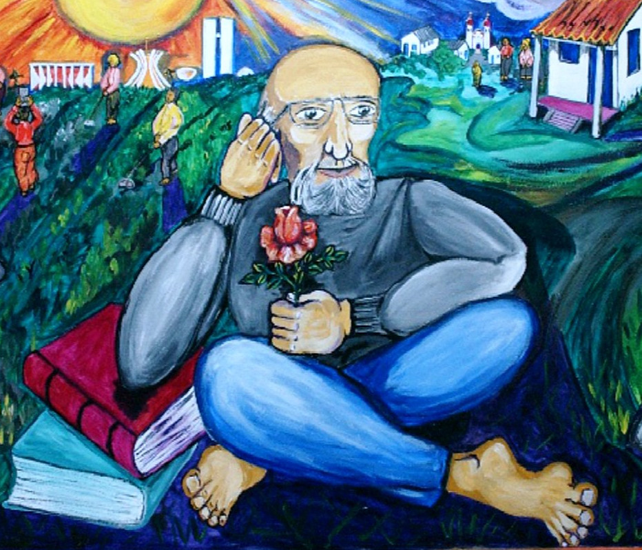
```
]
</center>

.right-column[
> "Ninguém educa ninguém, ninguém educa a si mesmo, os homens se educam entre si, mediatizados pelo mundo"
>
> Paulo Freire
]


---

## Course overview

<center>


```{r diagrama, echo=FALSE}

DiagrammeR::grViz("
digraph nicegraph {

  bgcolor = '#fdf6e3'

  # graph, node, and edge definitions
  graph [compound = true, nodesep = .5, ranksep = .25,
         color = '#dc322f']

  node [fontname = Helvetica, fontcolor = darkslategray,
        shape = rectangle, fixedsize = false, 
        color = '#586e75', fontsize = 30]

  edge [color = grey, arrowhead = none, arrowtail = none]

  # subgraph for fondation
  subgraph cluster0 {
    node [fixedsize = true, width = 4.3, fontsize = 22]
    '@@1-1' -> '@@1-2' -> '@@1-3' 
  }

  # subgraph for tools
  subgraph cluster1 {
    node [fixedsize = true, width = 4.3, fontsize = 22]
    '@@2-1' -> '@@2-2' -> '@@2-3' -> '@@2-4' 
  }
  
    # subgraph inference
  subgraph cluster2 {
    node [fixedsize = true, width = 4.3, fontsize = 22]
    '@@3-1' -> '@@3-2'
  }


  'Statistical modeling'             [width = 5, fontsize = 30, height = 0.75, style = filled, fillcolor = '#cb4b16', fontcolor = '#fdf6e3']
  'Foundation' [fontsize = 24, style = filled, fillcolor = dimgray, fontcolor = '#fdf6e3', width = 4.4, height = 0.6]
  'Fitting' [fontsize = 24, style = filled, fillcolor = dimgray, fontcolor = '#fdf6e3', width = 4.4, height = 0.6]
  'Inference' [fontsize = 24, style = filled, fillcolor = dimgray, fontcolor = '#fdf6e3', width = 4.5, height = 0.6]

  'Statistical modeling' -> 'Foundation' 
  'Statistical modeling' -> 'Fitting'
  'Statistical modeling' ->   'Inference' 
  'Foundation' -> '@@1-1'            [lhead = cluster0]
  'Fitting' -> '@@2-1'        [lhead = cluster1]
  'Inference' -> '@@3-1'        [lhead = cluster2]

}

[1]: c('Presentation', 'Probability distributions', 'Bayesian statistics I')
[2]: c('Linear models', 'Multiple regression', 'Generalized linear models', 'Mixed and hierarchical models')
[3]: c('Bayesian statistics II', 'Causal thinking')


", width = 1280*0.8)
```

</center>


---

## Teaching strategies

.pull-left[


- Lectures and computer labs
 
- Labs: tutorials in R language
 
- Q&A (in your preferred language)

- Office hours if possible (and if interest you)
 
- All resources at https://statistical-modeling.github.io/2024
 
- Learning resources will be available as we progress

]
 
 .pull-right[

```{r autonomia, echo=FALSE, out.width=896, fig.align='center'}

```
 
]
 

---
## Course schedule

```{r shedule, echo=FALSE}
schedule <- read.delim("../schedule.txt") %>% 
  filter(Week %in% 1:2) %>% 
  select(-N, -Instructor, -Date) %>% 
  mutate(Time = rep(c("09:00-10:30", "11:00-12:30"), 10), 
         Day = rep(rep(c("Monday", "Tuesday", "Wednesday", "Thursday", "Friday"), each = 2), 2))
schedule[1, 2] <- "Course presentation"
dt <- pivot_wider(schedule, names_from = Day, values_from = Theme)

dt %>%
  kbl() %>%
  kable_styling()
```


---
## Course roadmap

```{r roadmap, echo=FALSE, fig.align='center', out.width='80%'}
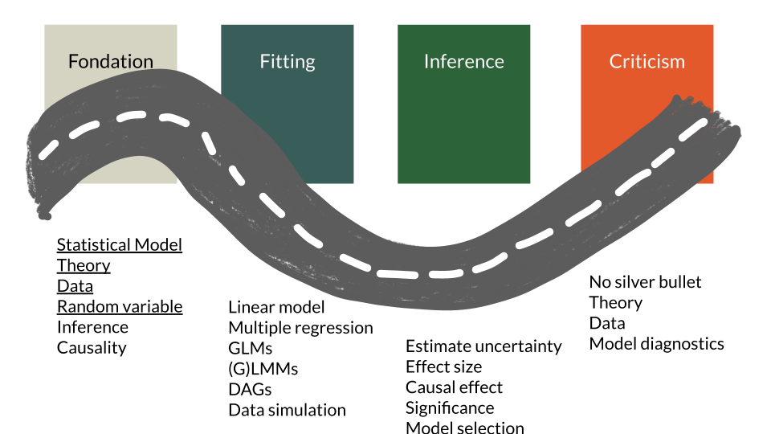
```


---
## Linking data and theory

.pull-left[
```{r iba, echo=FALSE, out.width=896, fig.align='center'}
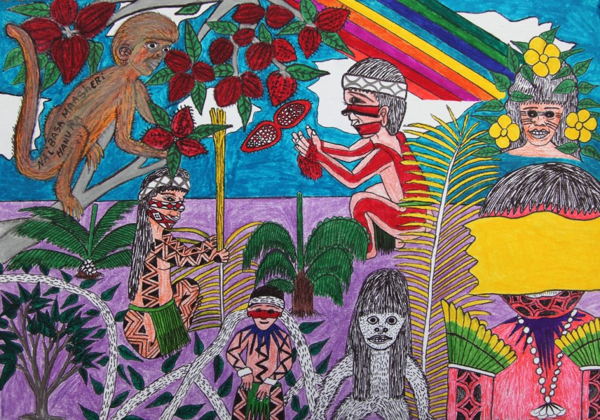
```

Ibã Huni Kuin, Nai Basa Masheri, 2014
]

.pull-right[

How do we address ecological problems characterized by complexity and uncertainty?

+ Use a **model** to simplify

+ **Theories**: summarize the understanding of how

+ **Hypotheses**: proposed explanations of how

+ **Data**: measurable variables carrying uncertainty

+ **Statistical models** confront theories with data

]


---
## Use a model to simplify


.pull-left[

### Darwin's theory of coral atolls

```{r atoll, echo=FALSE}
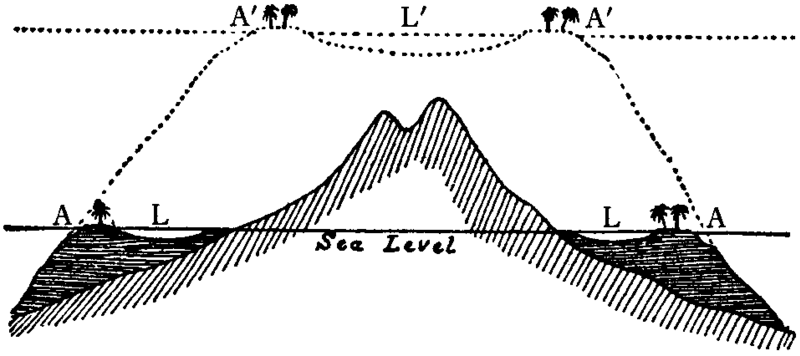
```

]

.pull-right[
```{r atoll2, echo=FALSE, out.width="95%"}
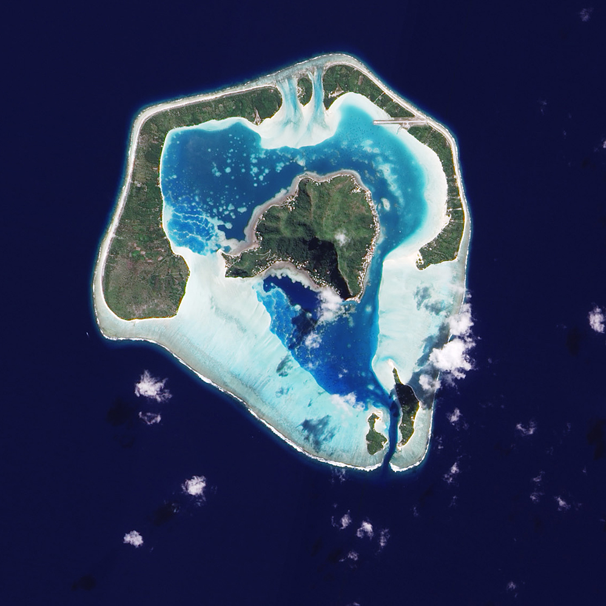
```

]


---
## Modeling goals in Ecology

```{r tredennick, echo=FALSE, out.width=768, fig.align='center'}
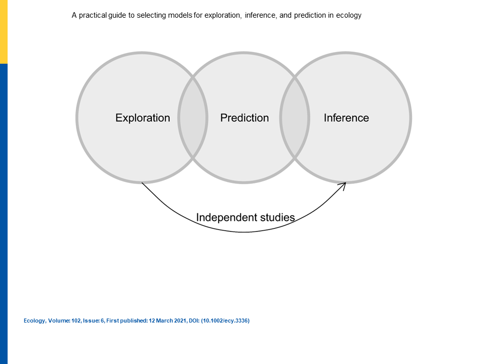
```


---
## What is the relation of species number to area?


```{r archipel, echo=FALSE, out.width="50%", fig.align='center'}
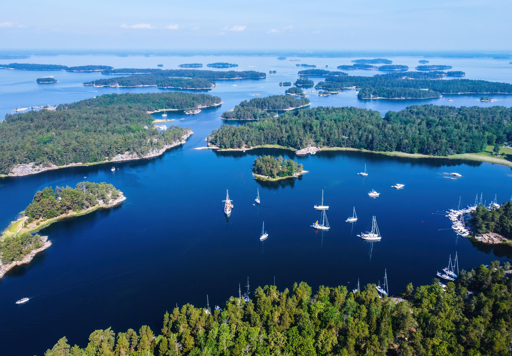
```

> Both for the plant-geographer and the ecologist it is of great importance to know if an area or a district is rich or poor from the point of view of vegetation

O. Arrhenius 1921. **Species and area**


---
## What is the relation of species number to area?

```{r schneider, echo=FALSE, out.width="65%", fig.align='center'}
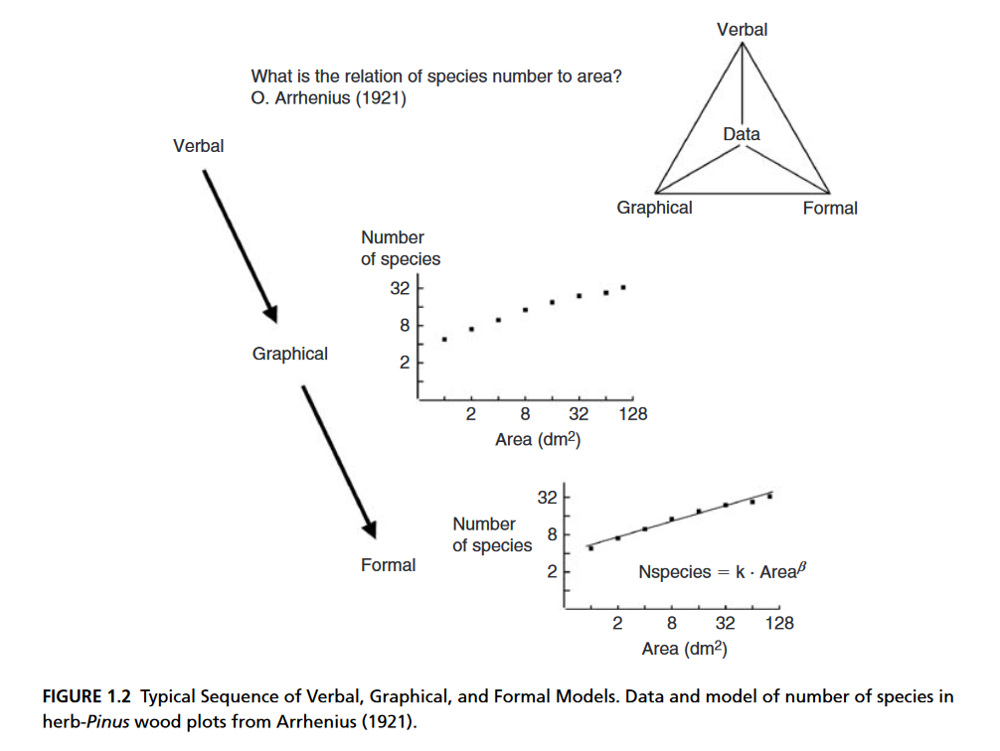
```

---

## What is a statistical model?
.bg-white.b--brblack.ba.bw2.br3.shadow-5.ph4.mt1[
A description of how **your data** should behave according to some theory

Thus, statistical models are hypotheses about how a given **data set** was generated
]

--

## Why is this different from a mathematical model?
.bg-white.b--brblack.ba.bw2.br3.shadow-5.ph4.mt1[Mathematical
models describe the behavior of **theoretical quantities**

Statistical models describe the behavior of **measurements** used to express 
theoretical quantities]


---
## What we expect from theory?

.pull-left[
### MacArthur & Wilson 
- Large areas support larger population sizes of all resident species than do small islands

- Probability of stochastic extinction is reduced on large islands

- Island area > Number of individuals > Species number
]

.pull.right[

```{r theory, echo = FALSE, out.width = '50%', fig.align='center'}
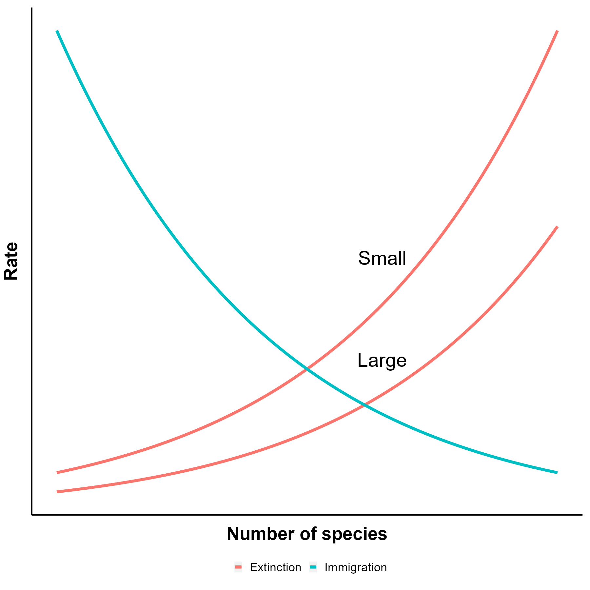
```


]


---
## What we expect from theory?


.pull-left[
### Birds of the East Indies

Preston 1961

```{r bird, echo = FALSE, warning=FALSE, out.width='60%'}

```


]

.pull-right[

```{r expect, echo = FALSE, warning=FALSE, message=FALSE, out.width='90%'}

```

]

---
## What the data shows


.pull-left[
```{r databird, echo = FALSE, warning=FALSE, message=FALSE, fig.align='center', out.width='90%'}
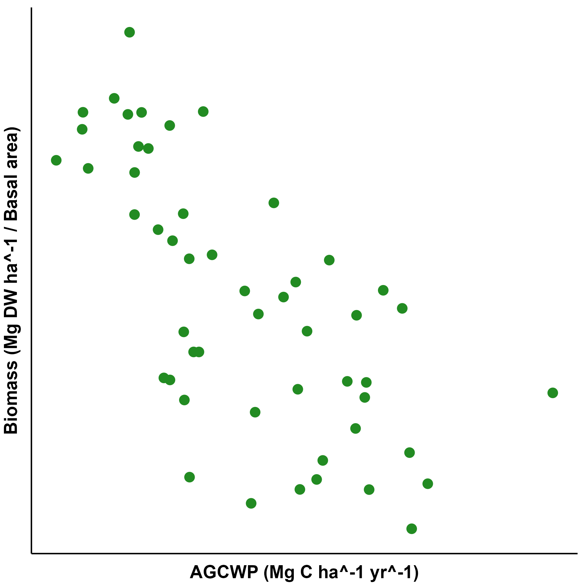
```

]

.pull-right[
```{r databird2, echo = FALSE, warning=FALSE, message=FALSE, fig.align='center', out.width='90%'}
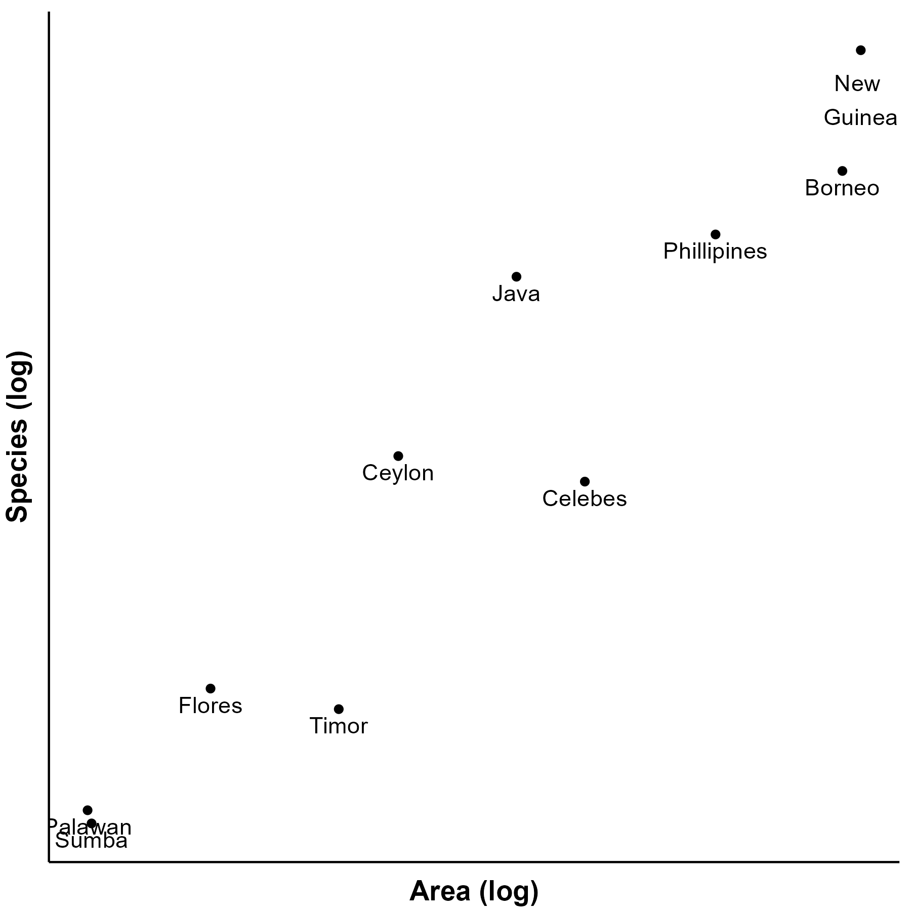
```

]

---
class: middle

### Empirical data, a.k.a. random variables

.bg-white.b--brblack.ba.bw2.br3.shadow-5.ph4.mt1[

* We can never control all sources of variation that affect our measurements or counts

* Thus, any measurement or count done in a scientific research has some degree of **uncertaintity**

* In other words, any quantitative data of scientific interest is a **random variable** 

]


---
### From the mathematical to the statistical model

.pull-left[

- We can not assure the exact value of a random variable but we can
   think on how likely would be each possible value

- A simple hypothesis: large departures from the theoretical
   expectation are less likely than small ones
   
- In this approach data is partitioned into **expected values** and 
  **unexplained variation** (a.k.a. *"residual"*, *"error"* or *"noise"*)

- $Data = mean(Y) + Residual$

]

.pull-right[
```{r expectvar, echo = FALSE, warning=FALSE, message=FALSE, fig.align='center'}
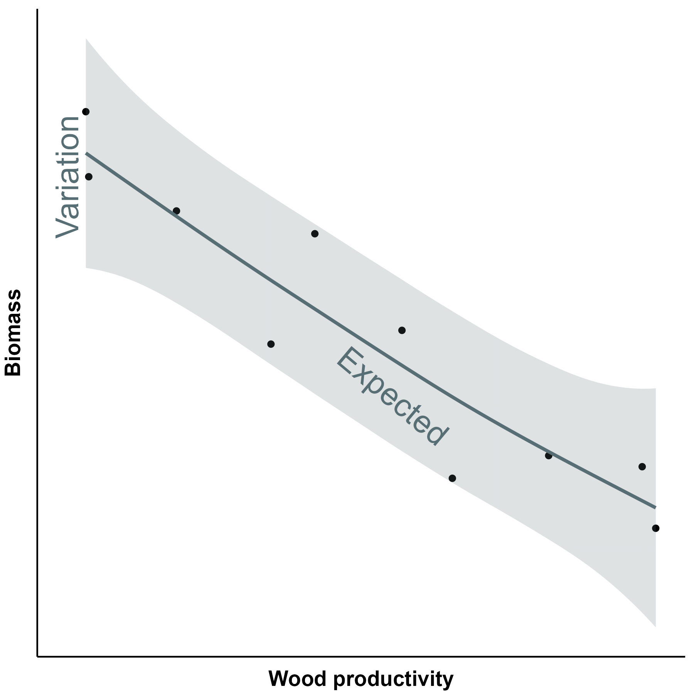

```


]

---
## The normal or Gaussian probability distibution

.pull-left[
* Ascribes a probability to each value a measurement can assume

* It is a model for the sum of many sources of variation

* Small deviations from the expected value are more likely than large deviations

* The probabilities of the deviations are symmetrical around the expected value
]


.pull-right[
.center[
```{r dnorm, echo=FALSE, out.width='90%'}
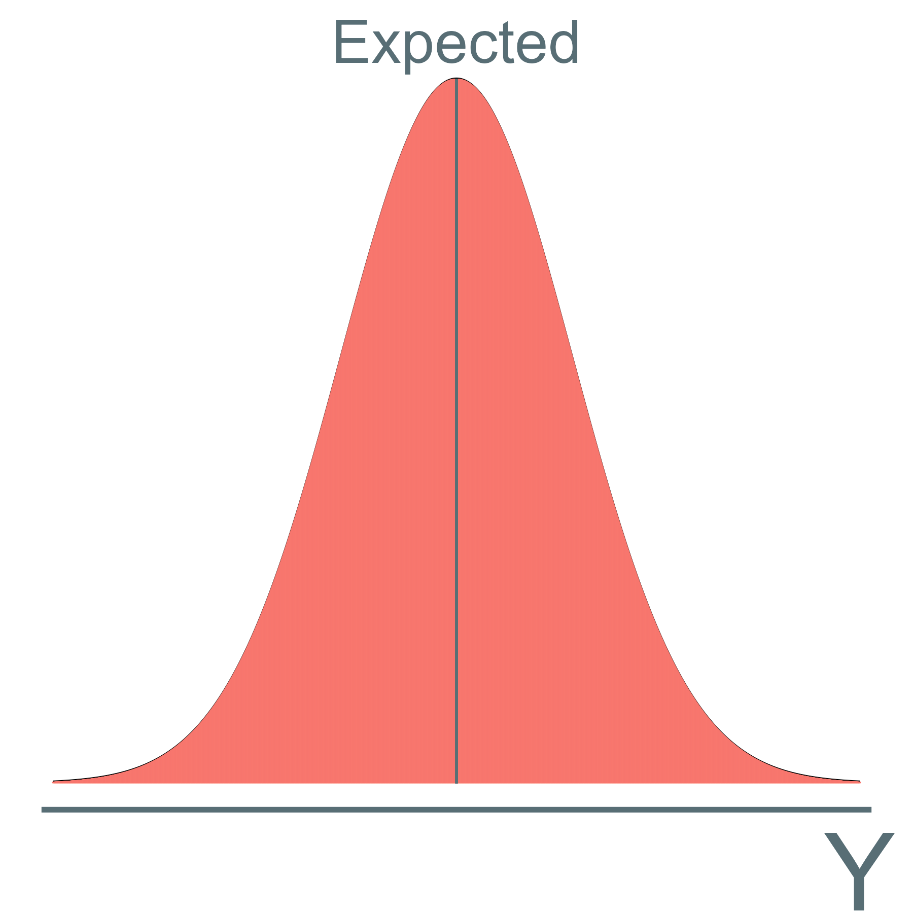
```
]]
	
---
## The normal distribution is a statistical model

.pull-left[
$$\mathcal{N}(\mu, \sigma) = \frac{1}{\sigma \sqrt{2\pi}}\;e^{-\frac{1}{2}\left(\frac{Y-\mu}{\sigma}\right)^2} $$

**Where:**
* $Y$: the value of a measurement 
* $\mu$: the expected value
* $\sigma$: the standard deviation

** Notation**:

* $Y \sim \mathcal{N}(\mu, \sigma)$ means *" $Y$ is a random variable that follows a normal distribution"*

]

.pull-right[
.center[
```{r dnorm2, echo=FALSE, out.width='90%'}
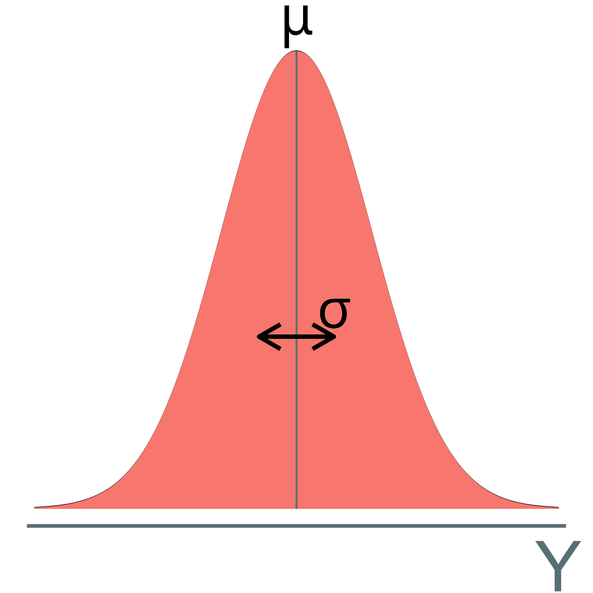
```
]]


---
## A syntax for statistical models


.pull-left[

**Our model:**

$$ 
\begin{aligned}
Y(i)^* & \sim \mathcal{N}(\mu, \sigma) \\[1em]
log(\mu) & =  log(cA^z) \\[1em]
log(\mu) & = log(c) + zlog(A) \\[1em] 
\mu^* & = c^* + zA^* \\[1em] 
\sigma & = C
\end{aligned}
$$
]

.pull-right[

$S = cA^z$

**Which reads:** "The log of the number of species at each island $Y(i)$ follows a normal distribution with expected value $\mu$ that is a function of area $A_i$, and with a standard deviation $\sigma$ of constant value $C$"

]

---
## What's next?

.pull-left[

**Model fitting:** 
use the data to find the best guesses for the free parameters of the model ( $c$, $z$ )

**Inference**: 
Use the guessed parameters and the fitted model to learn about the study system and to make predictions

**Model selection**: fit alternative models and compare them


]

.pull-right[

```{r expectvar2, echo = FALSE, warning=FALSE, message=FALSE, fig.align='center'}
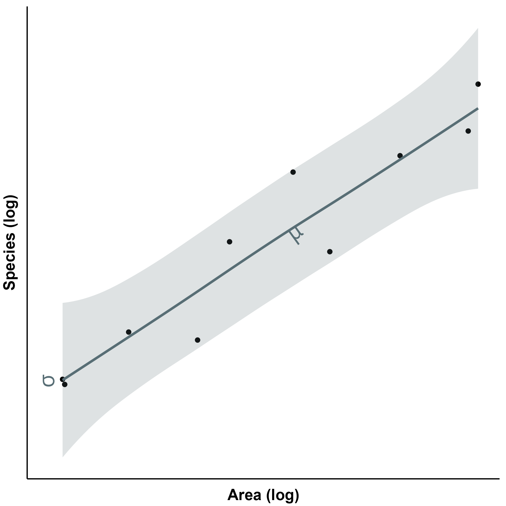

```

]


---
## Linear regression: a model to rule them all


* All statistical model has a  mathematical expression that
  describes the expected behavior of a **response** or **dependent
  variable**
  
--

* The simplest mathematical behavior is a linear relationship: the
response is proportional to other measurements (known as a **predictor**
or **independent variables**)

--

* **Linear regression** is the statistical model that describe proportionalities

--

* Linear regression is a foundational statistical model, from which a
  lot of other models were developed
  
--

* Thus, it is general a good idea to deduce linear relationships from
  your theoretical models and then fit a linear regression. Next we
  will show an example with the logistic equation

---
## What we expect from theory

.pull-left[

$$ 
\begin{aligned}
Y(i) & \sim \mathcal{N}(\mu, \sigma) \\[1em]
log(\mu) & =  log(cA^z) \\[1em]
log(\mu) & = log(c) + zlog(A) \\[1em] 
\mu^* & = c^* + zA^* \\[1em] 
\sigma & = C
\end{aligned}
$$
The log of species richness is a linear function of the log of island area

]

.pull-right[

```{r theory2, echo = FALSE, warning=FALSE, message=FALSE, fig.align='center', out.width='90%'}

```


]

---
## Which data do we need? $S = cA^z$

- The log of the number of species per island ( $S$ ) -> **response variable**
--


- The log of the area of each island ( $A$ ) -> **predictor variable**
--


---
## The linear regression model

.pull-left[

*Our model:*

$$ 
\begin{aligned}
Y(i) & \sim \mathcal{N}(\mu, \sigma) \\[1em]
\mu^* & = c^* + zA^* \\[1em] 
\sigma & = C
\end{aligned}
$$

*Which reads:*
The log of species richness across islands $Y(i)$ follows a normal distribution with expected value $\mu$ that is a linear function of the log of island area, with a standard deviation $\sigma$ of constant value $C$

]

.pull-right[

```{r theory3, echo = FALSE, warning=FALSE, message=FALSE, fig.align='center', out.width='90%'}

```


]

---
### What the fit shows

.pull-left[
```{r}
# Fit of the linear model of the log of 
# species as a linear function of the 
# log of area
lm(log(species) ~ log(area), 
   data = df)
```

]


.pull.right[

```{r fit, echo = FALSE, warning=FALSE, message=FALSE, fig.align='center', out.width='40%'}
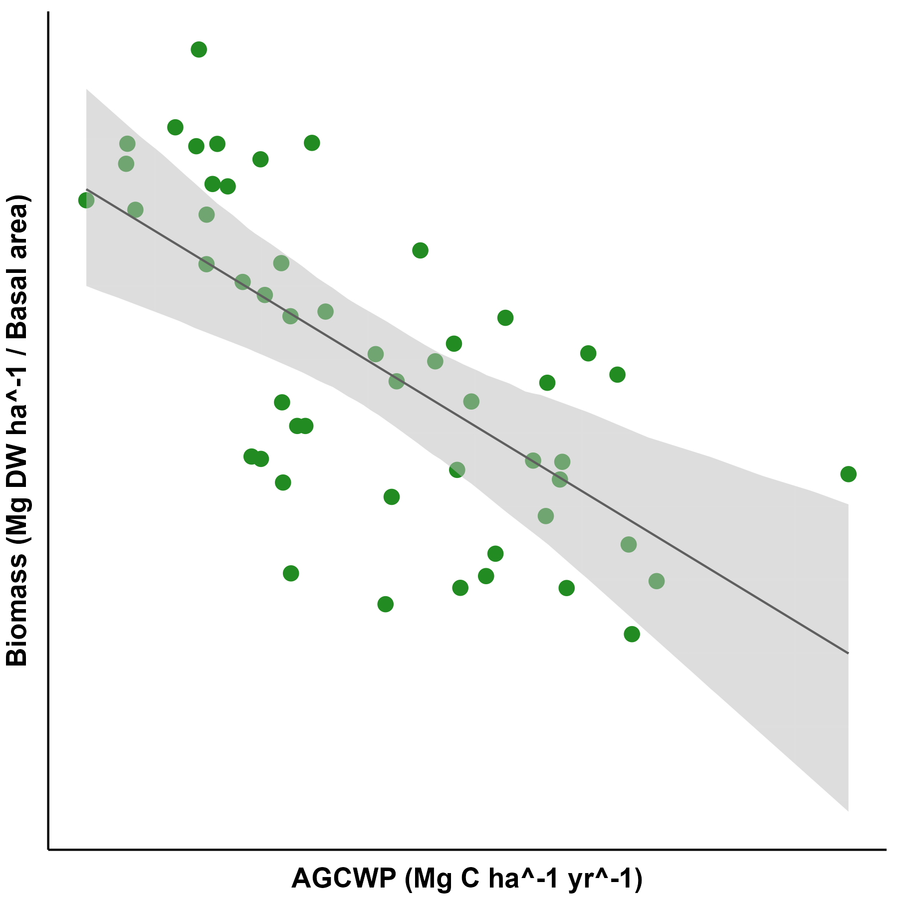
```

]

---
## Estimated parameters $S = cA^z$

.pull-left[


```{r coef, out.width="50%"}

mod <- lm(log(species) ~ log(area), data = df)
coef(mod)
```

$c = \exp(1.75)$ 

$z = 0.35$

$S = 5.75 \times 8870 ^ {0.35}$

$S = 138.4972$


]


.pull.right[

```{r fim, echo = FALSE, warning=FALSE, message=FALSE, fig.align='center', out.width='40%'}

```

]

---
## Where we are and what is next?


```{r roadmap2, echo=FALSE, fig.align='center', out.width='80%'}

```

---

## Further reading

* **Quantitative Reasoning in Ecology**: Chapter 1 in Schneider,
    D. 2009. Quantitative Ecology: Measurement, Models, and
    Scaling. New York, Academic Press, 2nd Ed.
    
    
* **Alternative views of scientific method and of modelling**:
    Chapter 2 in Hilborn, R & Mangel, M. 1997. The Ecological
    Detective - Confronting Models with Data. Princeton, Princeton
    University Press. 
    
* **Approaches to ecological modelling**: Chapter 1 in Ovaskeinen 
    et al. 2016. Quantitative Ecology and Evolutionary Biology. 
    Oxford, Oxford University Press.
