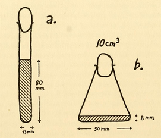
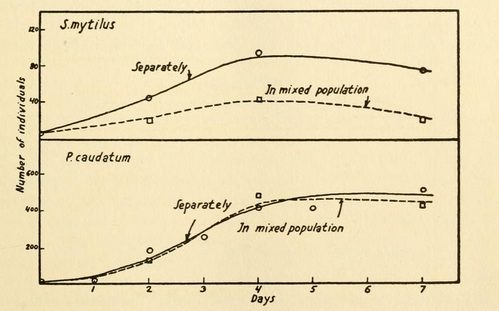
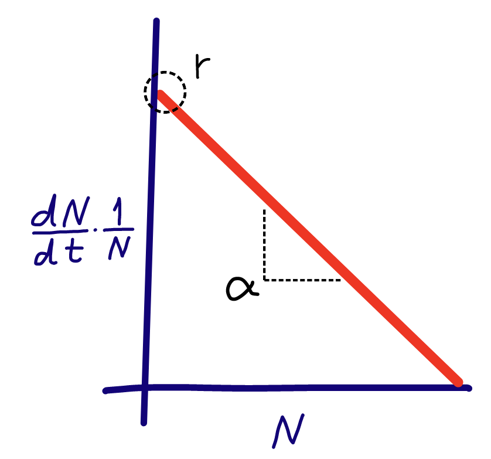

```{r setup, include=FALSE}
options(htmltools.dir.version = FALSE)
options(servr.daemon = TRUE)#para que no bloquee la sesión
```

```{r xaringan-themer, include=FALSE, warning=FALSE}
library(xaringanthemer)
library(ggplot2)
library(ggthemes)
style_duo_accent(
  primary_color = "#03045E",
  secondary_color = "#669bbc",
  colors = c(
    red = "#A70000",
    white = "#FFFFFF",
    black = "#181818"
  ),
  text_bold_color = "#03045E",
  header_font_google = google_font("Roboto Condensed"),
  text_font_google = google_font("Roboto Condensed", "300", "300i"),
  code_font_google = google_font("Fira Mono"), text_font_size = "28px"
)
xaringanExtra::use_share_again()
xaringanExtra::use_fit_screen()
xaringanExtra::use_tachyons()
# clipboard
htmltools::tagList(
  xaringanExtra::use_clipboard(
    button_text = "Copy code <i class=\"fa fa-clipboard\"></i>",
    success_text = "Copied! <i class=\"fa fa-check\" style=\"color: #90BE6D\"></i>",
    error_text = "Not copied 😕 <i class=\"fa fa-times-circle\" style=\"color: #F94144\"></i>"
  ),
  rmarkdown::html_dependency_font_awesome()
  )
## ggplot theme
theme_Publication <- function(base_size=14, base_family="helvetica") {
    (theme_foundation(base_size=base_size, base_family=base_family)
        + theme(plot.title = element_text(face = "bold",
                                          size = rel(1.2), hjust = 0.5),
                text = element_text(),
                panel.background = element_rect(colour = NA),
                plot.background = element_rect(colour = NA),
                panel.border = element_rect(colour = NA),
                axis.title = element_text(face = "bold",size = rel(1)),
                axis.title.y = element_text(angle=90,vjust =2),
                axis.title.x = element_text(vjust = -0.2),
                axis.text = element_text(), 
                axis.line = element_line(colour="black"),
                axis.ticks = element_line(),
                panel.grid.major = element_line(colour="#f0f0f0"),
                panel.grid.minor = element_blank(),
                legend.key = element_rect(colour = NA),
                legend.position = "bottom",
                legend.direction = "horizontal",
                legend.key.size= unit(0.2, "cm"),
                ##legend.margin = unit(0, "cm"),
                legend.spacing = unit(0.2, "cm"),
                legend.title = element_text(face="italic"),
                plot.margin=unit(c(10,5,5,5),"mm"),
                strip.background=element_rect(colour="#f0f0f0",fill="#f0f0f0"),
                strip.text = element_text(face="bold")
                ))
    
}

```

## Who we are (in order of appearance)
### A bunch of biologists ...
<center>
.pull-left[
```{r, out.width= "42%", echo=FALSE}
knitr::include_graphics("figs/PI.jpg")
```

**PI**, a.k.a Paulo Inácio Prado (he/him)

]

.pull-right[
```{r, out.width= "50%", echo=FALSE}
knitr::include_graphics("figs/andrea.jpg")
```

**Andrea**, a.k.a Andrea Sánchez-Tapia (she/her)
]
</center>

???

test note

---
## Who we are (in order of appearance)
### ... trying to help you to learn statistical modelling faster and easier than we did 
<center>
.pull-left[

```{r, out.width= "50%", echo=FALSE}
knitr::include_graphics("figs/diogo.jpg")
```

**Diogro**, a.k.a, Diogo Melo (he/him)
]

.pull-right[
```{r,  out.width= "50%", echo=FALSE}
knitr::include_graphics("figs/paulinha.jpg")
```

**Paulinha**, a.k.a Paula Lemos da Costa (she/her)
]
</center>


---
## What we want

 - To help you to be good users of statistical models in ecological research;
 - To make you learn this faster and easier than we did;
 - In doing that, to improve our own knowledge on statistical models.


<center>
.left-column[
```{r, out.width= "100%", echo=FALSE}
knitr::include_graphics("figs/Painel.Paulo.Freire_cropped.JPG")
```
]
</center>

.right-column[
> "Ninguém educa ninguém, ninguém educa a si mesmo, os homens se educam entre si, mediatizados pelo mundo"
>
> Paulo Freire
]


---

## What is a statistical model?
.bg-washed-blue.b--navy.ba.bw2.br3.shadow-5.ph4.mt1[
A description of how **your data** should behave according to some theory. 

Thus, statistical models are hypotheses about how a given **data set** was generated.
]

--

## Why is this different from a mathematical model?
.bg-washed-blue.b--navy.ba.bw2.br3.shadow-5.ph4.mt1[Mathematical
models describe the behavior of **theoretical quantities**.

Statistical models describe the behavior of **measurements** used to express 
theoretical quantities.]

---
class:middle

## Between theoretical quantities and the data lies the observer


.pull-left[

* $N(t)$ is theoretical: population size at any time $t$
* Examples of data used to express $N(t)$:
  * Number of earthworms counted in samples of soil taken weekly
  * Grass coverage measured yearly in permanent plots
]

.pull-right[
```{r, out.width= "75%", echo=FALSE}
knitr::include_graphics("figs/logistic_growth_sketch.png")
```
]

---

## An example: Georgy Gause's experiments

Does intraspecific competition imply logistic population growth?

<center>

.pull-left[


*Paramecium caudatum*,

https://makeagif.com/gif/paramecium-_yEVAH
]

.pull-right[

<iframe src="https://archive.org/embed/struggleforexist00gauz" width="560" height="420" frameborder="0" webkitallowfullscreen="true" mozallowfullscreen="true" allowfullscreen></iframe>
]

</center>
---

## Gause set experiments to approximate theoretical assumptions of logistic growth


.pull-left[

**Single-celled organisms in test-tube cultures under controlled lab
conditions:**
 * Steady and homogeneous environment
 * Well-mixed population
 * Asexual reproduction
 * Age-structure irrelevant

**Data:**

Daily counts of cells in 3 samples of the liquid culture medium (0.5 cm<sup>3</sup>)
 
]

.pull-right[
.center[
```{r,  out.width= "45%", echo=FALSE}

```
```{r,  out.width= "60%", echo=FALSE}

```
]]

---


```{r, echo=FALSE}
aurelia <- read.csv("gauss_1934_tab3_aurelia.csv")
aurelia.m <- aggregate(N ~ day, data = aurelia, mean)
aurelia.m$pcg <-  c(diff(aurelia.m$N)/diff(aurelia.m$day),NA)/aurelia.m$N
aurelia.m2 <- aurelia.m[aurelia.m$day>2,]
l.fit <- lm(pcg ~ N, data = aurelia.m, subset=day>2)
l.cf <- coef(l.fit)
logistica <- function(x, N0, r, K) K / (1 + ((K-N0)/N0)*exp(-r*x))
```
## What we expect from theory
     
.center[
```{r, echo=FALSE, fig.width=9, fig.height=6.5}
par(las=1, mar=c(6,7,4,2)+0.1,
    mgp=c(5,1,0),
    cex.lab=2, cex.axis=1.8, cex.main = 2.25)
plot(N ~ day, data = aurelia.m,
     type = "n",
     ylim = range(aurelia$N),
     xlab = "Time (days)", ylab = "N of cells / 0.5 cc",
     main = "P. aurelia")
curve(logistica(x, N0 = 2, r =l.cf[1], K = -l.cf[1]/l.cf[2]), add=TRUE, lwd =1.5, col="darkblue") 
```
]


---

## What the data shows

.center[
```{r, echo=FALSE, fig.width=9, fig.height=6.5}
par(las=1, mar=c(6,7,4,2)+0.1,
    mgp=c(5,1,0),
    cex.lab=2, cex.axis=1.8, cex.main = 2)
plot(N ~ day, data = aurelia.m,
     ylim = range(aurelia$N),
     xlab = "Time (days)", ylab = "N of cells / 0.5 cc",
     main = "Counts from 3 samples of 0.5 cc",
     pch=19, col="darkblue", cex = 1.5)
points(N ~ day, data= aurelia, pch = 3, cex=1.25, col="red")
legend("topleft", legend = c("Samples", "Average"),
       pch = c(3, 19), col = c("red", "blue"), cex=1.5, bty="n")
```
]

.right[[Data from Gause(1934) Appendix, Table 3](https://archive.org/details/struggleforexist00gauz/page/144/mode/2up?ref=ol) ]

---
class:middle

## Empirical data, a.k.a. random variables

.bg-washed-blue.b--navy.ba.bw2.br3.shadow-5.ph4.mt1[
* We can never control all sources of variation that affect our measurements or counts.
* Thus, any measurement or count done in a scientific research has some degree of uncertaintity.
* In other words, any quantitative data of scientific interest is a **random variable** 
]

---

## From the mathematical to the statistical model

.pull-left[
- We can not assure the exact value of a random variable but we can
   think on how likely would be each possible value.
- A simple hypothesis: large departures from the theoretical
   expectation are less likely than small ones.
- In this approach data is partitioned into **expected values** and 
  **unexplained variation** (a.k.a. *"residual"*, *"error"* or *"noise"*).
]
.pull-right[
.center[
```{r, echo=FALSE, fig.width=9, fig.height=6.5}
x1 <- seq(0,19, by=0.1)
df1 <- data.frame(
    day = x1,
    N=logistica(x1, N0 = 2, r =l.cf[1], K = -l.cf[1]/l.cf[2])
)
f.rib <- function(x, dpad = 25) geom_ribbon(aes(ymin= N - x*dpad, ymax = N + x*dpad), fill = "blue", alpha = 0.01)
p.m <-
    ggplot(df1, aes(day, N)) +
    geom_line(color="blue") +
    lapply(seq(0.1,5, by=0.05), f.rib) +
    geom_point(data = aurelia, shape = 3, color ="red", size=2, stroke=1.5)  +
    theme_Publication(18) +
    xlab("Time (days)") +
    ylab("N cells / 0.5 cc")

    p.m +
    theme(plot.margin=margin(b=1, l=1, r = 5, unit="lines")) +
    coord_cartesian(xlim = c(-0.9, 20.5), clip = "off")+
    annotate("text", x = 22, y = df1$N[nrow(df1)], label= "Expected", color="blue", size=9) +
    annotate("text", x = -0.8, y = 0, label= "Variation", color="blue", size=10, angle = 90)
    
```
]]

---
## The normal or Gaussian probability distribution

.pull-left[
* Ascribes a probability to each value a measurement can assume;
* It is a model for the sum of many sources of sources of variation;
* Small deviations from the expected value are more likely than large deviations;
* The probabilities of the deviations are symmetrical around the expected value.
]
.pull-right[
.center[
```{r, echo=FALSE, fig.width=9, fig.height=6.5}
x1 <- seq(-3.5,3.5, by=0.001)

 df2 <- data.frame(
     X = x1,
     Y = dnorm(x1)
 ) 

p.g <-
     ggplot(df2, aes(X,Y)) +
     geom_line() +
     theme_void() +
     theme(legend.position = "none") +
     geom_segment(aes(xend=X, yend=0, colour = Y)) +
     scale_color_gradient(low = "white", high = "blue",
                          name = "") +
     geom_segment(aes(x=0, y=dnorm(0), xend=0, yend=0), color="navy")
 
 p.g + annotate("text", x = 0, y = 0.42, label= "Expected", color="navy", size=10) +
     annotate("segment", x = -3.6, xend = 3.6, y = -0.015, yend = -0.015,
              colour = "navy", linewidth = 1.25) +
     annotate("text", x = 3.5, y = -0.05, label= "Y", color="navy", size=18)
```
]]
	
---
## The normal distribution is a statistical model

.pull-left[
$$\mathcal{N}(\mu, \sigma) = \frac{1}{\sigma \sqrt{2\pi}}\;e^{-\frac{1}{2}\left(\frac{Y-\mu}{\sigma}\right)^2} $$

**Where:**
* $Y$: the value of a measurement 
* $\mu$: the expected value
* $\sigma$: the standard deviation

** Notation**:

* $Y \sim \mathcal{N}(\mu, \sigma)$ means *" $Y$ is a random variable that follows a normal distribution."*

]
.pull-right[
.center[
```{r, echo=FALSE, fig.width=9, fig.height=6.5}
p.g +
    annotate("text", x = 0, y = 0.42, label= "mu", size=15, parse=TRUE) +
    annotate("text", x = 0.5, y = 0.17, label= "sigma", size=15, parse=TRUE) +
    annotate("segment", x = -0.5, xend = 0.5, y = .15, yend = .15,
             colour = "black", size = 1.5, arrow = arrow(ends="both")) +
    annotate("segment", x = -3.6, xend = 3.6, y = -0.015, yend = -0.015,
             colour = "navy", size = 1.25) +
    annotate("text", x = 3.5, y = -0.05, label= "Y", color="navy", size=18)


```
]]

---

## A syntax for statistical models


.pull-left[

**Our model:**

$$ 
\begin{aligned}
Y(t) & \sim \mathcal{N}(\mu, \sigma) \\[1em]
\mu & =  \frac{K}{1 + \frac{K-N_0}{N_0} \, e^{-rt}} \\[1em]
\sigma & = C
\end{aligned}
$$

**Which reads:** "The count of cells at each time $Y(t)$ follows a normal distribution with expected value $\mu$ that is a logistic function of time $t$, and with a standard deviation $\sigma$ of constant value $C$."

]

.pull-right[
.center[
```{r, echo=FALSE, fig.width=9, fig.height=6.5}
p.m2 <-
    p.m +
    theme(plot.margin=margin(b=1, l=1, r = 5, unit="lines")) +
    coord_cartesian(xlim = c(-1, 20.5), clip = "off") +
    annotate("text", x = 20, y = df1$N[nrow(df1)], label= "mu", color="blue", size=9, parse = TRUE) +
    annotate("segment", x = -0.5, xend = -0.5, y = 150, yend = -150,
             colour = "blue", size = 1, arrow = arrow(ends="both")) +
    annotate("text", x = -1, y = 0, label= "sigma", color="blue", size=10, angle = 90, parse = TRUE)
p.m2
```
]]

---

## What's next?

.pull-left[

**Model fitting:** 
use the data to find the best guesses for the free parameters of the model ( $K$, $r$, $C$ );

**Inference**: 
Use the guessed parameters and the fitted model to learn about the study system and to make predictions;

**Model selection**: fit alternative models and compare them.


]

.pull-right[
.center[
```{r, echo=FALSE, fig.width=9, fig.height=6.5}
p.m2
```
]]

---

## Linear regression: a model to rule them all


* All statistical model has a  mathematical expression that
  describes the expected behavior of a **response** or **dependent
  variable**;
  
--

* The simplest mathematical behavior is a linear relationship: the
response is proportional to other measurements (known as a **predictor**
or **independent variables**);

--

* **Linear regression** is the statistical model that describe proportionalities;

--

* Linear regression is a foundational statistical model, from which a
  lot of other models were developed. 
  
--

* Thus, it is general a good idea to deduce linear relationships from
  your theoretical models and then fit a linear regression. Next we
  will show an example with the logistic equation.

---

## Linear regression for logistic growth?


$$
\begin{aligned}
\frac{dN}{dt} & = rN \left( 1-\frac{N}{K} \right)
\end{aligned}
$$

---

## Linear regression for logistic growth?

$$
\begin{aligned}
\frac{dN}{dt} & = rN \left( 1-\frac{N}{K} \right) \\[1em]
&= rN - \frac{r}{K}N^2
\end{aligned}
$$

---

## Linear regression for logistic growth?

$$
\begin{aligned}
\frac{dN}{dt} & = rN \left( 1-\frac{N}{K} \right) \\[1em]
&= rN - \frac{r}{K}N^2\\[1em]
&= rN - \alpha N^2 \\[2em]
& \textrm{where: } \alpha = r/K
\end{aligned}
$$

---

## Linear regression for logistic growth?

.center[
.bg-washed-blue.b--navy.ba.bw2.br3.shadow-5.ph4.mt1[
$$
\frac{dN}{dt} = rN - \alpha N^2 \;\; \implies \; \; \underbrace{\frac{dN}{dt}\frac{1}{N}}_{\text{Per-capita} \atop\text{growth rate}} = r - \alpha N
$$
]]

---

## What we expect from theory

.pull-left[

$$\frac{dN}{dt}\frac{1}{N} = r - \alpha N$$


*Per capita* growth rate is a linear function of N in the logistic model.
]

.center[
.pull-right[
```{r,  out.width = "100%", echo=FALSE}

```
]]

---

## Which data do we need?

The rate increase in the number of cells in the interval between
samples ( $\Delta t$ ), divided by the number of cells at the
beggining of the interval:


$$ Y = \frac{ \text{N cells}_{t+1}  \, -  \, \text{N cells}_t}{\Delta t}  \cdot \frac{1}{\text{N cells}_t} $$

---

## The linear regression model

**Our model:**

.pull-left[

$$ 
\begin{aligned}
Y(t) & \sim \mathcal{N}(\mu, \sigma) \\[1em]
\mu & =  r - \alpha N \\[1em]
\sigma & = C
\end{aligned}
$$


**Which reads:** "The per capita variation in the number of cells
between sampling intervals $Y(t)$ follows a normal distribution with
expected value $\mu$ that is a linear function of the number of cells at
the beggining of the interval, and with a standard deviation $\sigma$
of constant value $C$."

]

.pull-right[
.center[
```{r, echo=FALSE, fig.width=9, fig.height=6.5}
df3 <- data.frame(N = 0:max(aurelia.m$N))
df3$pcg = predict(l.fit, newdata =df3)
f.rib2 <- function(x, dpad = 0.1) geom_ribbon(aes(ymin= pcg - x*dpad, ymax = pcg + x*dpad), fill = "blue", alpha = 0.03)

ggplot(df3, aes(N, pcg)) +
    geom_line(col = "darkblue") +
    lapply(seq(0.1,3, by=0.05), f.rib2) +
    theme_Publication(18) +
    ylab(expression(paste("Per capita growth rate (", day^-1,")"))) +
    xlab("N cells / 0.5 cc")
```
]]

---

## What the fit shows

.pull-left[
```{r}
lm( pcg ~ N, data = aurelia.m2)
```
]

.pull-right[
.center[
```{r, echo=FALSE}
par(las=1, mar=c(6,7,4,2)+0.1,
    mgp=c(5,1,0),
    cex.lab=2, cex.axis=1.8)
plot(pcg ~ N, data = aurelia.m, subset=day>2,
     pch=19, col="darkblue", cex=1.25,
     ylab = expression(paste("Per capita growth rate (", day^-1,")")),
     xlab = "N cells / 0.5 cc")
abline(h = 0, lty=2)
abline(l.fit, col="blue")
```
]]

---

## Inference with the estimated parameters

.pull-left[
.center[
```{r, echo=FALSE, fig.width=9, fig.height=6.5}
par(las=1, mar=c(6,7,4,2)+0.1,
    mgp=c(5,1,0),
    cex.lab=2, cex.axis=1.8, cex.main = 2.25)
plot(N ~ day, data = aurelia.m,
     ylim = range(aurelia$N),
     pch=19, cex = 1.5, col = "navy",
     xlab = "Time (days)", ylab = "N of cells / 0.5 cc",
     main = paste0("P. aurelia, K = ",round(-l.cf[1]/l.cf[2]), ", r = ", round(l.cf[1],3)))
curve(logistica(x, N0 = 2, r =l.cf[1], K = -l.cf[1]/l.cf[2]), add=TRUE, lwd =1.5, col="darkblue") 
```
]]


.pull-right[
.center[
```{r, echo=FALSE}
par(las=1, mar=c(6,7,4,2)+0.1,
    mgp=c(5,1,0),
    cex.lab=2, cex.axis=1.8)
plot(pcg ~ N, data = aurelia.m, subset=day>2,
     pch=19, col="darkblue", cex=1.25,
     ylab = expression(paste("Per capita growth rate (", day^-1,")")),
     xlab = "N cells / 0.5 cc")
abline(h = 0, lty=2)
abline(l.fit, col="blue")
```
]]


---


## Where are we and what's ahead

 1. Overview (this lecture)
 2. Probability distributions
 3. Linear regression
 4. Maximum likelihood fitting
 5. Bayesian fitting
 6. Causal thinking with statistical models
 7. Generalized linear models
 8. Mixed-effects and hierarchichal linear models
 9. Statistical models ecological dynamics

---

## Teaching strategies

 - Lectures and computer labs on each topic;
 - Labs: tutorials in R language;
 - At least two instructors present in all lectures and labs;
 - Office hours if possible (and if interest you);
 - All resources at https://statistical-inference.netlify.app ;
 - Learning resources will be available as we progress;
 
 
---

## Further reading

* **Quantitative Reasoning in Ecology**: Chapter 1 in Schneider,
    D. 2009. Quantitative Ecology: Measurement, Models, and
    Scaling. New York, Academic Press, 2nd Ed.
* **Alternative views of scientific method and of modelling**:
    Chapter 2 in Hilborn, R & Mangel, M. 1997. The Ecological
    Detective - Confronting Models with Data. Princeton, Princeton
    University Press. 
