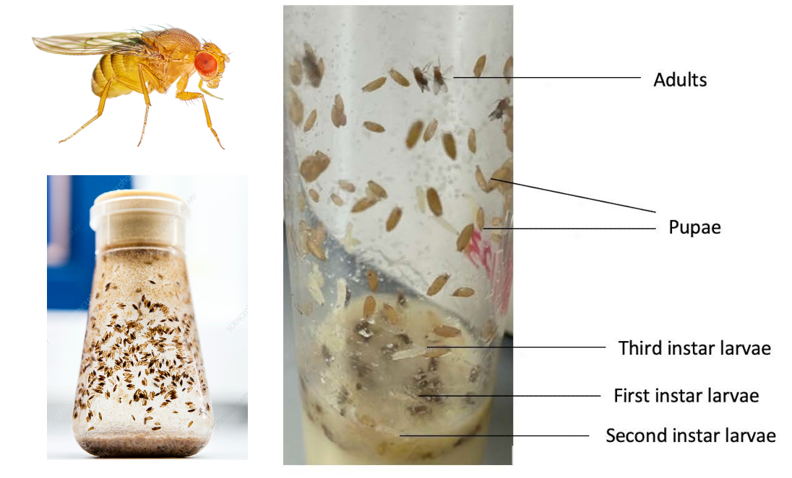

```{r setup, include=FALSE}
options(htmltools.dir.version = FALSE)
options(servr.daemon = TRUE)#para que no bloquee la sesión
knitr::opts_chunk$set(eval = TRUE, echo = FALSE, warning = FALSE, message = FALSE)
library(ggplot2)
library(ggthemes)
library(dplyr)
library(tidyr)
library(latex2exp)
library(ggridges)
library(viridis)
```

```{r xaringan-themer, include=FALSE, warning=FALSE}
library(xaringanthemer)
style_mono_accent(
  base_color = "#03045E",
  colors = c(
    red = "#A70000",
    white = "#FFFFFF",
    black = "#181818"
  ),
  text_bold_color = "#03045E",
  header_font_google = google_font("Roboto Condensed"),
  text_font_google = google_font("Roboto Condensed", "300", "300i"),
  code_font_google = google_font("Fira Mono"), text_font_size = "32px",
  code_font_size = "32px"
)
xaringanExtra::use_share_again()
xaringanExtra::use_fit_screen()
xaringanExtra::use_tachyons()
xaringanExtra::use_tile_view()
# clipboard
htmltools::tagList(
  xaringanExtra::use_clipboard(
    button_text = "Copy code <i class=\"fa fa-clipboard\"></i>",
    success_text = "Copied! <i class=\"fa fa-check\" style=\"color: #90BE6D\"></i>",
    error_text = "Not copied 😕 <i class=\"fa fa-times-circle\" style=\"color: #F94144\"></i>"
  ),
  rmarkdown::html_dependency_font_awesome()
)

## ggplot theme
theme_publication <- function(base_size=14, base_family="helvetica") {
    (theme_foundation(base_size=base_size, base_family=base_family)
        + theme(plot.title = element_text(face = "bold",
                                          size = rel(1.2), hjust = 0.5),
                text = element_text(),
                panel.background = element_rect(colour = NA),
                plot.background = element_rect(colour = NA),
                panel.border = element_rect(colour = NA),
                axis.title = element_text(face = "bold",size = rel(1)),
                axis.title.y = element_text(angle=90,vjust =2),
                axis.title.x = element_text(vjust = -0.2),
                axis.text = element_text(), 
                axis.line = element_line(colour="black"),
                axis.ticks = element_line(),
                panel.grid.major = element_line(colour="#f0f0f0"),
                panel.grid.minor = element_blank(),
                legend.key = element_rect(colour = NA),
                legend.position = "bottom",
                legend.direction = "horizontal",
                legend.key.size= unit(0.2, "cm"),
                ##legend.margin = unit(0, "cm"),
                legend.spacing = unit(0.2, "cm"),
                legend.title = element_text(face="italic"),
                plot.margin=unit(c(10,5,5,5),"mm"),
                strip.background=element_rect(colour="#f0f0f0",fill="#f0f0f0"),
                strip.text = element_text(face="bold")
                ))
    
}

```

## Key concepts

+ Random variables

+ Probability density functions

+ Probability distributions as statistical models

+ The normal probability distribution

+ Fitting statistical models to data

+ Other probability distributions

---

## Empirical data


.pull-left[

* Collection of *Drosophila melanogaster* populations 18 sites in Australia.
* Isofemale lines : progeny of single collected females allowed
  to interbreed 10 generations in the lab.
* 50 larvae from lines from each population kept at
  18°C, 25°C, and 29°C to develop (3 replicates).
* Controlled lab conditions: vials, culture medium, light cycle,
  temperature, fly density, etc.
* Measurement of adult flies reared from the vials.

]

.pull-right[
.center[


]

.right[

Van Heerwaarden & Sgrò, *Evolution* (2011).]

]

---

## Empirical data


```{r drosophila thorax length data}

dthor <- read.csv("42_Van_Heerwaarden_&_Sgro_2011_Dmelanogaster_thorax_length.csv")
## Sample means
dthor.m <-
    dthor %>%
    filter(Sex == "female", Temperature == "25") %>%
    group_by(Population) %>%
    summarise(th.mean = mean(Thorax_length, na.rm=TRUE)) %>%
    arrange(th.mean) %>%
    as.data.frame()
```

.pull-left[

* 30 adults picked at random among flies reared at
  each temperature.
* The histograms show frequencies of flies in classes of thorax length
for each population, only for females reared at 25°C.
* Blue lines are thorax length means from each sample.
]


.pull-right[
.center[

```{r drosophila pops histogram}
p.dros <-
    dthor %>%
    filter(Sex == "female", Temperature == "25") %>%
    mutate(pop = factor(Population, levels = dthor.m$Population)) %>%
    ggplot(aes(x = Thorax_length)) +
    geom_histogram(bins = 8, alpha =0.3) +
    geom_vline(data = dthor.m, aes(xintercept = th.mean), color = "blue", size = 1.5) +
    xlab("Thorax length (mm)") +
    ##geom_density() +
    facet_wrap(~ Population) +
    theme_publication(18)
p.dros
    
```
]
]

---

## Distribution of sample means

.pull-left[
.center[

```{r }

p.dros
    
```
]
]

.pull-right[
.center[


```{r drosophila-mean-hist}

p.dros2 <-
    dthor.m %>%
    ggplot(aes(th.mean)) +
    geom_histogram(binwidth = 0.013, alpha =0.5) +
    geom_rug(col = "blue", size =1.1) +
    xlim(0.97, 1.1) +
    xlab("Mean thorax length (mm)")+
    ylab("Count (# of populations)") +
    ggtitle("Distribution of population means") +
    theme_publication(18)

p.dros2
```

]]


---


## Random variables

.pull-left[

* Many values are possible, even for averages of measurements taken
  exactly in the same way, and under strongly controlled conditions.

* Scientific measurements are **random variables**: quantities that
  are inevitably affected by random events.

* How to deal with that? With models that tell us what's the chance of
observing each possible value of the measurement.

* In other words, by building **probability distributions**.

]

.pull-right[
.center[


```{r }
p.dros2
```

]]

---

## 1st step: the density scale

.pull-left[


* Let's re-scale the y-axis of this histogram, to make the total area
  of the histogram equal to one.
* That is, we express the original frequencies (or counts) in a new
  scale, such that the sum of the area of the bars is equal to one. We
  cal this scale **density**
* This is a linear (a.k.a. proportional) re-scaling, so the shape of the
  histogram does not change.

]

.pull-right[
.center[


```{r}
p1 <-
    dthor.m %>%
    ggplot(aes(th.mean)) +
    geom_histogram(aes(y=after_stat(density)), binwidth = 0.013, alpha =0.5) +
    xlim(0.97, 1.1) +
    xlab("Mean thorax length (mm)")+
    ylab("Density") +
    ggtitle("Distribution of population means") +
    theme_publication(18)

p1 + geom_rug(col = "blue", size =1.1)

```

]]

---

## 2nd step: the density function

.pull-left[

* Now let's imagine how to "smooth" the distribution of densities,
  using a continuous function.
* Think on this function as a continuous counterpart (or a continuous
  limit) of the histogram. This is the **density function**
* The area under the curve of a density function is one.

]


.pull-right[
.center[


```{r}

p1  + geom_density(color = "blue", size = 1.5)

```

]]


---


## Density function: some definitions

.pull-left[

* The density function is a continuous mathematical function $f(x)$ that returns a density
  value for any value of the measurement $x$.
* We call the **sample space** ( $\Omega$ ) the set of all values that a
  random variable can assume.


]


.pull-right[
.center[


```{r}
dmd <- density(dthor.m$th.mean)
tmp <- data.frame(x = dmd$x, y = dmd$y)
index <- min(which(tmp$x > 1.015, arr.ind = TRUE))
p2 <-
    dthor.m %>%
    ggplot(aes(th.mean)) +
    geom_density(color = "blue", size = 1.5) +
    xlim(0.97, 1.1) +
    xlab("Mean thorax length (mm)")+
    ylab("Density") +
    ##ggtitle("Distribution of population means") +
    theme_publication(18)

p2  +
    geom_segment(aes(x = x , xend = x, y = 0, yend =y),
                 data = tmp[index,], col = "red",
                 linetype = "dashed", size = 1.1) +
    geom_segment(aes(x = x, xend = 0.97, y = y, yend =y),
                 data = tmp[index,], col = "red",
                 linetype = "dashed", size = 1.1)

    
```

]]


---

## Density function and probabilities

.pull-left[


* The integral of $f(x)$ over the sample space equals one.

* This is a mathematical way to say that the area under $f(x)$ equals one.

]

.pull-right[
.center[
```{r}
p2 +
    geom_ribbon(aes(x=x, ymin=0, ymax =y),
                data = tmp,
                fill = "blue", alpha =.5) +
    geom_segment(aes(x=1.05, xend=1.065, y= 13, yend = 15), arrow = arrow()) +
    annotate("label", x = 1.087, y = 15, label = TeX(r"($\int_{\Omega} f(x) \, dx = 1$)", output = "character"),
             parse = TRUE, size = 7)

```
]]

---

## Density function and probabilities

.pull-left[


* The area under $f(x)$ for any interval $L \leq x \leq U$ is a
  fraction of the total area under $f(x)$.

* This area is a mathematical expression of the **probability assigned
  to a measurement interval**. It is also an integral of the density
  function:

$$ P(L \leq x \leq U) ~ = ~ \int_L^U f(x) \, dx $$

]

.pull-right[
.center[
```{r}
p2 +
    geom_ribbon(aes(x=x, ymin=0, ymax =y),
                data = filter(tmp, x>1.04&x<1.08),
                fill = "blue", alpha =.5) +
    geom_segment(aes(x=1.05, xend=1.067, y= 13, yend = 15), arrow = arrow()) +
    annotate("label", x = 1.087, y = 15, label = TeX(r"($\int_{1.04}^{1.08} f(x) \, dx)", output = "character"),
             parse = TRUE, size = 7)

```
]]

---


## Probability distributions as models


* The density function that we have defined is used to express
  probabilities of random variables, or a **probability
  distribution**.

--

* It is a model that attributes probabilities to data, that is, to
  values of a random variable.

--

* In our example, the random variable is the mean thorax length that
  we got from samples of 30 flies.

--

* With this kind of model we can ask many interesting questions about
  these sample means, like:


---

class: center, middle

### What's the probability of a mean thorax length of up 1.04 mm?

```{r}

p2 +
    geom_ribbon(aes(x=x, ymin=0, ymax =y),
                data = filter(tmp, x>0.96&x<1.04),
                fill = "blue", alpha =.5)
```

---

class: center, middle

### What's the confidence interval for the mean thorax length?

```{r}

p2 +
    geom_ribbon(aes(x=x, ymin=0, ymax =y),
                data = filter(tmp, x>0.995&x<1.07),
                fill = "blue", alpha =.5) +
    geom_vline(xintercept = 0.995, col = "red", linetype = "dashed", size = 1.1) +
    geom_vline(xintercept = 1.07, col = "red", linetype = "dashed", size = 1.1) +
    geom_segment(aes(x=0.995, xend = 1.07, y = 26.5, yend = 26.5),
                 arrow = arrow(ends = "both"),
                 col = "red") +
    annotate("label", x = 1.035, y = 26.5, label = "95% CI", size = 7) 
```


---

class: center, middle

### What's the theoretical expected value for this distribution?


```{r}
th.m <- mean(dthor.m$th.mean)
p2 +
    geom_vline(xintercept = th.m, col = "red", linetype = "dashed", size = 1.1) +
    geom_segment(aes(x = th.m + 0.002, xend=1.068, y= 12.5, yend = 15), arrow = arrow()) +
    annotate("label", x = 1.087, y = 15, label = TeX(r"($\int x \cdot f(x) \;  dx)", output = "character"),
             parse = TRUE, size = 7)
```

---

## Which probability distribution ?


* Now we know that probability distributions are a nice choice to
  model random variables. But how to build such a model?

--

* There are recipes to do that, but many probability distributions
  have been already proposed, for a huge variety of data types.

--

* In our example, our random variable are sample means. The **Central
  Limit Theorem** states that sample means will follow a Normal
  distribution, as the size of the samples increase.
  
--

* This is one of the most important results in probability theory. We
  have very good reasons to choose a Normal distribution as our
  statistical model.

---

## The Normal Distribution

.pull-left[

* Created to describe distribution of additive measurement errors.
* CLT tells us that this is good model for any random variable which is
a sum of many other random variables.
* It is a symmetric distribution, always bell-shaped.
* It has two parameters, that correspond to the mean and standard
  deviation of the distribution.
* Its mean and standard deviation  are independent.
]

.pull-right[
.center[

```{r normal-curve}

ggplot(data.frame(x = c(-4, 4)), aes(x = x)) +
    stat_function(fun = dnorm, col = "blue", size = 1.5) +
    annotate("label", x = 2.6, y = 0.35,
             label = TeX(r"($f(x) \, = \, \frac{1}{\sigma \sqrt{2\pi}} \; e^{- \frac{1}{2} \left( \frac{x-\,\mu}{\sigma} \right)^2} $)",
                         output = "character"),
             parse = TRUE, size = 6) +
    xlab("x") +
    ylab("Density") +
    ggtitle("Normal Probability Density Function") +
    theme_publication(18)
```

]]

---


## Location parameter of the Normal Distribution


.pull-left[

* The Normal has a **location parameter**, that we will call $\mu$.
* This parameter corresponds to the mean of the Normal distribution.
* By changing $\mu$ we change the position of the Normal distribution
along the x axis, without changing the standard deviation.
]

.pull-right[
.center[
	```{r normal-location}
    
    df1 <- data.frame(
        case_number = factor(1:5),
        caseMean = c(-4, -2, 0, 2, 4),
        caseSD = 1
    )
    
    n <- 100
    df3 <-
        df1 %>%
        mutate(low  = caseMean - 3 * caseSD, high = caseMean + 3 * caseSD) %>%
        uncount(n, .id = "row") %>%
        dplyr::mutate(x    = (1 - row/n) * low + row/n * high, 
                      norm = dnorm(x, caseMean, caseSD))
    
    ggplot(df3, aes(x, factor(case_number), height = norm, color = case_number)) +
        geom_ridgeline(scale = 3, aes(fill = case_number), alpha =0.5, linetype = 0) +
        xlim(-9,7) + 
        theme_publication(18) +
        theme(legend.position = "none",
              axis.line.y = element_blank(),
              axis.text.y = element_blank(),
              axis.ticks.y = element_blank(),
              axis.title.y = element_blank()
              ) +
        annotate("text", x = rep(-8.5,5),
                 y = 1:5 + 0.05,
                 label = c(TeX(r"($\mu = - 4$)"), TeX(r"($\mu = - 2$)"), TeX(r"($\mu = 0$)"),
                           TeX(r"($\mu = 2$)"), TeX(r"($\mu = 4$)")),
                 size = 6)
	```
]
]

---

## Scale parameter of the Normal Distribution

.pull-left[

* The Normal has a **scale parameter**, that we will call $\sigma$.
* This parameter corresponds to the standard deviation of the Normal distribution.
* By changing $\sigma$ we change the spread of the Normal distribution
around the mean, without changing the mean.
]


.pull-right[
.center[

```{r normal-scale}

df1 <- data.frame(
    case_number = factor(1:5),
    caseMean = 0,
    caseSD = rev(seq(0.5, 2.5,  by =0.5))
    )

n <- 100
df3 <-
    df1 %>%
    mutate(low  = caseMean - 3 * caseSD, high = caseMean + 3 * caseSD) %>%
    uncount(n, .id = "row") %>%
    dplyr::mutate(x    = (1 - row/n) * low + row/n * high, 
           norm = dnorm(x, caseMean, caseSD))

ggplot(df3, aes(x, factor(case_number), height = norm, color = case_number)) +
    geom_ridgeline(scale = 3, aes(fill = case_number), alpha =0.5, linetype = 0) +
    xlim(-9,7) + 
    theme_publication(18) +
    theme(legend.position = "none",
          axis.line.y = element_blank(),
          axis.text.y = element_blank(),
          axis.ticks.y = element_blank(),
          axis.title.y = element_blank()
          ) +
    annotate("text", x = rep(-8.5,5),
             y = 1:5 + 0.05,
             label = c(TeX(r"($\sigma = 2.5$)"), TeX(r"($\sigma = 2$)"), TeX(r"($\sigma = 1.5$)"),
                       TeX(r"($\sigma = 1$)"), TeX(r"($\sigma = 0.5$)")),
             size = 6)
```
]]

---

## Model fitting

.pull-left[

* We have chosen a statistical model for our data

* This model has two free parameters, $\mu$ and $\sigma$

* Which value should we choose for these two parameters?

* Finding good values for parameters of a statistical model means
  **fitting a model to the data**.
]


.pull-right[
.center[

```{r fitting-normal}

dt.m <- mean(dthor.m$th.mean)
dt.sd <- sd(dthor.m$th.mean)

plot.n <- function(mean, sd, ...)
    stat_function(fun = dnorm,
                  args = list(mean = mean, sd = sd),
                  xlim = c(mean - 3*sd, mean + 3*sd), ...)

p2 <-
    p1 +
    xlim(0.9, 1.15) +
    plot.n(dt.m-0.08, sd = dt.sd + 0.01, linetype = "dashed", color = "blue", size = 0.8) +
    plot.n(dt.m-0.02, sd = dt.sd + 0.05, linetype = "dashed", color = "blue", size = 0.8) +
    plot.n(dt.m, sd = dt.sd/2, linetype = "dashed", color = "blue", size = 0.8) +
    plot.n(dt.m + 0.08, sd = dt.sd*1.1, linetype = "dashed", color = "blue", size = 0.8) +
    theme(panel.grid.major = element_blank(),
          panel.grid.minor = element_blank())

p2 + plot.n(dt.m, sd = dt.sd, linetype = "dashed", color = "blue", size = 0.8)
    
```

]
]


## Model fitting

.pull-left[

* We fit statistical models by **estimating** the value of parameters,
  given the data observed.

* There are many ways to do that. For one of the fitting methods we will
  use in this course, the estimates for fitting a normal distribution are:
  
  * The sample mean as an estimate for $\mu$
  * The sample standard deviation as an estimate for $\sigma$

]

.pull-right[
.center[

```{r fitting-normal_right_one}
p2  +plot.n(dt.m, sd = dt.sd, color = "red", size = 1.5)
```

]
]


---

## Some notation


* Our model: mean thorax length $x$ follows a normal distribution:

$$ x \, \sim \, \text{Normal}(\mu, \sigma)$$

--

* The estimate of the parameter $\mu$ is the mean of the values of $x$ in the sample:

$$ \widehat{\mu} \, = \, \bar{x} \, = \, \frac{1}{N} \, \sum_{i=1}^N x_i $$


---


## Some notation


* The estimate of the parameter $\sigma$ is the square root of the variance of the values of $x$ in the sample:

$$ \widehat{\sigma} \, = \, \sqrt{s^2} $$

* Where the variance is the mean of the squared deviation from the sample mean:

$$ s^2 \, = \, \frac{1}{N} \, \sum_{i=1}^N (x_i - \bar{x})^2 $$ 

---

## Other probability distributions

.pull-left[
 
* The normal distribution is widely used, but other distributions
   suit different random variables better. There are many models to choose.
* Choosing a probability distribution to describe a given dataset means
   **making a hypothesis on how your data is generated**.
* For instance, take the number of kids assigned to male gender in 
   families of 12 children in Saxony in the XIX century (Geissller, 1889 *apud* Lindsey, 1995, Introductory Statistics).
]

.pull-right[
.center[
```{r saxony-data}

saxony <-
    data.frame(
        x = 0:12,
        y = c(3, 24, 104, 286, 670, 1033, 1343, 1112, 829, 478, 181, 45, 7)) %>%
    mutate(yobs = y/sum(y),
           ypred =  dbinom(x, size = 12, prob = 0.5),
           ypred2 = dbinom(x, size = 12, prob = sum(x*y)/(12*sum(y))))

    saxony %>%
        ggplot( aes(x, y)) +
        geom_col() +
        ggtitle("Frequency of families with 0 to 12 male children") +
        xlab("N of children assigned to male gender at birth")+
        ylab("Frequency (N of families)") +
        theme_publication()

```
]


]

---

## A simple model for this data

.pull-left[

1. Each family is an '*essay*' or an '*experiment*' with 12 '*trials*'; 
2. Each trial (a birth) has only two possible outcomes: male or female gender attributed to the newborn;
3. Trials are independent: the gender of one newborn does not affect the gender for the next births in the family;
4. The probability of each outcome at each trial is constant.
5. These assumptions holds for the **binomial probability distribution**

]

.pull-right[
.center[

```{r }
p.sax <-
    saxony %>%
    ggplot( aes(x, yobs)) +
    geom_col() +
    ggtitle("Proportion of families with 0 to 12 male children") +
    xlab("N of children assigned to male gender at birth")+
    ylab("Proportion of families") +
    theme_publication()
p.sax
```

]
]

---

## The binomial probability distribution

.pull-left[

* Assigns a probability for discrete values (real numbers, like counts):
$$f(x) = {N\choose x} p^x (1 - p)^{N - x}$$
  * $N$ : number of trials in each experiment
  * $p$ : probability of 'success' in each trial
* $N$ is usually known. To fit a binomial distribution we need only to estimate $p$
]


.pull-right[
.center[

```{r }

bin.ex <-
    data.frame(
        x = rep(0:12, 5),
        grupo = factor(rep(c("p = 0.1","p = 0.3","p = 0.5","p = 0.7","p = 0.9"), each =13)),
        y = c(dbinom(0:12, size = 12, prob = 0.10),
              dbinom(0:12, size = 12, prob = 0.30),
              dbinom(0:12, size = 12, prob = 0.50),
              dbinom(0:12, size = 12, prob = 0.70),
              dbinom(0:12, size = 12, prob = 0.90))
        )

ggplot( bin.ex, aes(x, y, label = grupo)) +
    geom_col(aes(fill=grupo)) +
    geom_text(x=13.4, y=0.15, size = 6) +
    scale_x_continuous(breaks = 0:12, limits =c(0,13.5)) +
    facet_grid(grupo~.) +
    xlab("Number of sucesses") +
    ggtitle("Binomial distribution, N = 12") +
    theme_publication() +
    theme(strip.background = element_blank(), strip.text.y = element_blank(), 
          strip.placement = "outside", panel.spacing.y = unit(0, "cm")) +
    theme(legend.position = "none",
              axis.line.y = element_blank(),
              axis.text.y = element_blank(),
              axis.ticks.y = element_blank(),
              axis.title.y = element_blank()
              )

```

]]

---

## Fitting a binomial distribution to data

.pull-left[

* A good estimator of $p$ is the observed proportion of successes
  among all trials. 
* In our example there was 38100 
  children assigned to male gender among a total of 73380 births, 
  or an observed proportion of 0.519 males.
* Red dots show the probabilities assigned by the binomial with this
  estimate, which suggests a gender bias towards males.

]

.pull-right[
.center[

```{r }
p.sax +  geom_point(aes(y = ypred2), col = "red", size = 3)

```

]
]

---

## Some other distributions

### Discrete

* **Poisson**: count data of independent events at a constant rate (e.g. number of captures of animals in traps)
* **Negative binomial**: the same, for aggregated events (e.g. number of trees of a given species in forest plots)
* **Geometric**: number of trials before an event with constant rate happens (e.g. number of years of life)


---

## Some other distributions

### Continuous

* **Log-normal**: multiplication of many random variables (e.g. population sizes in birth-death dynamics)
* **Exponential**: continuous time up to an event at constant rate (e.g. failure times of machines, life-spans)
* **Gamma**, **Weibull** : same as exponential, but event rate as a function of time (e.g. life spans with aging)
* **Uniform**: equiprobable values (useful as a null model or to generate other distributions)

---


## Many distributions are related

.center[

```{r, echo=FALSE, out.width="70%",}
knitr::include_graphics("distrib_relationships.png")
```
]

.right[
Bolker,2008
See also (http://www.johndcook.com/distribution_chart.html)
]

---

## Take-home messages

1. Probability distributions assign
   probabilities to each possible value of a measurement.

--

2. As such, probability distributions can be conceived as models of
   the process that generates the data at hand.

--

3. We fit a statistical model by finding sensible values for the
   parameters of probability distributions.

---

## References

+ Bolker, B.M. 2008 Ecological Models and Data in R. Princeton:
    Princeton University Press.

+ Gotelli, N.J., Ellison, A.M., Ellison, S.E., 2004. A Primer of
  Ecological Statistics. Sinauer Associates Publishers.

+ McElreath, R., 2018. Statistical Rethinking: A Bayesian Course with
  Examples in R and Stan, 2nd ed. CRC Press.


