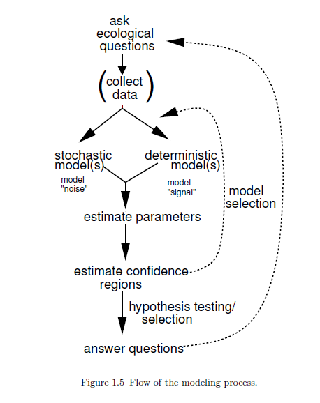

```{r setup, include=FALSE}
options(htmltools.dir.version = FALSE)
options(servr.daemon = TRUE)#para que no bloquee la sesión

```

```{r xaringan-themer, include=FALSE, warning=FALSE}
library(xaringanthemer)
library(ggplot2)
library(ggthemes)
library(knitr)
library(kableExtra)
library(dplyr)
library(tidyr)

xaringanExtra::use_share_again()
xaringanExtra::use_fit_screen()
xaringanExtra::use_tachyons()

style_solarized_light(
  title_slide_background_color = "#586e75",# base 3
  header_color = "#586e75",
  text_bold_color = "#cb4b16",
  background_color = "#fdf6e3", # base 3
  header_font_google = google_font("DM Sans"),
  text_font_google = google_font("Roboto Condensed", "300", "300i"),
  code_font_google = google_font("Fira Mono"), text_font_size = "28px"
)
# clipboard
htmltools::tagList(
  xaringanExtra::use_clipboard(
    button_text = "Copy code <i class=\"fa fa-clipboard\"></i>",
    success_text = "Copied! <i class=\"fa fa-check\" style=\"color: #90BE6D\"></i>",
    error_text = "Not copied 😕 <i class=\"fa fa-times-circle\" style=\"color: #F94144\"></i>"
  ),
  rmarkdown::html_dependency_font_awesome()
  )
## ggplot theme
theme_Publication <- function(base_size = 14, base_family = "helvetica") {
    (theme_foundation(base_size = base_size, base_family = base_family)
        + theme(plot.title = element_text(face = "bold",
                                          size = rel(1.2), hjust = 0.5),
                text = element_text(),
                panel.border = element_rect(colour = NA),
                panel.background = element_rect(fill = 'transparent'),
                plot.background = element_rect(fill = 'transparent', color = NA),
                axis.title = element_text(face = "bold",size = rel(1)),
                axis.title.y = element_text(angle=90,vjust =2),
                axis.title.x = element_text(vjust = -0.2),
                axis.text = element_text(), 
                axis.line = element_line(colour="black"),
                axis.ticks = element_line(),
                panel.grid.major = element_line(colour=NA),
                panel.grid.minor = element_blank(),
                legend.key = element_rect(colour = NA),
                legend.position = "bottom",
                legend.direction = "horizontal",
                legend.key.size= unit(0.2, "cm"),
                ##legend.margin = unit(0, "cm"),
                legend.spacing = unit(0.2, "cm"),
                legend.title = element_text(face="italic"),
                plot.margin = unit(c(10,5,5,5),"mm"),
                strip.background = element_rect(colour = NA,fill = "transparent"),
                strip.text = element_text(face="bold")
                ))
    
}

```


```{r generate_data, echo = F}

library(wesanderson)
library(dplyr)
library(ggplot2)


cor <- wes_palette("Rushmore1") #("FantasticFox1")


set.seed(4)
x1 <- seq(1, 5, by = 0.5)
mu <- 1.2 + 3.5 * x1
#res = rnorm(n = 9, mean = 0, sd = 5)
y1 <- rnorm(n = 9, mean = mu, sd = 3)
#y1 = y0 + res
xy <- data.frame(x1, mu, res = y1 - mu, y1)
#plot(y1~x1)
#abline(1.2, 3.5)
#abline(coef(lm(y1~x1)), col = "red")

## plot(x1, y1)
## abline(lm(y1~x1), col = "red")
## summary(lm(y1~x1))


xy$lmpred <- predict(lm(y1~x1))
xy$lmres <- residuals(lm(y1~x1))

prev <- xy$lmpred

tannin <- read.csv("crawley_regression.csv")

```

## Use a model to simplify


```{r iba, echo=FALSE, fig.align='center', out.width='60%'}
include_graphics("figs/isaias_sales.jpeg")
```

Ibã Huni Kuin, Nai Basa Masheri, 2014

---

## Flow of the modeling process

```{r flow, echo=FALSE, out.width='37%', fig.align='center'}

```


---

## In statistical models

+ We deal with __predictor__ and __response__ variables

--


+ In experimental settings this distinction is clear, we __manipulate__ the predictor variables and __measure/observe__ the response variables

--

+ In observational settings ("natural experiments"), we do not manipulate the predictor variables but sample the response variable across them

--

+ We hypothesize the __causation relationship__ and build the model accordingly

---
## The theory: tannins in plant–herbivore interactions

.pull-left[
+ tannin are the most abundant secondary metabolites in plants

+ **defense mechanism**: defend leaves against herbivores by deterrence or toxicity

+ tannins oxidize in insects $\rightarrow$ oxidative stress
]


.pull-right[

```{r question, echo=FALSE, out.width='70%', fig.align='center'}
include_graphics("figs/tannin.jpg")
```

]

---
## What do we expect from theory?

+ **response variable**: caterpillar growth

--


+ **predictor variable**: quantity of tannin in the caterpillar diet

--


```{r expect0, echo=FALSE, out.width='35%', fig.align='center'}
include_graphics("figs/expect0.png")
```

---
## What do we expect from theory?

+ **response variable**: caterpillar growth

+ **predictor variable**: quantity of tannin in the caterpillar diet


```{r expect, echo=FALSE, out.width='35%', fig.align='center'}
include_graphics("figs/expect.png")
```


---
## Linear model

+ The simplest possible model is one that describes a single variable $X$ having a direct effect on the response variable $Y$. $X \rightarrow Y$

--

+ The __response variable__ has a distribution, linear regression assumes it has a __normal distribution__. 

--

+ The relationship between $X$ and $Y$ can be described by the equation of a line where $\beta_0$ is the __intercept__ and $\beta_1$ is the __slope__

--

our *probability distribution centric* convention

$$
Y_i \sim \mathcal{N}(\mu_i, \sigma) \\
$$


--

$$
\mu_i = \beta_0 + \beta_1 X_i 
$$


---

## Assumptions of linear regression

1. The **linear** model correctly describes the functional relationship between $X$ and $Y$

--

2. The variable $X$ is measured without error $\rightarrow$ error as random variation of $Y$

--

3. $Y$ values are **independent** with normally distributed errors

--

4. Variances are constant along the regression line 

--


---
## How do we estimate the intercept and slope?

.pull-left[


```{r ols, echo = FALSE, fig.align='center'}
par(bg = NA)
plot(y1 ~ x1, las = 1, bty = "l", cex = 3, col = cor[3],
     #xaxt="n", yaxt="n",
     xlab = "predictor", ylab = "response",
     pch = 19, cex.axis = 1.5, cex.lab = 1.5)
points(x = mean(x1), y = mean(y1), pch = 19, cex = 1)
points(x = mean(x1), y = mean(y1), pch = 1, cex = 2.2)
abline(a = 16.8 , b = -1.25, col = "grey50")
abline(a = -11.3 , b = 8.07, col = "grey50")
abline(a = 15 , b = -1.8, col = "grey50")
abline(a = 12 , b = 4, col = "grey50")
abline(lm(y1 ~ x1), col = "grey50")
text("fulcrum", x = mean(x1) + .5, y = mean(y1), cex = 1.6)
```

]

.pull-right[

+ The simplest approach to do this: __Ordinary Least Squares__

+ For _any_ line, the observed values of $Y$ will be different from the predicted values $\hat{Y}$


]

---
## The residual sum of squares RSS

.pull-left[

```{r residuals, echo = FALSE, fig.align='center'}
par(bg = NA)
plot(y1 ~ x1, las = 1, bty = "l", cex = 3, col = cor[3],
     #xaxt="n", yaxt="n",
     xlab = "predictor", ylab = "response",
     pch = 19, cex.axis = 1.5, cex.lab = 1.5)
segments(x0 = x1, x1 = x1, y0 = y1, y1 = prev, lty = 2, lwd = 2)
abline(lm(y1 ~ x1), lwd = 3, col = cor[2], cex = 2)
```
]


.pull-left[

+ __Residuals__ are the difference between $Y_i$ and $\hat{Y_i}$. 

+ The magnitude of the deviations is more important than their sign, so we square them $(Y_i -\hat{Y_i})^2$

 
]

---
## The residual sum of squares RSS

.pull-left[

```{r residuals2, echo = FALSE, fig.align='center'}
par(bg = NA)
plot(y1 ~ x1, las = 1, bty = "l", cex = 3, col = cor[3],
     #xaxt="n", yaxt="n",
     xlab = "predictor", ylab = "response",
     pch = 19, cex.axis = 1.5, cex.lab = 1.5)
segments(x0 = x1, x1 = x1, y0 = y1, y1 = prev, lty = 2, lwd = 2)
abline(lm(y1 ~ x1), lwd = 3, col = cor[2], cex = 2)
```
]


.pull-left[


$$RSS = \sum_{i=1}^{n}(Y_i-\hat{Y}_i)^2 $$

- __Ordinal Least Squares__ minimizes the Residual Sum of Squares to find the best fit for the regression line

 <!-- to obtain the smallest average difference --> 

 
]

---
## The values that minimize RSS


$$\hat{\beta_1}=\frac{\sum_{i=1}^{n}(X_i-\bar{X})(Y_i-\bar{Y})}{\sum_{i=1}^{n}(X_i-\bar{X})^2}$$

$$
\hat{\beta_0} = \bar{Y} - \hat{\beta_1}\bar{X} 
$$


+ These values are __estimates__ ( $\hat{\beta_0}$, $\hat{\beta_1}$, $\hat{\sigma^2}$) of the values of the parameter in the whole population. 

--

+ With different samples, other estimates would be obtained: __the regression line for the sample is not necessarily the same as the regression line for the population__


---
## Variation partition in a linear model

+ The expression ${\sum_{i=1}^{n}(X_i-\bar{X})^2}$ in the denominator of $\hat{\beta_1}$ is the __Sum of Squares__ of variable $X$, a measure of the total variation around its mean

--

+ Likewise, $SS_Y = {\sum_{i=1}^{n}(Y_i-\bar{Y})^2}$ measures the variation of $Y$ around its mean

--

+ $SS_Y$ is in part caused by the regression. The variation that was left unaccounted for by the model is RSS.

$$SS_Y = SS_{Reg} + RSS$$
--

+ __How much of the variation is caused by the regression and how much is due to unaccounted (random) variation?__

---
## Sum of squares (total variation) vs RSS (random variation)

.pull-left[


```{r varpart, echo = F, out.width='90%'}
par(bg = NA)
plot(y1 ~ x1, data=xy, las=1, bty="l", cex=3, col=cor[3],
     #xaxt="n", yaxt="n",
     xlab="predictor", ylab="response", pch=19, cex.axis = 1.5, cex.lab = 1.5)
abline(h=mean(y1), col=cor[4], lwd=2)
segments(x0=x1, x1=x1, y0=y1, y1=mean(y1), lty=2, lwd = 2)
points(y1 ~ x1, data=xy, las=1, bty="l", cex=.7, pch=19, col=cor[3])
#abline(lm(y1 ~ x1), lwd=2, col='grey30')
```

]

.pull-right[

```{r rss2, echo = FALSE, fig.align='center', out.width='90%'}
par(bg = NA)
plot(y1 ~ x1, las = 1, bty = "l", cex = 3, col = cor[3],
     #xaxt="n", yaxt="n",
     xlab = "predictor", ylab = "response",
     pch = 19, cex.axis = 1.5, cex.lab = 1.5)
segments(x0 = x1, x1 = x1, y0 = y1, y1 = prev, lty = 2, lwd = 2)
abline(lm(y1 ~ x1), lwd = 3, col = cor[2], cex = 2)
```
]


---
## Coefficient of determination


$$r^2 = \frac{SS_{reg}}{SS_Y} = \frac{SS_{reg}}{SS_{reg}-RSS}$$

+ The proportion of variation in $Y$ that can be attributed to variation in $X$ (e.g. to the regression). 

--

+ $r^2$ lies between 0 (all variation is random) and 1 (all variation is due to the regression and the points are on the regression line) 

--

+ $r^2$ measures how close to the regression line the points are

--

+ $r^2$ does not confirm causality by itself! __Goodness of fit__

---
class: inverse, center, middle

## (This variation partition is key to understanding the summaries of linear models)

---
## Variation partition summary

<small>

|  Source|  df|  SS sum of squares| MS Mean square | Expected MS | F-ratio | p-value
|:--:|:--:|:--:|:--:|:--:|:--:|:--:|
|  Regression | $1$ | $SS_{reg} = \sum_{i=1}^{n}(\hat{Y}_i-\overline{Y})^2$ | $\frac{SS_{reg}}{1}$ | $\sigma^2+\beta_1^2\sum_{i=1}^{n}X^2$ | $\frac{SS_{reg}/1}{RSS/(n-2)}$ |F-distribution with $n-2$ df| 
|  Residual |  $n-2$ |  $RSS = \sum_{i=1}^{n}(Y_i-\hat{Y}_i)^2$ | $\frac{RSS}{(n-2)}$ | $\sigma^2$| |
|  Total | $n-1$ |  $SS_Y = \sum_{i=1}^{n}(Y_i-\overline{Y})^2$ | $\sigma_Y^2$ |


---
## Our case: growth of caterpillars and tannin

Do leaf chemical compounds affect negatively the growth of caterpillars? 


```{r, echo = F}
kableExtra::kable(tannin)
```

---
## Our case: growth of caterpillars and tannin

<center> 

$$
Y_i \sim \mathcal{N}(\mu_i, \sigma) \\
$$

$$
\mu_i = \beta_0 + \beta_1 X_i 
$$


**Which reads:**

--

Caterpillar growth under different tannin intake $Y_i$ follows a normal
distribution with expected value $\mu$ that is linear function of tannin intake $X_i$, 
with a standard deviation $\sigma$ of constant value


---

## Fitting the linear model

```{r fit}

mod <- lm(growth ~ tannin, data = tannin)
mod

pred <- predict(mod)
pred
```

---
## Fitting the linear model

```{r, fig.align='center', out.width='40%'}
plot(growth ~ tannin, data = tannin)
abline(a = 11.756, b = -1.217, col = "red")
```


---
## Variation partitioning

<small>

$$SS_{reg} = \sum_{i=1}^{n}(\hat{Y}_i-\bar{Y}_i)^2$$ 


$$RSS = \sum_{i=1}^{n}(Y_i-\hat{Y}_i)^2$$ 

```{r rss}
# SSreg
SSreg <- sum((pred - mean(tannin$growth)) ^ 2)
SSreg

# RSS
RSS <- sum((tannin$growth - pred) ^ 2) 
RSS

```

---
## Variation partitioning

<small>


$$SSY = \sum_{i=1}^n(Y_i - \bar{Y})^2$$ 


```{r, r2}
#SSY
SSY <- sum((tannin$growth - mean(tannin$growth)) ^ 2) 
SSY

SSreg / SSY # r2

# F ratio
SSreg / (RSS / (nrow(tannin) - 2))
```


---
## Anova table

<small>

```{r}
anova(mod)
```

---
## Variation partition summary

<small>
```{r}
summary(mod)
```


---

```{r, echo = FALSE, out.width='50%', fig.align='center'}
include_graphics("figs/but-wait-theres-0498a1.jpg")
```


> The important point is that we always do model-checking; the
summary table is not the end of the process of regression analysis.

<small>
Michael J. Crawley. Statistics: an introduction using R


---
## Model checking


```{r check, echo = FALSE, fig.align='center', out.width= '45%'}
par(mfrow = c(2, 2), bg = NA)
plot(mod)
```


---

## Further reading

+ How Do You Write Your Model Definitions? https://www.sumsar.net/blog/2013/10/how-do-you-write-your-model-definitions/

---

## References

+ Crawley. M.J. 2015. Statistics: an introduction using R. John Wiley & Sons Ltd.

+ Gotelli, N.J., Ellison, A.M., Ellison, S.E. and S.R.F.H.F.A.M., 2004. A Primer of Ecological Statistics. Sinauer Associates Publishers.

+ James, G., Witten, D., Hastie, T., Tibshirani, R., 2013. An Introduction to Statistical Learning: with Applications in R, 1st ed. 2013. Corr. 4th printing 2014 edition. ed. Springer, New York, NY.

+ McElreath, R., 2018. Statistical Rethinking: A Bayesian Course with Examples in R and Stan, 2nd ed. CRC Press.


