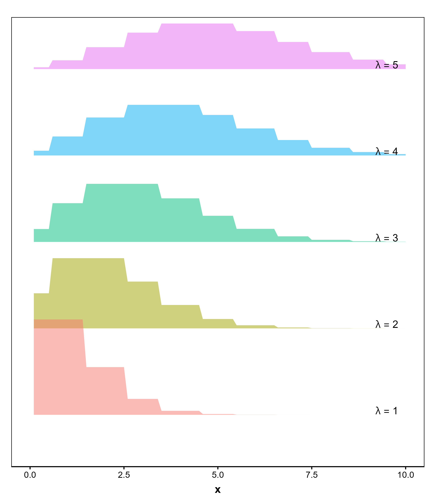

```{r setup, include=FALSE}
options(htmltools.dir.version = FALSE)
options(servr.daemon = TRUE)#para que no bloquee la sesión
knitr::opts_chunk$set(eval = TRUE, echo = FALSE, warning = FALSE, message = FALSE)

```

```{r xaringan-themer, include=FALSE, warning=FALSE}
library(xaringanthemer)
library(ggplot2)
library(ggthemes)
library(knitr)
library(kableExtra)
library(dplyr)
library(tidyr)
library(rethinking)
library(ggridges)
library(viridis)
library(latex2exp)

xaringanExtra::use_share_again()
xaringanExtra::use_fit_screen()
xaringanExtra::use_tachyons()

style_solarized_light(
  title_slide_background_color = "#586e75",# base 3
  header_color = "#586e75",
  text_bold_color = "#cb4b16",
  background_color = "#fdf6e3", # base 3
  header_font_google = google_font("DM Sans"),
  text_font_google = google_font("Roboto Condensed", "300", "300i"),
  code_font_google = google_font("Fira Mono"), text_font_size = "28px"
)
# clipboard
htmltools::tagList(
  xaringanExtra::use_clipboard(
    button_text = "Copy code <i class=\"fa fa-clipboard\"></i>",
    success_text = "Copied! <i class=\"fa fa-check\" style=\"color: #90BE6D\"></i>",
    error_text = "Not copied 😕 <i class=\"fa fa-times-circle\" style=\"color: #F94144\"></i>"
  ),
  rmarkdown::html_dependency_font_awesome()
  )
## ggplot theme
theme_publication <- function(base_size = 14, base_family = "helvetica") {
    (theme_foundation(base_size = base_size, base_family = base_family)
        + theme(plot.title = element_text(face = "bold",
                                          size = rel(1.2), hjust = 0.5),
                text = element_text(),
                panel.border = element_rect(colour = NA),
                panel.background = element_rect(fill = 'transparent'),
                plot.background = element_rect(fill = 'transparent', color = NA),
                axis.title = element_text(face = "bold",size = rel(1)),
                axis.title.y = element_text(angle=90,vjust =2),
                axis.title.x = element_text(vjust = -0.2),
                axis.text = element_text(), 
                axis.line = element_line(colour="black"),
                axis.ticks = element_line(),
                panel.grid.major = element_line(colour=NA),
                panel.grid.minor = element_blank(),
                legend.key = element_rect(colour = NA),
                legend.position = "bottom",
                legend.direction = "horizontal",
                legend.key.size= unit(0.2, "cm"),
                ##legend.margin = unit(0, "cm"),
                legend.spacing = unit(0.2, "cm"),
                legend.title = element_text(face="italic"),
                plot.margin = unit(c(10,5,5,5),"mm"),
                strip.background = element_rect(colour = NA,fill = "transparent"),
                strip.text = element_text(face="bold")
                ))
    
}

## Aux functions
f.rib <- function(X, dpad = 5)
    geom_ribbon(aes(ymin= y - X*dpad, ymax = y + X*dpad), fill = "blue", alpha = 0.01)

make.q <- function(from, to, cfs, normal=TRUE, sig, size=100){
    if(normal)
        df <- data.frame(x = seq(from, to, length =size)) %>%
            mutate(y = cfs[1]+cfs[2]*x,
                   low.1 =  qnorm(0.05, size, mean = y, sd =sig),
                   upp.1 =  qnorm(0.95, size, mean = y, sd =sig),
                   low.2 =  qnorm(0.25, size, mean = y, sd =sig),
                   upp.2 =  qnorm(0.75, size, mean = y, sd =sig))
    else
        df <- data.frame(x = seq(from, to, length =size)) %>%
            mutate(y = cfs[1]+cfs[2]*x,
                   low.1 =  qpois(0.05, size, lambda = y),
                   upp.1 =  qpois(0.95, size, lambda = y),
                   low.2 =  qpois(0.25, size, lambda = y),
                   upp.2 =  qpois(0.75, size, lambda = y))
} 

plot.q <- function(df2, df1){
    ggplot(df2, aes(x, y)) +
        geom_line(col="navy") +
        geom_ribbon(aes(ymin = low.1, ymax = upp.1), fill="blue", alpha =0.25) +
        geom_ribbon(aes(ymin = low.2, ymax = upp.2), fill="blue", alpha =0.25) +
        geom_point(data = df1, color ="red", size=1.25, stroke=1.25)  +
        theme_Publication(18)
    }
```


## Recap

* The key interest in statistical analysis is to find a meaningful relationship 
  between the __response__ variable (usually denoted by $y$) and one or 
  more __explanatory__ variables $x_{i}$

--

* So far we have assumed the likelihood of $y$ to be $P(y|\mu, \sigma)$, which 
means $Y_i \sim N(\mu, \sigma)$ 

--

* The most extreme deviation of normality is when your response variable can 
  only assume $0$ or $1$ values (binary data)

--

* Other deviations include categorical variables and count data and for these 
  cases as well as situations that do not conform to some of the assumptions of 
  a linear model we use generalized linear models


---
## Rethinking gaussian linear regression
### Maximum Entropy

__Definition__: The probability distribution with the largest entropy is the one
that makes the fewest assumptions about the data, given constraints

- Bet on the distribution with the biggest entropy

- The center of gravity for high plausible distributions

--
  
$$ 
\begin{align}
H(p) = -\sum{p_{i} log p_{i}}
\end{align}
$$ 
> The distribution that can happen the __most ways__ is also the distribution with 
the biggest information theory. The distribution with the biggest entropy is the
__most conservative__ distribution that obeys its constraints.

Richard McElreath


---
## Understanding entropy

.pull-left[
```{r, echo = FALSE, fig.align='center', out.width='80%'}

```
]

.pull-right[
How can pebbles be distributed across buckets under varying constraints?

- $\uparrow$ entropy as we increase the N of buckets

- $\uparrow$ entropy as we even the distribution of pebbles

- E: distribution that can happen the __most ways__

- E: __most conservative__ distribution that obeys its constraints

]

---
## Understanding entropy


.pull-left[
```{r, echo = FALSE, fig.align='center', out.width='80%'}

```
]

.pull-right[
```{r, echo = TRUE}
p <-list()
p$A <- c(0, 0, 10, 0, 0)
p$B <- c(0, 1, 8, 1, 0)
p$C <- c(0, 2, 6, 2, 0)
p$D <- c(1, 2, 4, 2, 1)
p$E <- c(2, 2, 2, 2, 2)

(p_norm <- lapply(p,function(q) q/sum(q)))

```


]


---
## Understanding entropy


.pull-left[
```{r, echo = FALSE, fig.align='center', out.width='80%'}

```
]


.pull-right[

$$ 
\begin{align}
H(p) = -\sum{p_{i} log p_{i}}
\end{align}
$$

```{r, echo = TRUE}
entropy <- function(p) -sum(ifelse(p == 0, 0, p * log(p))) 
(H <- sapply(p_norm, entropy))

library(vegan)
sapply(p, diversity)
```


]


---
## Generalized linear models 

### Why does entropy matter?

Choose the probability distribution from the __exponential family__ that best 
matches the constraints imposed by the predictors.


```{r, echo = FALSE, fig.align='center', out.width='40%'}

```


---
## A (very) quick recap on probability distributions
### Discrete and continuous distributions


.pull-left[
__Discrete__: Binomial distribution

```{r, echo = FALSE, out.width='90%'}

```
]


.pull-right[
__Continuous__: Exponential distribution

```{r, echo = FALSE,  out.width='90%'}

```
]

---
## Exponential family of distributions: Exponential
### $Y \sim Exponential(\lambda)$

.pull-left[

- The Exponential distribution models the __time between events__ in a process that 
occurs continuously and independently at a constant rate $\lambda$

- Rate parameter: $\lambda$

- The mean of the distribution is $1 / \lambda$

- Common applications: Failure times of systems, waiting times in queues

]

.pull-right[
.center[
```{r fig.align='center', out.width='70%'}

```
]
]

---
## Exponential family of distributions: Gamma
### $Y \sim Gamma(\lambda, k)$

.pull-left[

+ The Gamma generalizes the Exponential distribution by adding flexibility with two parameters: $\lambda$ (rate) and $k$ (shape)

+ The mean is $\mu = k / \lambda$, and the variance is $\sigma^2 = k / \lambda^2$

+ Common applications: Modeling lifetimes of processes with additional variability

]

.pull-right[
.center[
```{r fig.align='center', out.width='70%'}

```
]
]


---
## Exponential family of distributions: Normal
### $Y \sim Normal(\mu, \sigma)$


.pull-left[


* The Normal has a **location parameter**, that we will call $\mu$

* This parameter corresponds to the mean of the Normal distribution

* By changing $\mu$ we change the position of the Normal distribution
along the x axis, without changing the standard deviation
]

.pull-right[
.center[
```{r normal-location, fig.align='center'}

```
]
]


---
## Exponential family of distributions: Normal
### $Y \sim Normal(\mu, \sigma)$


.pull-left[
* The Normal has a **scale parameter**, that we will call $\sigma$

* This parameter corresponds to the standard deviation of the Normal distribution

* By changing $\sigma$ we change the spread of the Normal distribution
around the mean, without changing the mean

]

.pull-right[
.center[
```{r normal-location2, fig.align='center', out.width='70%'}

```
]
]


---
## Exponential family of distributions: Poisson
### $Y \sim Poisson(\lambda)$

.pull-left[

+ The Poisson distribution models the number of events that occur in a fixed interval of time or space


+ $\lambda$: the average rate of events in the interval

+ The mean and variance are both equal to $\lambda$

+ Common applications: Counting rare events such species number

]

.pull-right[
.center[
```{r fig.align='center', out.width='70%'}

```
]
]

---
## Exponential family of distributions: Binomial
### $Y \sim Binomial(n, p)$

.pull-left[

+ The Binomial distribution models the __number of successes__ in $n$ independent trials of an experiment with success probability $p$

+ The mean is $np$, and the variance is $np(1-p)$

+ Common applications: Success/failure experiments such as coin flips or clinical trials

]

.pull-right[
.center[
```{r fig.align='center', out.width='70%'}

```
]
]


---
## Generalized liner models 


Two changes from the linear model:

.pull-left[
__Principled change__: the principle of maximum entropy
+ the distributions are chosen because they maximize entropy given certain 
contraints 

+ emerge from probability theory and information theory

+ the model is consistent with known information (e.g. for binary data, the 
Binomial distribution maximizes entropy)
]

.pull-right[
__Epicycle change__: a modeling trick

+ connects the linear predictor to the mean of the outcome variable's 
distribution

+ it’s added to make the math and modeling work

+ but it doesn’t inherently explain why the relationship takes the transformed form

+ ex: probabilities in Binomial models must stay between 0 and 1, so we need a link like logit or probit

]


---
## Generalized Linear Models

GLMs choose the probability distribution from the exponential family that best 
matches the constraints imposed by the predictors


.bg-white.b--brblack.ba.bw2.br3.shadow-5.ph4.mt1[
$$Y_i \sim Normal(\mu, \sigma) \\
\mu_i = \alpha + \beta x_i$$
]

--

.bg-white.b--brblack.ba.bw2.br3.shadow-5.ph4.mt1[
$$Y_i \sim Binomial(n, p_i) \\
f(p_i) = \alpha + \beta (x_i - \overline{x})$$
]


--
- When the predictor $x_i$ is mean-centered, the intercept $\alpha$ represents
the value of the link function $f(p_i)$ when $x_i$ is at its mean
- The slope $\beta$ still represents the change in $f(p_i)$ for a one-unit
change in $x$
 


---
## Generalized Linear Models

GLMs choose the probability distribution from the exponential family that best 
matches the constraints imposed by the predictors


.bg-white.b--brblack.ba.bw2.br3.shadow-5.ph4.mt1[
$$Y_i \sim Normal(\mu, \sigma) \\
\mu_i = \alpha + \beta x_i$$
]


.bg-white.b--brblack.ba.bw2.br3.shadow-5.ph4.mt1[
$$Y_i \sim Binomial(n, p_i) \\
logit(p_i) = \alpha + \beta x_i$$
]


---
## Generalized Linear Models

* The response variable is modeled by a distribution from the exponential family
  (e.g. Gaussian, Gamma, Binomial, Poisson) $\to$ change in the likelihood

--

* Independent variables (or covariates) may be continuous, categorical
  or a combination of both

--

* The link function linearizes the relationship between fitted values and the 
  predictors


---

## Model Structure

We need to determine three parts of the model:

* __Random component__ entries of the response variable $Y$ are assumed to be 
  independently drawn from a distribution of the exponential family 
  (e.g. Binomial). It models the variation of the data about the mean
  
  
$$
\begin{align}
y_i \sim \mathcal{Binomial}(n, p_i) \\
\mathcal{logit}(p_i) = \alpha + \beta x_i \\
\end{align}
$$
---

## Model Structure

We need to determine three parts of the model:

* __Random component__ entries of the response variable $Y$ are assumed to be 
  independently drawn from a distribution of the exponential family 
  (e.g. Poisson). It models the variation of the data about the mean

* __Systematic component__ explanatory variables $\left( x_1, x_2, \dots \right)$ 
  are combined linearly to form a linear prediction 
  (e.g: $\alpha + \beta_1 x_1 + \beta_2 x_2 + \dots$). We want to know how the 
  mean response changes as the explanatory variables change

--

* __Link function__ $f(p)$ specifies how the random and systematic components 
  are connected

---

## A GLM consists of 3 steps

1. Choose the __distribution__ for the response variable:

  This choice should be made a priori based on available knowledge on the 
  response variable

--

2. Define the __systematic__ part in terms of covariates

--

3. Specify the relationship (__link__) between the expected value of the response
  variable and the systematic part


---

## Binary Data

*-* It's an extreme departure from normality. Response variable assumes only 
values $1$ or $0$ (no/yes, survived/deceased, presence/absence, lost/won)

--

A Bernoulli random variable can only assume values $1$ or $0$ and therefore 
provides the __random component__ of the model. The Bernoulli distribution is a
special case of the __Binomial distribution__ and can be expressed as:

$$
\begin{align}
P(Y_i = y_i | p_i) = p_i^{y_i} (1-p_i)^{1-y_i}
\end{align}
$$

--


The probability that the outcome $Y_i$  takes a specific value $y_i$, given the probability $p_i$


-- 


Saying that the probability $P(Y_i = 1) = p_i$ and $P(Y_i = 0) = (1-p_i)$


--


Now we want to relate the parameter $p_i$ to the __linear predictor__
  $\left( x\right)$ choosing a __link function__

---

## Logistic Regression

The most popular choice is to use the _logit_ function as the link function

--

The basic Binomial (Logistic) Regression follows the form:

$$
\begin{align}
y_i \thicksim Binomial(n, p_i) \\[1em]
logit(p_i) = \alpha + \beta x_i
\end{align}
$$

where $y$ is some count variable, $n$ is the number of trials, and $\pi$ is the 
probability a given trial was $1$. 
In our binary example, $n=1$ which means $y$ 
will be a vector of 1's and 0's.

--

Now let's take a closer look at our link function

$$
\begin{align}
logit(p_i) = \alpha + \beta x_i
\end{align}
$$

---
class: middle, inverse

### Logistic regression is a special case of a __GLM__ where the response follows a __Bernoulli distribution__, and the __logit__ function is used as the link function.


---

## Logistic Regression

The function $logit(p_i) = \alpha + \beta x_i$ can be written as:

$$
\begin{align}
logit(p_i) = \log\left(\frac{p_i}{(1-p_i)}\right) = \alpha + \beta x_i   
\end{align}
$$
--

$$ exp(\alpha + \beta x_i) = \frac{p_i}{(1 - p_i)} $$

when solving for $p_i$:

$$
\begin{align}
p_i = \frac{e^{\alpha + \beta x_i}}{1+e^{\alpha + \beta x_i}}
\end{align}
$$


---


## So, Logistic Regression

The function $logit(p_i) = \alpha + \beta x_i$ can be written as:


$$
\begin{align}
p_i = \frac{e^{\alpha + \beta x_i}}{1+e^{\alpha + \beta x_i}}
\end{align}
$$
--

when $\alpha + \beta x_i = 0$ the probability $p_i = \frac{1}{2}$

while the probability tends to one when $\alpha + \beta x_i \to \infty$ and 
  zero when $\alpha + \beta x_i \to - \infty$


---

## Logistic Regression

Now let's see how this looks like: $p_i = \frac{e^{\alpha + \beta x_i}}{1+e^{\alpha + \beta x_i}}$


--

.pull-left[
```{r, echo=FALSE}
set.seed(123)
# some random data
X <- rnorm(100)
alpha <- 0.35
beta <- -3.2

linear_predictor <- alpha + beta * X
predicted_pi_i <- exp(linear_predictor) / 
                (1 + exp(linear_predictor))
```
] 

--

.pull-right[
```{r, echo=FALSE, fig.height = 5.5, fig.width = 5.5}
ggplot(data = tibble(linear_predictor = linear_predictor, probability = predicted_pi_i)) + 
  aes(x = linear_predictor, y = probability) + 
  geom_point() + geom_line() +
  theme_minimal()
```
]

---

## Logistic Regression

Now let's see how this looks like: $p_i = \frac{e^{\alpha + \beta x_i}}{1+e^{\alpha + \beta x_i}}$

.pull-left[
```{r, echo = TRUE}
set.seed(123)
# some random data
X <- rnorm(100)
alpha <- 0.35
beta <- -3.2

linear_predictor <- alpha + beta * X
predicted_pi_i <- exp(linear_predictor) / 
                (1 + exp(linear_predictor))
```

This is a logistic curve. The parameters $\alpha$ and $\beta$
  control the location of the inflection point and the steepness of the curve, 
  allowing you to model binary response variables

]

.pull-right[
```{r, echo=FALSE, fig.height = 5.5, fig.width = 5.5}
ggplot(data = tibble(linear_predictor = linear_predictor, probability = predicted_pi_i)) + 
  aes(x = linear_predictor, y = probability) + 
  geom_point() + geom_line() +
  theme_minimal()
```
]

---
## The Titanic example

.pull-left[

```{r, echo = FALSE, fig.align='center'}

```

]

.pull-right[
```{r, echo = TRUE}
data("Titanic")
Titanic[, , Age = "Child", ]
```
]


---
## The Titanic example


Let's model the probability of survival according to class and gender. We can 
  start with a null model where we assume all passengers have the same 
  probability of survival
  
  $$y_i \sim Binomial(n, p_i)$$
  
  $$logit(p_i) = \alpha$$
  
--


```{r, echo = TRUE}
library(titanic)

# Data preparation
df <- data.frame(survived = titanic_train$Survived)

# Bayesian Null Model
model_null <- quap(
  alist(
    survived ~ dbinom(1, p),  # Likelihood
    logit(p) <- a,            # Linear model
    a ~ dnorm(0, 1)           # Prior for intercept
  ),
  data = list(survived = df$survived, n = nrow(df))
)

```


---
## The Titanic example: the null model


$$
\begin{align}
p_i = \frac{e^{\alpha + \beta x_i}}{1+e^{\alpha + \beta x_i}}
\end{align}
$$


```{r, echo = TRUE} 
# Summary
m0_precis <- precis(model_null, prob = 0.95)
# the best fitting (alpha) intercept should lead to 
# e^alpha / (1 + e^alpha) = mean(Survived)
alpha <- m0_precis$mean
exp(alpha) / (1 + exp(alpha))
mean(titanic_train$Survived)
```


---
## The Titanic example: the effect of gender

Now let's include gender. What was the probability of surviving depending on gender?


$$y_i \sim Binomial(n, p_i)$$
$$logit(p_i) = \alpha + \beta * Gender$$
  
--

```{r, echo = TRUE}
# Convert gender to numeric
df$gender <- as.numeric(titanic_train$Sex == "male")

# Bayesian Model with Gender
model_gender <- quap(
  alist(
    survived ~ dbinom(1, p),          # Likelihood
    logit(p) <- a + b * gender,       # Linear model
    a ~ dnorm(0, 1),                  # Prior for intercept
    b ~ dnorm(0, 1)                   # Prior for slope
  ),
  data = list(survived = df$survived, gender = df$gender)
)

```


---
## The Titanic example: the effect of gender

Now let's include gender. What was the probability of surviving depending on gender?


$$y_i \sim Binomial(n, p_i)$$

$$logit(p_i) = \alpha + \beta * Gender$$
  
--

```{r, echo = TRUE}
# Summary
precis(model_gender, prob = 0.95)
```


---
## The Titanic example: the effect of gender


$$ p = \frac{1}{1 + e^{-logit(p)}}$$ 

The calculation $\frac{1}{1 + odds}$ converts odds to probabilities

```{r, echo = TRUE}
# What is the best-fitting probability of survival for male/female?
coeffs <- precis(model_gender)
logit_p_women <- coeffs['a', 'mean']
logit_p_men <- coeffs['a', 'mean'] + coeffs['b', 'mean']
# Probability of survival for women
1 / (1 + exp(-logit_p_women))

# Probability of survival for men
1 / (1 + exp(-logit_p_men))

```

---
## The Titanic example: the effect of gender and class

Our data set also includes information on passenger's class. Let's incorporate 
  that into our model


$$logit(p_i) = \alpha + \beta_1 * Sex + \beta_2 * Class$$


```{r, echo = TRUE}
df$class <- as.factor(titanic_train$Pclass) # Prepare class data
# Bayesian Model with Gender and Class using quap
model_class <- quap(
  alist(
    survived ~ dbinom(1, p),                      # Likelihood
    logit(p) <- a + b_1 * gender + b_2[class],  # Linear model
    a ~ dnorm(0, 1),                              # Prior for intercept
    b_1 ~ dnorm(0, 1),                       # Prior for gender slope
    b_2[class] ~ dnorm(0, 1)              # Prior for class effects
  ),
  data = list(
    survived = df$survived,
    gender = df$gender,
    class = df$class
  )
)

```

---
## The Titanic example: the effect of gender and class


```{r, echo = TRUE}
# Summary
precis(model_class, depth = 2, prob = 0.95)
```


---
## The Titanic example: the effect of gender and class


```{r, echo = TRUE}
(coeffs <- precis(model_class, depth = 2))
# A woman in first class
1 / (1 + exp(-(coeffs['a', 'mean'] + coeffs['b_2[1]', 'mean'])))

# A man in third class
1 / (1 + exp(-(coeffs['a', 'mean'] + coeffs['b_1', 'mean'] + 
                 coeffs['b_2[3]', 'mean'])))

```

---
## The Titanic Example: Comparing Predictions with Observations

We now compare the **predicted probabilities** from our Bayesian model with the **actual survival proportions** in the dataset.

```{r, echo = TRUE}
library(dplyr)
library(ggplot2)

# Compute observed survival probabilities per category
observed_probs <- titanic_train %>% 
  group_by(Sex, Pclass) %>% 
  summarize(observed_p = mean(Survived), .groups = "drop")

# Compute predicted survival probabilities per category from model
predicted_probs <- observed_probs %>%
  mutate(
    gender = as.numeric(Sex == "male"),  # Convert gender to numeric
    class = as.factor(Pclass),           # Class as factor
    predicted_p = 1 / (1 + exp(-(coeffs['a', 'mean'] + 
                                  coeffs['b_1', 'mean'] * gender + 
                                  coeffs[paste0('b_2[', class, ']'), 'mean'])))
  )


```

---
## The Titanic Example: Comparing Predictions with Observations


```{r}
# Merge observed and predicted probabilities
comparison <- predicted_probs %>%
  select(Sex, Pclass, observed_p, predicted_p)

# Display comparison table
comparison %>% 
  mutate(difference = observed_p - predicted_p) %>% 
  knitr::kable(digits = 3)
```

---
## Further reading

+ Generalized linear models with examples in R (Vol. 53). 
  Dunn, P. K., & Smyth, G. K. (2018) New York: Springer.

+ "Regression models for count data in R." Zeileis, Achim, Christian Kleiber, 
  and Simon Jackman. Journal of statistical software 27.8 (2008): 1-25.
  
+ "Statistical modeling of patterns in annual reproductive rates."
  Brooks, Mollie E., et al. Ecology 100.7 (2019): e02706.
  
+ Generalized linear models. Chapter 10 in McElreath. Statistical rethinking. 
  Boca Ratol, FL, CRC Press.Statistical rethinking. 
  
  
