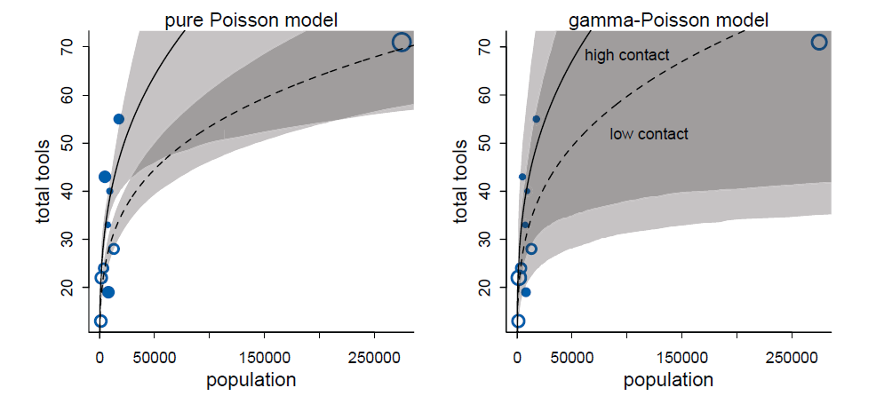

```{r setup, include=FALSE}
options(htmltools.dir.version = FALSE)
options(servr.daemon = TRUE)#para que no bloquee la sesión

load("poisson.RData")

```

```{r xaringan-themer, include=FALSE, warning=FALSE}
library(xaringanthemer)
library(ggplot2)
library(ggthemes)
library(knitr)
library(kableExtra)
library(dplyr)
library(tidyr)
library(rethinking)
library(rstan)

xaringanExtra::use_share_again()
xaringanExtra::use_fit_screen()
xaringanExtra::use_tachyons()

style_solarized_light(
  title_slide_background_color = "#586e75",# base 3
  header_color = "#586e75",
  text_bold_color = "#cb4b16",
  background_color = "#fdf6e3", # base 3
  header_font_google = google_font("DM Sans"),
  text_font_google = google_font("Roboto Condensed", "300", "300i"),
  code_font_google = google_font("Fira Mono"), text_font_size = "28px"
)
# clipboard
htmltools::tagList(
  xaringanExtra::use_clipboard(
    button_text = "Copy code <i class=\"fa fa-clipboard\"></i>",
    success_text = "Copied! <i class=\"fa fa-check\" style=\"color: #90BE6D\"></i>",
    error_text = "Not copied 😕 <i class=\"fa fa-times-circle\" style=\"color: #F94144\"></i>"
  ),
  rmarkdown::html_dependency_font_awesome()
  )
## ggplot theme
theme_Publication <- function(base_size = 14, base_family = "helvetica") {
    (theme_foundation(base_size = base_size, base_family = base_family)
        + theme(plot.title = element_text(face = "bold",
                                          size = rel(1.2), hjust = 0.5),
                text = element_text(),
                panel.border = element_rect(colour = NA),
                panel.background = element_rect(fill = 'transparent'),
                plot.background = element_rect(fill = 'transparent', color = NA),
                axis.title = element_text(face = "bold",size = rel(1)),
                axis.title.y = element_text(angle=90,vjust =2),
                axis.title.x = element_text(vjust = -0.2),
                axis.text = element_text(), 
                axis.line = element_line(colour="black"),
                axis.ticks = element_line(),
                panel.grid.major = element_line(colour=NA),
                panel.grid.minor = element_blank(),
                legend.key = element_rect(colour = NA),
                legend.position = "bottom",
                legend.direction = "horizontal",
                legend.key.size= unit(0.2, "cm"),
                ##legend.margin = unit(0, "cm"),
                legend.spacing = unit(0.2, "cm"),
                legend.title = element_text(face="italic"),
                plot.margin = unit(c(10,5,5,5),"mm"),
                strip.background = element_rect(colour = NA,fill = "transparent"),
                strip.text = element_text(face="bold")
                ))
    
}

## Aux functions
f.rib <- function(X, dpad = 5)
    geom_ribbon(aes(ymin= y - X*dpad, ymax = y + X*dpad), fill = "blue", alpha = 0.01)

make.q <- function(from, to, cfs, normal=TRUE, sig, size=100){
    if(normal)
        df <- data.frame(x = seq(from, to, length =size)) %>%
            mutate(y = cfs[1]+cfs[2]*x,
                   low.1 =  qnorm(0.05, size, mean = y, sd =sig),
                   upp.1 =  qnorm(0.95, size, mean = y, sd =sig),
                   low.2 =  qnorm(0.25, size, mean = y, sd =sig),
                   upp.2 =  qnorm(0.75, size, mean = y, sd =sig))
    else
        df <- data.frame(x = seq(from, to, length =size)) %>%
            mutate(y = cfs[1]+cfs[2]*x,
                   low.1 =  qpois(0.05, size, lambda = y),
                   upp.1 =  qpois(0.95, size, lambda = y),
                   low.2 =  qpois(0.25, size, lambda = y),
                   upp.2 =  qpois(0.75, size, lambda = y))
} 

plot.q <- function(df2, df1){
    ggplot(df2, aes(x, y)) +
        geom_line(col="navy") +
        geom_ribbon(aes(ymin = low.1, ymax = upp.1), fill="blue", alpha =0.25) +
        geom_ribbon(aes(ymin = low.2, ymax = upp.2), fill="blue", alpha =0.25) +
        geom_point(data = df1, color ="red", size=1.25, stroke=1.25)  +
        theme_Publication(18)
    }
```


## Recap

* The key interest in statistical analysis is to find a meaningful relationship 
  between the __response__ variable (usually denoted by $y$) and one or 
  more __explanatory__ variables $x_{i}$

--

* In statistical modeling, minimizing __entropy__ helps derive probability 
distributions under constraints, leading to models that best represent the 
observed data


--

* __Exponential Family Distributions__ commonly used in GLMs

--

* GLM: specify a __likelihood function__

--

* GLM: use a __link function__ to connect predictors 
to the mean of the distribution

---
## Generalized Linear Models

GLMs use probability distributions from the exponential family that best fit 
the constraints defined by the predictors

--

.bg-white.b--brblack.ba.bw2.br3.shadow-5.ph4.mt1[
$$Y_i \sim Zaphod(\theta_i, \phi)$$
$$f(\theta_i) = \alpha + \beta (x_i - \overline{x})$$
]


--

- When the predictor $x_i$ is mean-centered, the intercept $\alpha$ represents
the value of the link function $f(p_i)$ when $x_i$ is at its mean
- The slope $\beta$ still represents the change in $f(p_i)$ for a one-unit
change in $x$

_Zaphod is not a real distribution!_ 

---
## Distributions and link functions


```{r, echo =FALSE}
library(knitr)
library(kableExtra)

# Create the table with LaTeX notation
df <- data.frame(
  Distribution = c("Normal", "Exponential", "Gamma", #"Inverse Gaussian", 
                   "Poisson", "Bernoulli", "Binomial", #"Categorical", 
                   "Multinomial"),
  Support = c("$(-\\infty, +\\infty)$", "$(0, +\\infty)$", "$(0, +\\infty)$", #"$(0, +\\infty)$", 
              "$\\{0,1,2,...\\}$", "$\\{0,1\\}$", "$\\{0,1,...,N\\}$", #"$[0,K)$", 
              "$[0,N]$"),
  Typical_Uses = c("Linear-response data", 
                   "Exponential-response data, scale parameters", 
                   "Various response distributions",
                   "Count of occurrences in fixed time/space", 
                   "Outcome of single yes/no occurrence", 
                   "Count of 'yes' occurrences out of $N$", 
                   "K-vector of integer: $[0, N]$"),
  Link_Name = c("Identity", "Negative inverse", "Inverse", #"Inverse squared",
                "Log", "Logit", "Logit", #"Logit", 
                "Logit"),
  Link_Function = c("$\\mathbf{X} \\boldsymbol{\\beta} = \\mu$", 
                    "$\\mathbf{X} \\boldsymbol{\\beta} = -\\mu^{-1}$", 
                    "$\\mathbf{X} \\boldsymbol{\\beta} = \\mu^{-1}$", 
                    "$\\mathbf{X} \\boldsymbol{\\beta} = \\ln(\\mu)$", 
                    "$\\mathbf{X} \\boldsymbol{\\beta} = \\ln \\left(\\frac{\\mu}{1-\\mu} \\right)$", 
                    "$\\mathbf{X} \\boldsymbol{\\beta} = \\ln \\left(\\frac{\\mu}{N-\\mu} \\right)$", 
                    "$\\mathbf{X} \\boldsymbol{\\beta} = \\ln \\left(\\frac{\\mu}{1-\\mu} \\right)$"),
  Mean_Function = c("$\\mu = \\mathbf{X} \\boldsymbol{\\beta}$", 
                    "$\\mu = - (\\mathbf{X} \\boldsymbol{\\beta})^{-1}$", 
                    "$\\mu = (\\mathbf{X} \\boldsymbol{\\beta})^{-1}$", 
                    "$\\mu = \\exp(\\mathbf{X} \\boldsymbol{\\beta})$", 
                    "$\\mu = \\frac{\\exp(\\mathbf{X} \\boldsymbol{\\beta})}{1 + \\exp(\\mathbf{X} \\boldsymbol{\\beta})}$", 
                    "$\\mu = \\frac{\\exp(\\mathbf{X} \\boldsymbol{\\beta})}{1 + \\exp(\\mathbf{X} \\boldsymbol{\\beta})}$", 
                                        "$\\mu = \\frac{\\exp(\\mathbf{X} \\boldsymbol{\\beta})}{1 + \\exp(\\mathbf{X} \\boldsymbol{\\beta})}$")
)

# Display the table correctly in xaringan
names(df) <- gsub("_", " ", names(df))
kable(df, format = "html", escape = FALSE) %>%  # IMPORTANT: escape = FALSE
  kable_styling(full_width = FALSE, bootstrap_options = c("striped", "hover", "condensed"), 
                font_size = 22) %>%
  column_spec(1, bold = TRUE) %>%
  column_spec(5, width = "6cm") # Adjusting width for clarity


```


---
## Count Data: variation from a Binomial distribution

When a binomial distribution has a very small probability of an event $p$ and a
very large number of trials $n$, then it takes a special shape

.pull-left[
```{r, echo = FALSE, out.width="70%", fig.align="center"}

```

]

--

.pull-right[

```{r, echo = FALSE, out.width="70%", fig.align="center"}

```
]


---
## Count Data: variation from a Binomial distribution


.pull-left[

```{r, echo = FALSE}
include_graphics("figs/monks.jpg")
```


]

.pull-right[

Monastery of copying manuscripts with 1,000 monks, on average, 1 of them produce
a manuscript

```{r, echo = TRUE}
# Simulate for over 10,000 days (1e5)
y <- rbinom(n = 1e5, size = 1000, prob = 1/1000)
c(mean(y), var(y))
```
]

When $\mu$ and $\sigma^2$ of the distribution are equal, this a special case
of a binomial a.k.a. __Poisson__

---
## Count Data: Poisson Regression

$$Y \sim Poisson(\lambda_i)$$
$$log(\lambda_i) = \alpha + \beta x_i $$


For response variables that are non-negative integers. For example, counting
  the number of eggs female lay as a function of their age, body size, etc. 
  You could have the number of new cases of a disease as a function
  of time. 

--

One of the assumptions of this 
  distribution is that the mean $\mu$ and variance $\sigma^2$ are the same and 
  expressed as $\lambda$

---
class: middle, inverse

Poisson __GLM__ with a __log__ link

---
## Poisson Regression

Defining the Poisson regression model:

$$
\begin{align}
y_i \thicksim Poisson(\lambda)
\end{align}
$$

--

Since $\lambda$ is constrained to be positive, it is typical to use the _log_ 
  as the __link__ function. With this we are assuming that the logarithm of the
  parameter $\lambda_i$ depends linearly on the predictors: 
  $\mathbb{E}[\lambda_i] = \mathbb{E}[log(Y_i|x_i)] = \alpha + \beta x_i$
The full model is:

--

$$
\begin{align}
y_i \thicksim Poisson(\lambda) \\
log(\lambda_i) = \alpha + \beta x_i
\end{align}
$$

The logarithm as a link function transforms the relationship between fitted 
  values and the predictors into a linear regression


---
## The Oceanic tool example


.pull-left[

+ Technological evolution in island populations


+ Tool kits of different size: fish hooks, axes, boats, hand plows... 


+ Larger populations will develop and sustain more complex tool kits


+ Oceania: natural variation in population size induced by natural variation in
island size


+ Contact rates effectively increase population size

]


.pull-right[

```{r, echo = FALSE}
include_graphics("figs/McElreath_Fig11_6.png")
```
[Kline et al 2010](https://royalsocietypublishing.org/doi/10.1098/rspb.2010.0452) 
]


---
## Understanding the data and the model

$$ T_i \sim Poisson(\lambda_i)$$
$$ log(\lambda_i) = \alpha + \beta * log(P)$$


.pull-left[

- the number of tools increases with the log of population size 

- the order of magnitude is what matters

- the impact of population on total tool is moderated by __contact__ - *no nation
is an island*

- investigate a positive interaction between population and contact rate


]

.pull-right[
```{r, echo = FALSE, out.width='70%', fig.align='center'}

```

]

---
##  Understanding the data

.pull-left[

```{r}
data(Kline)
head(Kline, c(6, 4))
```
]

.pull-right[

```{r}


d <- Kline

d$P <- scale(log(d$population))
d$contact_id <- ifelse(d$contact == "high", 2, 1)

dat <- list(
  T = d$total_tools, 
  P = d$P, 
  cid = d$contact_id
)
```

]

---
## Build and fit the model: the __prior__


.pull-left[
$$ T_i \sim Poisson(\lambda_i)$$
$$ log(\lambda_i) = \alpha + \beta * log(P)$$
]


.pull-right[

```{r, eval = FALSE}
ulam(
  alist(
    T ~ dpois(lambda), 
    log(lambda) <- a + b * P, 
    a ~ dnorm(3, 0.5), 
    b ~ dnorm(0, ?)
  ), 
  data = dat, chains = 4, log_lik = TRUE
)

```
]


---
## Simulating the priors


Let's simulate curves with two different priors, one with a large variance, and
the other one with a small one

```{r}
set.seed(10)
N <- 100
a <- rnorm(N, 3, 0.5)
b_large <- rnorm(N, 0, 10)
b_small <- rnorm(N, 0, 0.2)

x_seq <- seq(from = log(100), to = log(200000), length.out = 100)

# given that: log(lambda) = a + b * c, then:
lambda_large <- sapply(x_seq,function(x) exp(a + b_large * x))
lambda_small <- sapply(x_seq,function(x) exp(a + b_small * x))
```


---
## Predicted curves based on simulated priors

```{r, fig.align='center', echo = FALSE, out.width="85%"}

```


---
## Priors and the model fit

.pull-left[

Check the prior with $\sigma = 0.2$ in the log scale

```{r, fig.align='center', echo = FALSE, out.width="85%"}

```
]

--

.pull-right[
Fit the model with the prior with the smallest variance
```{r, eval = FALSE}
m01 <- ulam(
  alist(
    T ~ dpois(lambda), 
    log(lambda) <- a + b * P, 
    a ~ dnorm(3, 0.5), 
    b ~ dnorm(0, 0.2)
  ), 
  data = dat, chains = 4, log_lik = TRUE
)

```

]

---
## Comparing prior and posterior distributions


```{r, fig.align='center', echo = FALSE, out.width='50%'}

```


---
## Model coefficients

```{r}
precis(m01)
coef_m01 <- precis(m01)$mean

# predict the number of tools for specific population size - Hawaii
# log(lambda) = a + b * P
lambda_i <- exp(coef_m01[1] + coef_m01[2] * 2.321008320)
lambda_i

Kline[Kline$culture == "Hawaii", 1:4]
```

---
## The link function

__link()__: Apply the inverse link function to a model object and compute model
values


```{r}
# create a sequence of x to use to compute lambda
P_seq <- seq(from = -1.4, to = 3, length.out = 100)
lambda <- link(m01, data = data.frame(P = P_seq)) 
lmu <- apply(lambda, 2, mean) # mean of the simulations
head(lmu)
lci <- apply(lambda, 2, PI) # confidence intervals 
lci[, 1:7]
```


---
## Comparing predictions of model 1 with the data 

```{r, echo = FALSE, fig.align="center", out.width="50%"}

```


---
## Interaction with contact

This means that each category of contact (i.e. low, high) would have an intercept
$\alpha$ and slope $\beta$


$$T_i \sim Poisson(\lambda_i)$$
$$log(\lambda_i) = \alpha_{CID[i]} + \beta_{CID[i]} * log(P)$$

.pull-left[

```{r, eval = FALSE}
m02 <- ulam(
  alist(
    T ~ dpois(lambda), 
    log(lambda) <- a[cid] + b[cid] * P, 
    a[cid] ~ dnorm(3, 0.5),
    b[cid] ~ dnorm(0, 0.2)
  ), 
  data = dat, chains = 4, log_lik = TRUE
)
```
]

.pull-right[

```{r, echo = FALSE, fig.align='center', out.width='60%'}

```

]

---
## Calculating the predicted values using the link() function

__CID 1__

```{r}
# predictions for cid=1 (lowcontact)
lambda1 <- link(m02, data = data.frame(P = P_seq, cid = 1))
lambda1[1:5, 1:8]

lmu1 <- apply(lambda, 2, mean)
lci1 <- apply(lambda, 2, PI)
```


---
## Calculating the predicted values using the link() function

__CID 2__


```{r}
# predictions for cid=2 (highcontact)
lambda2 <- link(m02, data = data.frame(P = P_seq, cid = 2))
lambda2[1:5, 1:8]
lmu2 <- apply(lambda2, 2, mean)
lci2 <- apply(lambda2, 2, PI)
```


---
## Comparing predictions of model 2 with the data 

```{r, echo = FALSE, fig.align="center", out.width="50%"}

```


---
## Underdispersed and overdispersed data

The main feature of the Poisson distribution is that the __mean__ and the 
__variance__ are both equal to $\lambda$

--

The fact that the variance equals the mean is a hard constraint, rarely matched 
by real data

--

When you encounter over-dispersion (i.e., the variance in the data is much 
larger than what assumed by Poisson), you need to choose a different model

--

This happens very often, and one of the solutions is to use is a __Generalized 
Poisson distribution__ or alternatively __Negative Binomial Regression__ 

--

A negative binomial distribution can be thought of as a Poisson with a scaled 
variance, also called __Gamma-Poisson__ distribution


---
class: middle, inverse

A Negative Binomial regression is a special case of a __GLM__ where the response 
follows a __Negative Binomial__ distribution, modeled as a __Gamma-Poisson 
mixture__, and the __log__ function is used as the link function

---
## The distribution of Negative-Binomial or Gamma-Poisson

```{r, echo = FALSE, fig.align="center", out.width="35%"}

```


---

## Poisson Model parameters

- **Poisson Distribution:** $Y \sim \text{Poisson}(\lambda)$

- The Poisson models assume the mean and variance are equal: $E[Y] = \text{Var}(Y) = \lambda$


- This assumption often fails in real-world data

--

## Gamma-Poisson Mixture

- Instead of assuming a fixed $\lambda$, model it as a 
**Gamma-distributed prior**: $\lambda \sim \text{Gamma}(\alpha, \beta)$

- The marginal distribution of $Y$ becomes **Negative Binomial**: $Y \sim \text{NB}(r, p)$

- Where $r = \alpha$ and $p = \frac{\beta}{\beta+1}$

---

## Why Use a Gamma Prior?

- The **Gamma distribution** is conjugate to Poisson $\to$ simplifies Bayesian inference

- There is an **analytical expression** for Poisson probabilities mixed with Gamma-distributed rates

- Poisson distributions are **narrow** (variance = mean), but Gamma-Poisson allows more variation

Therefore, 

it can be used for **modeling count data** with high variance (e.g., ecological epidemiological data)


---
## Fitting a  Negative-Binomial or Gamma-Poisson model 

- A **Negative Binomial model** is also known as a **Gamma-Poisson model**

- It assumes each **Poisson count observation has its own rate**

- This model estimates the **shape of a Gamma distribution** to describe Poisson rates

- Predictor variables **adjust the shape of the distribution, not the expected value** of each observation

---
## Back to the ocean islands example

$$ Y_i ∼ Gamma-Poisson(\lambda_i, \phi)$$

- __ $\lambda$ __ is the __rate__ parameter

- __ $\phi$ __ is a positive parameter that controls for __variance__

- The variance is: $\lambda + \lambda^2/\phi$

- __Larger $\phi$__ means the distribution
is closer to a __pure Poisson process__

---
## Building the model

$$ Y_i ∼ Gamma-Poisson(\lambda_i, \phi)$$

The standard approach in __log-link__ Poisson regression is:

$$\log(\lambda) = \alpha_{CID[i]} + \beta_{CID[i]} * log(P)$$

In this model, an additional scaling factor $g$ is introduced:

$$\log(\lambda) = \alpha_{CID[i]} + \beta_{CID[i]} * log(P) - log(g)$$

This represents a __global normalization__ to prevent uncontrolled growth

---
## Where does __g__ come from?

- Poisson Model: assumes a __fixed $\lambda$__

- Gamma-Poisson Model: Instead of a fixed $\lambda$, assume it follows a __Gamma prior__:

$$\lambda \sim Gamma(\alpha, 1/g)$$

- $g$ acts as a __scaling factor__ controlling dispersion 

- This prior introduces extra variance, leading to a __Negative Binomial__ marginal 
distribution

Thus:

- $\lambda$ is modeled as a hierarchical function of population size
- The global scale parameter $g$ accounts for extra variability in the Poisson process
- Higher $g$ means higher variance, ensuring the model can account for overdispersion


---
## Understanding the model notation

$$\log(\lambda) = \alpha_{CID[i]} + \beta_{CID[i]} * log(P) - log(g)$$

This is also:

$$\lambda = exp(\alpha_{CID[i]} + \beta_{CID[i]} * log(P) - log(g))$$

Using log rules:

$$\lambda = \frac{exp(\alpha_{CID[i]}) P^{\beta_{CID[i]}}}{g}$$

This formulation arises because:

- $g$ comes from the Gamma prior, influencing the variance
- The log transformation ensures $\lambda$ stays positive
- The power-law effect of $P$ enables nonlinear scaling in response predictions


---
## Building the model in R


```{r, echo = FALSE}
dat2 <-list(
  T = d$total_tools,
  P = d$population, # no log transformation
  cid = d$contact_id)

```


.pull-left[

```{r, eval = FALSE}
# The previous model:
m02 <- ulam(
  alist(
    T ~ dpois(lambda), 
    log(lambda) <- a[cid] + b[cid] * P, 
    a[cid] ~ dnorm(3, 0.5),
    b[cid] ~ dnorm(0, 0.2)
  ), 
  data = dat, chains = 4, log_lik = TRUE
)

```

]


.pull-right[
```{r, eval = FALSE}
# Creating a dataset
dat2 <-list(
  T = d$total_tools,
  P = d$population, # no log transformation
  cid = d$contact_id)

# Gamma-poisson model with the scalling factor g
m3 <- ulam(
  alist(
    T ~ dgampois(lambda, phi),
    lambda <- exp(a[cid]) * P ^ b[cid] / g,
    a[cid] ~ dnorm(1, 1),
    b[cid] ~ dexp(1),
    g ~ dexp(1),
    phi ~ dexp(1)
  ),
  data = dat2,
  chains = 4,
  log_lik = TRUE
)

```
]


---
## Comparing predictions of model 3 with the data 

```{r, echo = FALSE, fig.align="center", out.width = "90%"}

```


---

## Conclusion

- The **Negative Binomial** arises naturally from a **Gamma-Poisson** process

- Useful for **modeling overdispersion** in count data

- Widely used in **Bayesian statistics and hierarchical modeling**

- Easy to implement in **R, Stan, JAGS, and other Bayesian frameworks**

---

## Take home messages

- The choice of probability distribution for $Y$ follows the principle of 
__maximum entropy__ under given constraints


--


- __Link functions__ transform nonlinear relationships into linear ones, making 
model interpretation more intuitive


--


- __Generalized Linear Models__ (GLMs) extend classical regression to handle 
different types of response variables (counts, binary outcomes, etc.)


--


- __Overdispersion__ matters! When variance exceeds the mean, Negative Binomial 
models provide a better fit than Poisson


-- 


- Bayesian approaches allow flexible modeling of LMs, GLMs, and mixture models 
using a unified conceptual framework


---
## Further reading

+ Generalized linear models with examples in R (Vol. 53). 
  Dunn, P. K., & Smyth, G. K. (2018) New York: Springer.

+ "Regression models for count data in R." Zeileis, Achim, Christian Kleiber, 
  and Simon Jackman. Journal of statistical software 27.8 (2008): 1-25.
  
+ "Statistical modeling of patterns in annual reproductive rates."
  Brooks, Mollie E., et al. Ecology 100.7 (2019): e02706.
  
  
+ Statistical Rethinking, chapters 11 and 12