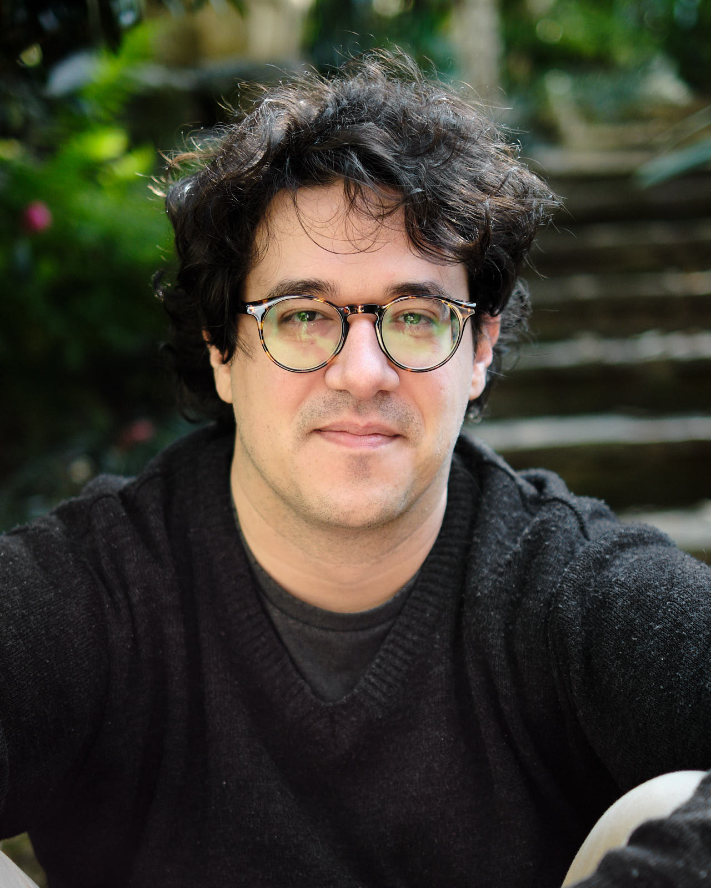

```{r setup, include=FALSE}
knitr::opts_chunk$set(echo = FALSE)
```


## Sara Mortara

Sara's main research interest lies in the structure and dynamics of tropical forests, particularly within the context of ecological restoration. Her work focuses on integrating data from ecological experiments with landscape-level models to support data- and science-driven decision-making, unlocking the potential for restoration at scale. Sara is a biologist with a degree from Escola Superior de Agricultura Luiz de Queiroz (ESALQ), Universidade de São Paulo. She holds a master's degree in Ecology and Conservation from the Universidade Estadual de Santa Cruz (UESC) and a Ph.D. in Ecology from the University of São Paulo. From 2019 to 2020, she worked as a postdoctoral researcher at the Instituto de Pesquisas Jardim Botânico do Rio de Janeiro, applying ecological niche models to restoration projects and teaching R programming in the graduate program. Currently, Sara is a researcher at re.green, a company pioneering large-scale ecological restoration efforts in the Atlantic and Amazon Forests. At re.green, she combines ecological models, experimental data, and multidisciplinary approaches to advance restoration science and practice, contributing to scalable, data-driven restoration solutions. 

## Diogo Melo  

```{r, echo=FALSE, out.width='50%'}

```

Diogo’s main research interest is understanding the evolution of genetic architecture, especially how genetic architecture can restrict and alter evolutionary trajectories, and how selection can shape these restrictions. Most of his work is computational, but he has also worked with data from large quantitative genetics experiments, trying to link theoretical knowledge on genetic effects to what is seen in real populations. His work is centered on the evolution of genetic correlations, a topic he explores using several different approaches, including QTL mapping, experimental evolution, computer simulations, and comparative data. Diogo has an undergraduate degree in biology from the University of São Paulo, where he also obtained a master's degree and a Ph.D. in genetics and evolutionary biology. From 2020 to 2024, he joined Princeton University as an Associate Research Scholar at the Ayroles Lab and lecturer in the Ecology and Evolution Department. He is now 
and assistant professor at the Biology Institute of the University of São Paulo.