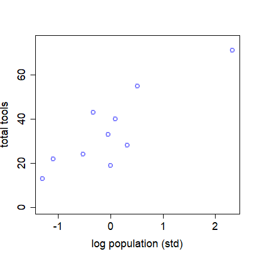

```{r setup, include=FALSE}
options(htmltools.dir.version = FALSE)
options(servr.daemon = TRUE)#para que no bloquee la sesión

load("poisson.RData")

```

```{r xaringan-themer, include=FALSE, warning=FALSE}
library(xaringanthemer)
library(ggplot2)
library(ggthemes)
library(knitr)
library(kableExtra)
library(dplyr)
library(tidyr)
library(rethinking)

xaringanExtra::use_share_again()
xaringanExtra::use_fit_screen()
xaringanExtra::use_tachyons()

style_solarized_light(
  title_slide_background_color = "#586e75",# base 3
  header_color = "#586e75",
  text_bold_color = "#cb4b16",
  background_color = "#fdf6e3", # base 3
  header_font_google = google_font("DM Sans"),
  text_font_google = google_font("Roboto Condensed", "300", "300i"),
  code_font_google = google_font("Fira Mono"), text_font_size = "28px"
)
# clipboard
htmltools::tagList(
  xaringanExtra::use_clipboard(
    button_text = "Copy code <i class=\"fa fa-clipboard\"></i>",
    success_text = "Copied! <i class=\"fa fa-check\" style=\"color: #90BE6D\"></i>",
    error_text = "Not copied 😕 <i class=\"fa fa-times-circle\" style=\"color: #F94144\"></i>"
  ),
  rmarkdown::html_dependency_font_awesome()
  )
## ggplot theme
theme_Publication <- function(base_size = 14, base_family = "helvetica") {
    (theme_foundation(base_size = base_size, base_family = base_family)
        + theme(plot.title = element_text(face = "bold",
                                          size = rel(1.2), hjust = 0.5),
                text = element_text(),
                panel.border = element_rect(colour = NA),
                panel.background = element_rect(fill = 'transparent'),
                plot.background = element_rect(fill = 'transparent', color = NA),
                axis.title = element_text(face = "bold",size = rel(1)),
                axis.title.y = element_text(angle=90,vjust =2),
                axis.title.x = element_text(vjust = -0.2),
                axis.text = element_text(), 
                axis.line = element_line(colour="black"),
                axis.ticks = element_line(),
                panel.grid.major = element_line(colour=NA),
                panel.grid.minor = element_blank(),
                legend.key = element_rect(colour = NA),
                legend.position = "bottom",
                legend.direction = "horizontal",
                legend.key.size= unit(0.2, "cm"),
                ##legend.margin = unit(0, "cm"),
                legend.spacing = unit(0.2, "cm"),
                legend.title = element_text(face="italic"),
                plot.margin = unit(c(10,5,5,5),"mm"),
                strip.background = element_rect(colour = NA,fill = "transparent"),
                strip.text = element_text(face="bold")
                ))
    
}

## Aux functions
f.rib <- function(X, dpad = 5)
    geom_ribbon(aes(ymin= y - X*dpad, ymax = y + X*dpad), fill = "blue", alpha = 0.01)

make.q <- function(from, to, cfs, normal=TRUE, sig, size=100){
    if(normal)
        df <- data.frame(x = seq(from, to, length =size)) %>%
            mutate(y = cfs[1]+cfs[2]*x,
                   low.1 =  qnorm(0.05, size, mean = y, sd =sig),
                   upp.1 =  qnorm(0.95, size, mean = y, sd =sig),
                   low.2 =  qnorm(0.25, size, mean = y, sd =sig),
                   upp.2 =  qnorm(0.75, size, mean = y, sd =sig))
    else
        df <- data.frame(x = seq(from, to, length =size)) %>%
            mutate(y = cfs[1]+cfs[2]*x,
                   low.1 =  qpois(0.05, size, lambda = y),
                   upp.1 =  qpois(0.95, size, lambda = y),
                   low.2 =  qpois(0.25, size, lambda = y),
                   upp.2 =  qpois(0.75, size, lambda = y))
} 

plot.q <- function(df2, df1){
    ggplot(df2, aes(x, y)) +
        geom_line(col="navy") +
        geom_ribbon(aes(ymin = low.1, ymax = upp.1), fill="blue", alpha =0.25) +
        geom_ribbon(aes(ymin = low.2, ymax = upp.2), fill="blue", alpha =0.25) +
        geom_point(data = df1, color ="red", size=1.25, stroke=1.25)  +
        theme_Publication(18)
    }
```


## Recap

* The key interest in statistical analysis is to find a meaningful relationship 
  between the __response__ variable (usually denoted by $y$) and one or 
  more __explanatory__ variables $x_{i}$

--

* In statistical modeling, minimizing __entropy__ helps derive probability 
distributions under constraints, leading to models that best represent the 
observed data


--

* __Exponential Family Distributions__ commonly used in GLMs

--

* GLM: specify a __likelihood function__

--

* GLM: use a __link function__ to connect predictors 
to the mean of the distribution

---
## Generalized Linear Models

GLMs choose the probability distribution from the exponential family that best 
matches the constraints imposed by the predictors

--

.bg-white.b--brblack.ba.bw2.br3.shadow-5.ph4.mt1[
$$Y_i \sim Zaphod(\theta_i, \phi)$$
$$f(\theta_i) = \alpha + \beta (x_i - \overline{x})$$
]


--
- When the predictor $x_i$ is mean-centered, the intercept $\alpha$ represents
the value of the link function $f(p_i)$ when $x_i$ is at its mean
- The slope $\beta$ still represents the change in $f(p_i)$ for a one-unit
change in $x$

_Zaphod is not a real distribution!_ 


---
## Count Data: variation from a Binomial distribution

When a binomial distribution has a very small probability of an event $p$ and a
very large number of trials $n$, then it takes a special shape

.pull-left[
```{r, echo = FALSE, fig.out = '50%'}
include_graphics("figs/binomial.png")
```

]

--

.pull-right[
```{r, echo = FALSE, fig.out = '50%'}
include_graphics("figs/binomial2.png")
```
]


---
## Count Data: variation from a Binomial distribution


.pull-left[

```{r, echo = FALSE}

```


]

.pull-right[

Monastery of copying manuscripts with 1,000 monks, on average, 1 of them produce
a manuscript

```{r, echo = TRUE}
# Simulate for over 10,000 days (1e5)
y <- rbinom(n = 1e5, size = 1000, prob = 1/1000)
c(mean(y), var(y))
```
]

When $\mu$ and $\sigma^2$ of the distribution are equal, this a special case
of a binomial a.k.a. __Poisson__

---
## Count Data: Poisson Regression

$$Y ~ Poisson(\lambda_i)$$
$$log(\lambda_i) = \alpha + \beta(x_i - \overline{x}) $$


For response variables that are non-negative integers. For example, counting
  the number of eggs female lay as a function of their age, body size, etc. 
  You could have the number of new cases of a disease as a function
  of time. 

--

One of the assumptions of this 
  distribution is that the mean $\mu$ and variance $\sigma^2$ are the same and 
  expressed as $\lambda$


---
## Poisson Regression

Defining the Poisson regression model:

$$
\begin{align}
y_i \thicksim Poisson(\lambda)
\end{align}
$$

--

Since $\lambda$ is constrained to be positive, it is typical to use the _log_ 
  as the __link__ function. With this we are assuming that the logarithm of the
  parameter $\lambda_i$ depends linearly on the predictors: 
  $\mathbb{E}[\lambda_i] = \mathbb{E}[log(Y_i|x_i)] = \alpha + \beta x_i$
The full model is:

--

$$
\begin{align}
y_i \thicksim Poisson(\lambda) \\
log(\lambda_i) = \alpha + \beta x_i
\end{align}
$$

The logarithm as a link function transforms the relationship between fitted 
  values and the predictors into a linear regression


---
## The Oceanic tool example


.pull-left[

+ Technological evolution in island populations


+ Tool kits of different size: fish hooks, axes, boats, hand plows... 


+ Larger populations will develop and sustain more complex tool kits


+ Oceania: natural variation in population size induced by natural variation in
island size


+ Contact rates effectively increase population size

]


.pull-right[

```{r, echo = FALSE}

```

]


---
## Understanding the data and the model

$$ T_i \sim Poisson(\lambda_i)$$
$$ log(\lambda_i) = \alpha + \beta * log(P)$$


.pull-left[

- the number of tools increases with the log of population size 

- the order of magnitude is what matters

- the impact of population on total tool is moderated by __contact__ - *no nation
is an island*

- investigate a positive interaction between population and contact rate


]

.pull-right[
```{r, echo = FALSE, out.width='70%', fig.align='center'}
include_graphics("figs/predict_poisson.png")
```

]

---
##  Understanding the data

.pull-left[

```{r}
data(Kline)
head(Kline, c(6, 4))
```
]

.pull-right[

```{r}


d <- Kline

d$P <- scale(log(d$population))
d$contact_id <- ifelse(d$contact == "high", 2, 1)

dat <- list(
  T = d$total_tools, 
  P = d$P, 
  cid = d$contact_id
)
```

]

---
## Build and fit the model

$$ T_i \sim Poisson(\lambda_i)$$
$$ log(\lambda_i) = \alpha + \beta * log(P)$$

.pull-left[

```{r, eval = FALSE}
m01 <- ulam(
  alist(
    T ~ dpois(lambda), 
    log(lambda) <- a + b * P, 
    a ~ dnorm(3, 0.5), 
    b ~ dnorm(0, 0.2)
  ), 
  data = dat, chains = 4, log_lik = TRUE
)

```
]

.pull-right[

```{r, echo = FALSE, fig.align='center', out.width='60%'}

```

]


---
## Model coefficients

```{r}
precis(m01)
coef_m01 <- precis(m01)$mean

# predict the number of tools for specific population size - Hawaii
# log(lambda) = a + b * P
lambda_i <- exp(coef_m01[1] + coef_m01[2] * 2.321008320)
lambda_i

Kline[Kline$culture == "Hawaii", 1:4]
```

---
## The link function

__link()__: Apply the inverse link function to a model object and compute model
values


```{r}
# create a sequence of x to use to compute lambda
P_seq <- seq(from = -1.4, to = 3, length.out = 100)
lambda <- link(m01, data = data.frame(P = P_seq)) 
lmu <- apply(lambda, 2, mean) # mean of the simulations
head(lmu)
lci <- apply(lambda, 2, PI) # confidence intervals 
lci[, 1:7]
```


---
## Comparing predictions with the data 

---
## Interaction with contact

This means that each category of contact (i.e. low, high) would have an intercept
$\alpha$ and slope $\beta$


$$T_i \sim Poisson(\lambda_i)$$
$$log(\lambda_i) = \alpha_{CID[i]} + \beta_{CID[i]} * log(P)$$

.pull-left[

```{r, eval = FALSE}
m02 <- ulam(
  alist(
    T ~ dpois(lambda), 
    log(lambda) <- a[cid] + b[cid] * P, 
    a[cid] ~ dnorm(3, 0.5),
    b[cid] ~ dnorm(0, 0.2)
  ), 
  data = dat, chains = 4, log_lik = TRUE
)
```
]

.pull-right[

```{r, echo = FALSE, fig.align='center', out.width='60%'}

```

]

---
## Comparing predictions with the data 


---
## Underdispersed and overdispersed data

The main feature of the Poisson distribution is that the __mean__ and the 
__variance__ are both equal to $\lambda$

--

The fact that the variance equals the mean is a hard constraint, rarely matched 
by real data

--

When you encounter over-dispersion (i.e., the variance in the data is much 
larger than what assumed by Poisson), you need to choose a different model

--

This happens very often, and one of the solutions is to use is a __Generalized 
Poisson distribution__ or alternatively __Negative Binomial Regression__ 
(a negative binomial distribution can be thought of as a Poisson with a scaled 
variance)


---
## Negative Binomial Regression

Fitting a Negative binomial amounts to fitting:

$$
\begin{align}
\mathbb{E}[\lambda_i] = \alpha + \beta x_i
\end{align}
$$

and 

$$
\begin{align}
\mathbb{V[\lambda]} = \mathbb{E}[\lambda_i^2] - \mathbb{E}[\lambda_i]^2 = \phi \lambda 
\end{align}
$$
where $\phi$ controls the dispersion of the data

--

A value $\phi > 1$ signals over-dispersion, while (the very rare case of) 
$\phi<1$ under-dispersion. The Poisson regression is appropriate only
when $\phi \approx 1$

--

A simple way to test for dispersion is to fit a _quasipoisson_ model, which 
returns a dispersion parameter (anything larger than 1 means over-dispersion)


---
## Other GLMs

Historically, GLMs have been defined for the canonical families:

* __Gaussian__: linear regression
* __Gamma and Inverse Gaussian__: Positive, continuous
* __Poisson__: count data
* __Negative Binomial__: count data (fit an ancillary parameter for over-dispersion)
* __Binary/Binomial (logistic)__: binary responses; number of successes;
  probabilities/proportions

--

There are also 'non-canonical' GLMs, that use the same general idea:

* __Log-normal__: Positive, continuous
* __Log-gamma__: survival models
* __Probit__: binary

---
## Further reading

+ Generalized linear models with examples in R (Vol. 53). 
  Dunn, P. K., & Smyth, G. K. (2018) New York: Springer.

+ "Regression models for count data in R." Zeileis, Achim, Christian Kleiber, 
  and Simon Jackman. Journal of statistical software 27.8 (2008): 1-25.
  
+ "Statistical modeling of patterns in annual reproductive rates."
  Brooks, Mollie E., et al. Ecology 100.7 (2019): e02706.
  
  
