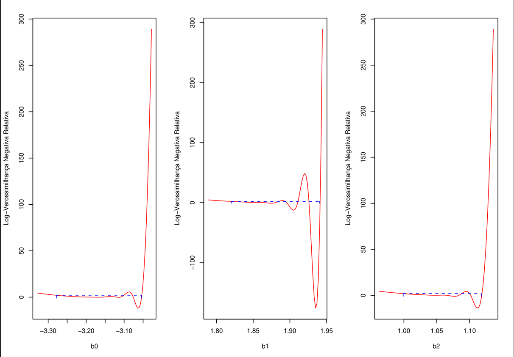

```{r setup, include=FALSE}
options(htmltools.dir.version = FALSE)
options(servr.daemon = TRUE)#para que no bloquee la sesión
knitr::opts_chunk$set(eval = TRUE, echo = FALSE, warning = FALSE, message = FALSE)
library(sads)
library(dplyr)
```

```{r xaringan-themer, include=FALSE, warning=FALSE}
library(xaringanthemer)
library(ggplot2)
library(ggthemes)
style_duo_accent(
  primary_color = "#03045E",
  secondary_color = "#669bbc",
  colors = c(
    red = "#A70000",
    white = "#FFFFFF",
    black = "#181818"
  ),
  text_bold_color = "#03045E",
  header_font_google = google_font("Roboto Condensed"),
  text_font_google = google_font("Roboto Condensed", "300", "300i"),
  code_font_google = google_font("Fira Mono"), text_font_size = "28px"
)
xaringanExtra::use_share_again()
xaringanExtra::use_fit_screen()
xaringanExtra::use_tachyons()
xaringanExtra::use_tile_view()
# clipboard
htmltools::tagList(
  xaringanExtra::use_clipboard(
    button_text = "Copy code <i class=\"fa fa-clipboard\"></i>",
    success_text = "Copied! <i class=\"fa fa-check\" style=\"color: #90BE6D\"></i>",
    error_text = "Not copied 😕 <i class=\"fa fa-times-circle\" style=\"color: #F94144\"></i>"
  ),
  rmarkdown::html_dependency_font_awesome()
  )
## ggplot theme
theme_Publication <- function(base_size=14, base_family="helvetica") {
    (theme_foundation(base_size=base_size, base_family=base_family)
        + theme(plot.title = element_text(face = "bold",
                                          size = rel(1.2), hjust = 0.5),
                text = element_text(),
                panel.background = element_rect(colour = NA),
                plot.background = element_rect(colour = NA),
                panel.border = element_rect(colour = NA),
                axis.title = element_text(face = "bold",size = rel(1)),
                axis.title.y = element_text(angle=90,vjust =2),
                axis.title.x = element_text(vjust = -0.2),
                axis.text = element_text(), 
                axis.line = element_line(colour="black"),
                axis.ticks = element_line(),
                panel.grid.major = element_line(colour="#f0f0f0"),
                panel.grid.minor = element_blank(),
                legend.key = element_rect(colour = NA),
                legend.position = "bottom",
                legend.direction = "horizontal",
                legend.key.size= unit(0.2, "cm"),
                ##legend.margin = unit(0, "cm"),
                legend.spacing = unit(0.2, "cm"),
                legend.title = element_text(face="italic"),
                plot.margin=unit(c(10,5,5,5),"mm"),
                strip.background=element_rect(colour="#f0f0f0",fill="#f0f0f0"),
                strip.text = element_text(face="bold")
                ))
    
}
## Aux functions
f.rib <- function(X, dpad = 5)
    geom_ribbon(aes(ymin= y - X*dpad, ymax = y + X*dpad), fill = "blue", alpha = 0.01)

make.q <- function(from, to, cfs, normal=TRUE, sig, size=100){
    if(normal)
        df <- data.frame(x = seq(from, to, length =size)) %>%
            mutate(y = cfs[1]+cfs[2]*x,
                   low.1 =  qnorm(0.05, size, mean = y, sd =sig),
                   upp.1 =  qnorm(0.95, size, mean = y, sd =sig),
                   low.2 =  qnorm(0.25, size, mean = y, sd =sig),
                   upp.2 =  qnorm(0.75, size, mean = y, sd =sig))
    else
        df <- data.frame(x = seq(from, to, length =size)) %>%
            mutate(y = cfs[1]+cfs[2]*x,
                   low.1 =  qpois(0.05, size, lambda = y),
                   upp.1 =  qpois(0.95, size, lambda = y),
                   low.2 =  qpois(0.25, size, lambda = y),
                   upp.2 =  qpois(0.75, size, lambda = y))
} 

plot.q <- function(df2, df1){
    ggplot(df2, aes(x, y)) +
        geom_line(col="navy") +
        geom_ribbon(aes(ymin = low.1, ymax = upp.1), fill="blue", alpha =0.25) +
        geom_ribbon(aes(ymin = low.2, ymax = upp.2), fill="blue", alpha =0.25) +
        geom_point(data = df1, color ="red", size=1.25, stroke=1.25)  +
        theme_Publication(18)
    }
```

# Recap

* The likelihood is a function for the support of data to a
  statistical model;

--

* The maximum likelihood method (ML) fits a statistical model by finding
  the values of the parameters of a model that maximizes the
  likelihood function (or the log-likelihood).  

--

* We call the values of the parameters fitted by ML the *maximum likelihood estimates* (**MLE*).

---

# Today we'll see ...

How to use the likelihood function and MLEs of a fitted model to:

1. To compare the support data gives to alternative models;
2. To make inferences about MLEs


---

# Inferences about competing models

```{r }
set.seed(4)
df1 <- data.frame(x = runif(21))
df1$y = exp((df1$x-0.3)^2) -1
sim1 <- matrix(rnorm(length(df1$x)*10, mean = df1$y,sd =0.1), ncol = 10)
df1 <- cbind(df1, sim1)
names(df1)[3:12] <- paste("y",1:10, sep="")

f2 <- function(i, data = df1)
    lm(data[,i] ~ x + I(x^2), data = data)

f5 <- function(i, data = df1)
    lm(data[,i] ~ x + I(x^2) + I(x^3) + I(x^4) + I(x^5), data = data)

dg1 <- lapply(3:12, function(i) lm(df1[,i]~x, data = df1))
dg2 <- lapply(3:12, f2)
dg5 <- lapply(3:12, f5)

newdata <- data.frame(x = seq(0,1, length=100))

```

.pull-left[

**The truth:**

$$
\begin{align}
y_i &\sim \mathcal{N}(\mu_i, \sigma) \\
\mu_i & = e^{(x_i - 0.3)^2} -1 \\
\sigma & = C \\
\end{align}
$$

]

.pull-right[
.center[
```{r }
par(las=1, mar=c(6,7,4,2)+0.1,
    mgp=c(5,1,0),
    cex.lab=2, cex.axis=1.8, cex.main = 2.25)
plot(y1 ~ x, data=df1, xlab ="X", ylab ="Y", pch=19,
     ylim=c(-.3,0.8))
curve(exp((x-0.3)^2) -1, lwd=1.5, add = TRUE, col="blue")
curve(qnorm(0.025, exp((x-0.3)^2) -1, 0.1), lty=2, add = TRUE, col="blue")
curve(qnorm(0.975, exp((x-0.3)^2) -1, 0.1), lty=2, add = TRUE, col="blue")
```
]]

---

.pull-left[

### The models

$$
\begin{align}
\textbf{M1}: & \mu_i = \beta_0 + \beta_1 x_i + \beta_2 {x_i}^2\\[1em]
\textbf{M2}: & \mu_i = \beta_0 + \beta_1 x_i + \beta_2 {x_i}^2 + \\
&+ \beta_3 {x_i}^3  + \beta_4 {x_i}^4 + \beta_5 {x_i}^5
\end{align}
\\
$$


### Likelihood ratio

$\frac{\mathcal{L}_{M2}}{\mathcal{L}_{M1}}=$ ```r  as.numeric(round((exp((logLik(dg5[[1]])) - logLik(dg2[[1]]))),1))```

]

.pull-right[
.center[

```{r }
par(las=1, mar=c(6,7,4,2)+0.1,
    mgp=c(5,1,0),
    cex.lab=2, cex.axis=1.8, cex.main = 2.25)
plot(y1~x, data=df1, xlab ="X", ylab ="Y", pch=19)
lines(predict(dg2[[1]], newdata=newdata)~newdata$x, col="blue")
lines(predict(dg5[[1]], newdata=newdata)~newdata$x, col ="red")
legend("topleft", c("Model 1", "Model 2"),
       lty=1, col=c("blue", "red"), bty="n", cex=1.5)
```
]]

---

# Overfitting

.pull-left[

```{r , echo=TRUE}
M2 <- lm(y1 ~ x + I(x^2) + I(x^3) +
             I(x^4) + I(x^5), data = df1)
summary(M2)$coefficients[,1:2]
```

> To make inferences about unique features of the data at hand, as if they applied to all (or most all) samples (hence the population).
>
.right[Burham & Anderson (2002).]
]

.pull-right[
.center[
```{r }
par(las=1, mar=c(6,7,4,2)+0.1,
    mgp=c(5,1,0),
    cex.lab=2, cex.axis=1.8, cex.main = 2.25)
dg5.p <- lapply(dg5, function(x) predict(x, newdata=newdata)) 
plot(df1[,3]~df1$x, xlab ="X", ylab ="Y", pch=19, type="n",
     ylim = c(min(sapply(dg5.p, min)), max(sapply(dg5.p, max))))
invisible(sapply(dg5.p, function(x) lines(x ~ newdata$x, col ="grey")))
curve(exp((x-0.3)^2) -1, lwd=2, add = TRUE, col="blue")

```
]
]


---

# Underfitting

.pull-left[


> Failure to identify features in the data-generating process that are
> strongly replicable.
>
.right[Burham & Anderson (2002).]
]

.pull-right[
.center[
```{r }
par(las=1, mar=c(6,7,4,2)+0.1,
    mgp=c(5,1,0),
    cex.lab=2, cex.axis=1.8, cex.main = 2.25)
dg1.p <- lapply(dg1, function(x) predict(x, newdata=newdata)) 
plot(df1[,3]~df1$x, xlab ="X", ylab ="Y", pch=19, type="n",
     ylim = c(min(sapply(dg1.p, min)), max(sapply(dg1.p, max))))
invisible(sapply(dg1.p, function(x) lines(x ~ newdata$x, col ="grey")))
curve(exp((x-0.3)^2) -1, lwd=2, add = TRUE, col="blue")
```
]
]

---

# A good fit


.pull-left[

```{r , echo=TRUE}
M1 <- lm(y1 ~ x + I(x^2), data = df1)
summary(M1)$coefficients[,1:2]
```
]

.pull-right[
.center[
```{r }
par(las=1, mar=c(6,7,4,2)+0.1,
    mgp=c(5,1,0),
    cex.lab=2, cex.axis=1.8, cex.main = 2.25)
dg2.p <- lapply(dg2, function(x) predict(x, newdata=newdata)) 
plot(df1[,3]~df1$x, xlab ="X", ylab ="Y", pch=19, type="n",
     ylim = c(min(sapply(dg2.p, min)), max(sapply(dg2.p, max))))
invisible(sapply(dg2.p, function(x) lines(x ~ newdata$x, col ="grey")))
curve(exp((x-0.3)^2) -1, lwd=2, add = TRUE, col="blue")
```
]
]


---

# Akaike information criterion

.left-column[
.center[

Hirotugu Akaike (1997-2009)
]]

.right-column[

H. Akaike deduced a correction for the estimation bias in likelihoods, later named in his honor:

$$\textrm{AIC} \, = \, -2\, \textbf{L}_y(\widehat{\theta}) + 2\,K$$

Where $\textbf{L}_y(\widehat{\theta})$ is log-likelihood of a model, evaluated at the MLE's (that is, the maximum log-likelihood of a fit); and $K$ is the number of model parameters.

]


---


# Akaike information criterion

.left-column[
.center[

Hirotugu Akaike (1997-2009)
]]

.right-column[

$$\textrm{AIC} \, = \, -2\, \textbf{L}_y(\widehat{\theta}) + 2\,K$$


AIC estimates a statistical distance between two probability distributions: the true one, which is the reference, and a given model fitted to a sample from the true distribution.

AIC is an estimate of the information of the underlying (true) distribution that is preserved by a model. 

More specifically, AIC is an estimate of the Kullback-Leibler divergence (or K-L relative entropy) of the model to the reference true distribution that generated the data.
]


---

# How to use AIC

* AIC expresses distance to the true model, or loss of information by the fitted model;

* Thus, the model with the lowest value of AIC among a set of
  competing models is the most plausible one (or best supported by the
  data);
  
* Canonic rule: models that differ $\leq 2$ in their AIc values are
  equally supported by data;

* To ease model selection, we calculate $\Delta \mathrm{AIC}$: 
$$\Delta_i \, = \, \textrm{AIC}_i - \min (\textrm{AIC})$$

* The best supported , or more plausible, model will have $\Delta_i = 0$

---

# AICc: correction for small samples

For  $n/K \, < \,40$, use:


$$ \textrm{AICc} \, = \, -2\,\textbf{L}_y(\widehat{\theta}) + 2\,K \left(\frac{n}{n-K-1}\right) $$


Where $n$ is the sample size.

---

# Evidence weights 

$$w_i\,=\, \frac{e^{-1/2 \Delta_i}}{\sum e^{-1/2 \Delta_i}}$$

* Evidence or Akaike weights sum up one;

* Thus, $w_i$ express the relative support of each model in the set of competing models, in a standardized scale;

* In a frequentist approach, $w_i$ estimates the probability that each
  model will be the best supported one, if you repeat the sample and then the selection many
  times.


---

# Model selection with AIC: example

.pull-left[


```{r , echo=TRUE}
library(bbmle)
M0 <- M1 <- lm(y1 ~ x, data = df1)
M1 <- lm(y1 ~ x + I(x^2), data = df1)
M2 <- lm(y1 ~ x + I(x^2) + I(x^3) +
             I(x^4) + I(x^5), data = df1)
AICctab(M0, M1, M2, logLik=TRUE, base = TRUE,
        weights = TRUE, nobs = nrow(df1))
```

]


.pull-right[
.center[

```{r }
par(las=1, mar=c(6,7,4,2)+0.1,
    mgp=c(5,1,0),
    cex.lab=2, cex.axis=1.8, cex.main = 2.25)
plot(y1~x, data=df1, xlab ="X", ylab ="Y", pch=19)
lines(predict(dg1[[1]], newdata=newdata)~newdata$x, col ="green")
lines(predict(dg2[[1]], newdata=newdata)~newdata$x, col="blue")
lines(predict(dg5[[1]], newdata=newdata)~newdata$x, col ="red")
legend("topleft", c("Model 0", "Model 1", "Model 2"),
       lty=1, col=c("green", "blue", "red"), bty="n", cex=1.5)
```
]]


---

# Final remarks on AIC

   * Ties can and do happen: more than one model with $\Delta_i < 2$
   tell us that the data does not contain enough evidence to spot
   the best model;
   
   * Model selection with AIC is not a statistical test; 
   
   * Model selection is restricted to competing models: if all
     competing models are bad, the selected model will just be the
     least bad.
   
   * AIC does not express goodness of fit. The selected model can still have a poor fit; 
   
   * AIC cannot be used to compare models fitted to different datasets; 
   
   * For the same reason, the AIC cannot be used to compare models
     fitted to transformed and untransformed data.
   
---

# Inference about parameters 

```{r }
Birds <- read.csv("DatasetS1-IndivBirdParasiteLoad.csv")
Birds.m <- 
    Birds %>%
    group_by(BirdSpecies) %>%
    summarise(m.Mh = mean(Mh.g.), m.Wp = mean(Wp.tot),
              lm.Mh = log10(m.Mh), lm.Wp = log10(m.Wp))


## starting values
Bird.m0 <- lm(lm.Wp~lm.Mh, data=Birds.m)
cfs <- list(coef(Bird.m0)[1], coef(Bird.m0)[2], summary(Bird.m0)$sigma)
names(cfs) <- c("beta0", "beta1", "sigma")

Birds.m1 <- mle2(lm.Wp ~ dnorm(beta0 + beta1* lm.Mh, sd =sigma),
                 start = cfs,
                 data = Birds.m,
                 parameters=list(beta0~1, beta1~1, sigma ~1))
Birds.p <- profile(Birds.m1)
```

.pull-left[

### Log-likelihood profiles

* A plot of the minimum of the **negative log-likelihood** value as a
function of a single parameter;

* Y-axis standardized such as its minimum is zero.

* **Canonical rule**: all parameter values within 2 units of the relative
  negative log-likelihood are equally plausible.

]

.pull-right[
.center[
```{r }
par(las=1, mar=c(6,7,4,2)+0.1,
    mgp=c(5,1,0),
    cex.lab=2, cex.axis=1.8, cex.main = 2.25)
plotprofmle(Birds.p, which =3, lwd =2) 	
```
]]

---

# Danger Will Robinson!

.pull-left[
.center[
[](https://www.youtube.com/watch?v=_U-7L1tmBAo)
]
]

.pull-right[
.center[

]]

---

# Example: scaling of parasite loads

.pull-left[
* The biomass of bird ectoparasites is proportional to the $2/3$
power of host body mass.
* Data: Average body biomass and average ectoparasites mass per bird for 42
   bird species.
* Simple linear regression of log of average parasite biomass as the response, and log of average body mass as the predictor variable.
 
.footnote[Hechinger et al. Proc. R. Soc, 2019]
 ]


.pull-right[
.center[
```{r }
par(las=1, mar=c(6,7,4,2)+0.1,
    mgp=c(5,1,0),
    cex.lab=2, cex.axis=1.8, cex.main = 2.25)
plot(lm.Wp ~ lm.Mh, data = Birds.m,
     xlab = "log Average body mass (g)",
     ylab = "log Average parasite mass (g)",
     pch=19, col="blue")
```
]]

---

# Plausibility intervals

.pull-left[
.center[

```{r }
par(las=1, mar=c(6,7,4,2)+0.1,
    mgp=c(5,1,0),
    cex.lab=2, cex.axis=1.8, cex.main = 2.25)
plotprofmle(Birds.p, which =2, lwd =2)
arrows(x0 = 2/3, y0= -0.2, x1=2/3, y=.5, code =1, lwd = 2)
```
]
]

.pull-right[
.center[
```{r }
par(las=1, mar=c(6,7,4,2)+0.1,
    mgp=c(5,1,0),
    cex.lab=2, cex.axis=1.8, cex.main = 2.25)
plot(lm.Wp ~ lm.Mh, data = Birds.m,
     xlab = "log Average body mass (g)",
     ylab = "log Average parasite mass (g)",
     pch=19, col="blue")
abline(Bird.m0, lwd= 1.5)
```
]]

---

# Plausibility x confidence intervals

.pull-left[
.center[
```{r }
par(las=1, mar=c(6,7,4,2)+0.1,
    mgp=c(5,1,0),
    cex.lab=2, cex.axis=1.8, cex.main = 2.25)
plot(Birds.p, which =2)
arrows(x0 = 2/3, y0= -0.1, x1=2/3, y=.5, code =1, lwd = 2)
```
]
]


.pull-right[
.center[
```{r }
par(las=1, mar=c(6,7,4,2)+0.1,
    mgp=c(5,1,0),
    cex.lab=2, cex.axis=1.8, cex.main = 2.25)
plotprofmle(Birds.p, which =2, lwd =2)
arrows(x0 = 2/3, y0= -0.2, x1=2/3, y=1, code =1, lwd = 2)
```
]
]

---


# Further reading

+ Introduction, and Information and likelihood theory. chapters 1-2
  **in** Burnham, K. P., & Anderson, D. R. (2002). Model Selection and
  Multimodel Inference: A Practical-Theoretic Approach, 2nd ed. New
  York, Springer-Verlag.

+   Likelihood and all that. chapter 6 *in* Bolker, B.M. 2008 Ecological
    Models and Data in R. Princeton: Princeton University Press.
