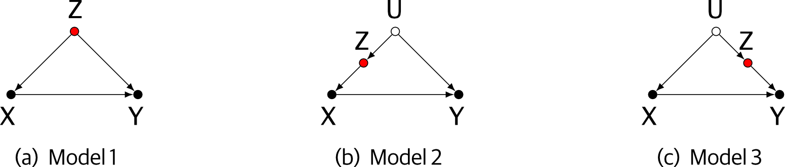
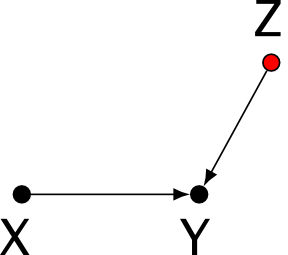
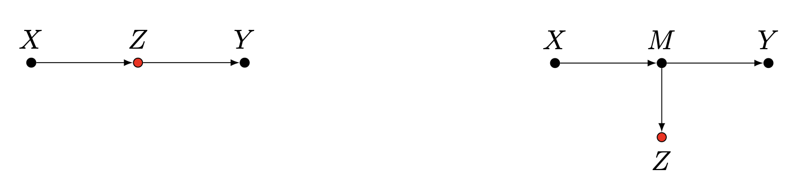
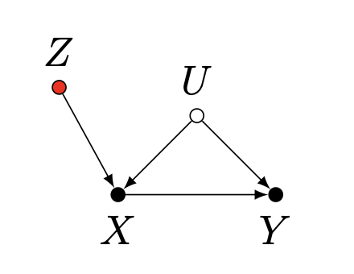

```{r setup, include=FALSE, eval =TRUE}
Sys.setenv(RSTUDIO_PANDOC="/opt/homebrew/bin/")
knitr::opts_chunk$set(echo = TRUE, eval =FALSE)
```

# Relembrando regressão múltipla

Na [regressão linear múltipla](../03_linear_models/lab2.html), o valor esperado da resposta é uma **combinação linear** das variáveis preditoras:

$$
\begin{aligned} 
  y_i &\sim Normal(\mu_i, \sigma) \\
  \mu_i &= \sum_j \beta_j x_{ij} \\
\end{aligned} 
$$

Este modelo é ajustado encontrando os valores de $\beta_j$ que fornecem a melhor predição da resposta esperada (ou média) $\mu_i$. Se os preditores são causas independentes da resposta, os coeficientes estimados $\beta_j$ expressam os efeitos isolados de cada preditor sobre a resposta. Você pode verificar isso criando uma variável Gaussiana com um valor médio que é a soma de dois preditores independentes:

```{r,  eval=FALSE }
set.seed(42)
x1 <- runif(1000)
x2 <- runif(1000)
y <- rnorm(1000, mean = x1 + x2, sd = 0.5)
```

e então comparando os coeficientes da regressão múltipla com aqueles da regressão simples em cada preditor individual:

```{r , eval=FALSE }
coef( lm(y ~ x1 + x2) )
coef( lm(y ~ x1) )
coef( lm(y ~ x2) )
```

O que acontece se os preditores não são independentes? Simule dois preditores que compartilham uma causa comum, ou seja, uma variável desconhecida $u$. A causa comum cria uma correlação entre os dois preditores:

```{r , eval=FALSE }
u <- runif(100)
x1 <- rnorm(100, mean = u, sd =0.1)
x2 <- rnorm(100, mean = u, sd =0.1)
y <-  rnorm(100, mean = x1 + x2, sd =0.1)
plot(x2 ~ x1)
```

E agora os coeficientes de cada preditor no modelo múltiplo são muito menores que seus efeitos isolados (estimados a partir de regressões simples):

```{r , eval=FALSE }
coef( lm(y ~ x1 + x2) )
coef( lm(y ~ x1) )
coef( lm(y ~ x2) )
```

Isso acontece porque os coeficientes de uma regressão múltipla expressam **efeitos parciais ou controlados**, ou seja, os efeitos diretos de cada preditor quando todos os outros preditores são mantidos constantes (e não são contabilizados por outros preditores). Assim, os coeficientes de uma regressão múltipla para um preditor $x_1$ correspondem aos coeficientes de uma regressão simples da resposta em função dos **resíduos** de $x_1$ em relação a todos os outros preditores $x_i$.

Calcule os resíduos dos preditores $x_1$ e $x_2$ um em relação ao outro e plote $y$ em função de cada uma dessas variáveis residuais:

```{r, eval=FALSE }
x1_res <- residuals( lm(x1 ~ x2) )
x2_res <- residuals( lm(x2 ~ x1) )

par(mfcol = c(2,2))
plot(y ~ x1, main = "y ~ x1")
abline( lm(y ~ x1) )
plot(y ~ x1_res, main = "y ~ x1|x2", xlab = "residuals of x1 ~ x2")
abline( lm(y ~  x1_res))
plot(y ~ x2, main = "y ~ x2")
abline( lm(y ~x2) )
plot(y ~ x2_res, main = "y ~ x2|x1", xlab = "residuals of x2 ~ x1")
abline( lm(y ~  x2_res))
par(mfcol = c(1,1))
```

Os coeficientes de $x_1$ e $x_2$ na regressão múltipla são as inclinações das linhas na linha inferior dos gráficos na figura acima. Essas inclinações são menores que as da regressão linear com os valores brutos dos preditores (primeira linha de gráficos acima). Você pode verificar isso comparando os coeficientes dessas regressões com os coeficientes da regressão múltipla:

```{r , eval=FALSE }
coef( lm(y ~ x1 + x2) )
coef( lm(y ~x1_res) )
coef( lm(y ~x2_res) )
```

Em resumo, coeficientes de regressão múltipla expressam efeitos diretos, controlados por todos os outros preditores. A inferência dos caminhos causais por trás desses efeitos parciais não é trivial, porque tais efeitos podem ter diferentes significados. Variáveis independentes em uma regressão múltipla podem desempenhar diferentes papéis, como confundidores, mediadores ou proxies. Se você entender isso, pode inferir alguns aspectos importantes dos padrões causais a partir de diferentes modelos lineares.

# Bons controles

Ao ajustar modelos causais, frequentemente é necessário adicionar covariáveis a um modelo linear para identificar corretamente o efeito de interesse. Isso significa executar uma regressão múltipla na qual um dos coeficientes está relacionado ao caminho causal de interesse, e os outros são adicionados ao modelo para bloquear caminhos não-causais. Muitos dos exemplos neste tutorial são de [Cinelli, Carlos, Andrew Forney, and Judea Pearl. "A crash course in good and bad controls." Sociological Methods & Research (2021): 00491241221099552.](https://ftp.cs.ucla.edu/pub/stat_ser/r493.pdf)

Por exemplo, nos seguintes DAGs, onde X, Y e Z são observados, e U não é observado:



Sempre há uma causa comum compartilhada entre X e Y, e estimar o efeito de X em Y requer bloquear este caminho não-causal, incluindo a causa compartilhada (ou variável de confusão) como controle no modelo. A variável Z pode ser usada como covariável em todos os casos, mesmo na presença do confundidor não observado U.

Vamos verificar isso simulando o DAG no modelo 2:

```{r, eval=FALSE }
N = 100
U = rnorm(N)
b_zu = 0.5
Z = rnorm(N, b_zu * U)
b_xz = 0.8
X = rnorm(N, b_xz * Z)
b_yu = 1
b_yx = 1
Y = rnorm(N, b_yu * U + b_yx * X)

lm(Y ~ X) |> coef() # Enviesado pelo caminho não-causal, efeito de X é superestimado
lm(Y ~ X + Z) |> coef() # Não enviesado, efeito de X está correto e igual a b_yx
```

A mesma lógica se aplica se o confundidor é mediado por outra variável M:


Z deve ser adicionado como covariável em todos estes casos.

__Questão__: Se estamos interessados no efeito de X em Y, M também poderia ser adicionado ao modelo? Explique.

__Exercício__: Escolha um destes DAGs e execute uma simulação, explore o efeito de adicionar Z ou M como covariáveis.

## Controles razoavelmente bons

Algumas covariáveis podem ser adicionadas a um modelo não para evitar viés, mas para aumentar a precisão. Por exemplo, no seguinte DAG:

```{r, out.height=100, out.width=100, echo=FALSE,  eval =TRUE}

```

Neste caso, adicionar Z como covariável aumenta a precisão da estimativa do efeito de X em Y.

Novamente, vamos verificar usando simulações e então verificar as distribuições posteriores dos efeitos estimados de X em Y:

```{r, eval=FALSE }
set.seed(2)
N = 200
X = rnorm(N)
Z = rnorm(N)
b_yx = 1
b_yz = 2
Y = rnorm(N, b_yx * X + b_yz * Z)
## Ajusta modelos sem e com a variável Z como covariável
m_yx = lm(Y ~ X) 
m_yxz = lm(Y ~ X + Z) 

# Intervalos de confiança do coeficiente de X
confint(m_yx)["X",]
confint(m_yxz)["X",]

# Plot do intervalo de confiança do coeficiente de X nos dois modelos
plot(1:2, c(coef(m_yx)["X"], coef(m_yxz)["X"]), 
      ylim = c(-1, 3), xlim = c(0, 3), 
      xlab = "Modelo", ylab = "Coeficiente de X", 
      xaxt = "n", pch = 19, col = 2)
arrows(1, confint(m_yx)["X",1], 1, confint(m_yx)["X",2], angle = 90, code = 3, length = 0.1)
arrows(2, confint(m_yxz)["X",1], 2, confint(m_yxz)["X",2], angle = 90, code = 3, length = 0.1)
axis(1, at = 1:2, labels = c("Sem Z", "Com Z"))

```

As distribuições posteriores do coeficiente para X têm a mesma média, mas variâncias diferentes. Isso acontece porque adicionar a covariável remove parte da variação em Y que não está associada com X, o que diminui a variância do efeito estimado de X (ou aumenta sua precisão, que é a mesma coisa).

__Questão__: E se Z é uma causa de X, não de Y. Adicionar Z à regressão ajudaria neste caso?

# Maus controles

Duas classes de maus controles são o viés pós-tratamento ou viés de supercontrole, e a amplificação de viés.

Nos seguintes DAGs, controlar por Z levaria a uma subestimativa do efeito de X em Y.

```{r, out.height=150, out.width=550, echo=FALSE, eval =TRUE}

```

No seguinte caso, controlar por Z levaria a um aumento no viés causado pela variável não observada U.

```{r, out.height=150, out.width=210, echo=FALSE, eval =TRUE}

```

__Exercício__: Simule o exemplo de amplificação de viés e verifique o efeito de incluir a variável Z no modelo.

## AIC e significância não vão ajudar você

Para explorar o efeito de uma variável de controle ruim, vamos simular um colisor:

```{r, eval=FALSE }
# DAG : X -> Z <- Y
N = 200
X = rnorm(N)
Y = rnorm(N)
Z = rnorm(N, Y + X)

m1 = lm(Y~X)   # Modelo correto
m2 = lm(Y~X+Z) # Modelo incluindo o colisor
```

Primeiro, vamos olhar para a significância das variáveis em ambos os modelos:

```{r, eval=FALSE }
summary(m1)
summary(m2)
```

Não incluir Z dá a estimativa correta de nenhum efeito de X em Y, mas o modelo incluindo Z nos diz que tanto X quanto Z têm efeitos significativos em Y. Por que isso?

Muitos pesquisadores interpretariam os resultados significativos no modelo 2 como evidência de que tanto X quanto Z afetam Y, não cometa este erro! Modelos estatísticos são cegos para causas, eles apenas capturam associações.

E quanto ao AIC? A comparação de modelos identificaria o modelo correto?

```{r, eval=FALSE }
library(bbmle)
AICctab(m1, m2, mnames = c("Correto", "Enviesado"),
        base=TRUE, weights = TRUE, nobs = N)
```

O modelo enviesado também é selecionado pelo AIC. Isso não é surpreendente, já que a inclusão do colisor aumenta a informação disponível sobre Y, e assim faz melhores predições.

__A única maneira de identificar o possível viés é tendo um modelo científico claro.__

# Prática com DAGs

## pacote dagitty

Muitas das implicações causais contidas nos DAGs podem ser analisadas automaticamente.
O pacote dagitty fornece funções para isso.

```{r,  eval =FALSE}
if(!require("dagitty")) install.packages("dagitty")
library(dagitty)
```

## Alguns DAGs para explorar

Para cada um dos seguintes DAGs do livro rethinking, escreva os modelos corretos para estimar a influência causal total de X em Y:

```{r, out.height=285, out.width=400, echo=FALSE, eval =TRUE}

```

Você pode verificar suas respostas usando o pacote dagitty ou a [interface online](http://www.dagitty.net/dags.html)^[Para iniciantes, recomendamos começar brincando com esta interface, e depois verificar os resultados com o pacote `dagitty`]. Aqui está um exemplo:

```{r, eval=FALSE }
dag1 = dagitty('dag { X -> Y Z -> X Z -> Y A -> Z A -> Y}')

# Plotando o dag, podemos usar coordenadas para posicionar os nós na posição desejada
coordinates( dag1 ) <-
    list( x=c(X = 0, Y = 2, Z = 1, A = 2),
          y=c(X = 0, Y = 0, Z = -1, A = -1) )
plot(dag1)

# obter todos os caminhos de X para Y
paths(dag1, from = "X", to = "Y")

# obter o conjunto de ajuste correto
adjustmentSets(dag1, exposure = "X", outcome = "Y")
```
