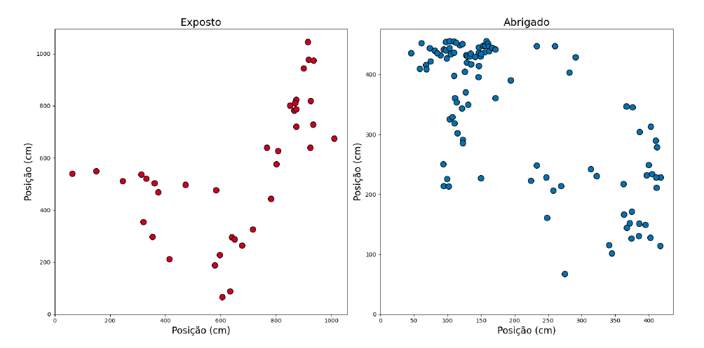

```{r setup, include=FALSE}
options(htmltools.dir.version = FALSE)
options(servr.daemon = TRUE)#para que no bloquee la sesión


```

```{r xaringan-themer, include=FALSE, warning=FALSE}
library(xaringanthemer)
library(ggplot2)
library(ggthemes)
library(knitr)
library(kableExtra)
library(dplyr)
library(tidyr)
library(rethinking)
library(rstan)
library(purrr)

load("loo_errors.RData")

data <- read.csv("data/field_data.csv")

xaringanExtra::use_share_again()
xaringanExtra::use_fit_screen()
xaringanExtra::use_tachyons()

style_solarized_light(
  title_slide_background_color = "#586e75",# base 3
  header_color = "#586e75",
  text_bold_color = "#cb4b16",
  background_color = "#FFFFFF", # base 3
  header_font_google = google_font("DM Sans"),
  text_font_google = google_font("Roboto Condensed", "300", "300i"),
  code_font_google = google_font("Fira Mono"), text_font_size = "28px"
)
# clipboard
htmltools::tagList(
  xaringanExtra::use_clipboard(
    button_text = "Copy code <i class=\"fa fa-clipboard\"></i>",
    success_text = "Copied! <i class=\"fa fa-check\" style=\"color: #90BE6D\"></i>",
    error_text = "Not copied 😕 <i class=\"fa fa-times-circle\" style=\"color: #F94144\"></i>"
  ),
  rmarkdown::html_dependency_font_awesome()
  )
## ggplot theme
theme_Publication <- function(base_size = 14, base_family = "helvetica") {
    (theme_foundation(base_size = base_size, base_family = base_family)
        + theme(plot.title = element_text(face = "bold",
                                          size = rel(1.2), hjust = 0.5),
                text = element_text(),
                panel.border = element_rect(colour = NA),
                panel.background = element_rect(fill = 'transparent'),
                plot.background = element_rect(fill = 'transparent', color = NA),
                axis.title = element_text(face = "bold",size = rel(1)),
                axis.title.y = element_text(angle=90,vjust =2),
                axis.title.x = element_text(vjust = -0.2),
                axis.text = element_text(), 
                axis.line = element_line(colour="black"),
                axis.ticks = element_line(),
                panel.grid.major = element_line(colour=NA),
                panel.grid.minor = element_blank(),
                legend.key = element_rect(colour = NA),
                legend.position = "bottom",
                legend.direction = "horizontal",
                legend.key.size= unit(0.2, "cm"),
                ##legend.margin = unit(0, "cm"),
                legend.spacing = unit(0.2, "cm"),
                legend.title = element_text(face="italic"),
                plot.margin = unit(c(10,5,5,5),"mm"),
                strip.background = element_rect(colour = NA,fill = "transparent"),
                strip.text = element_text(face="bold")
                ))
    
}


```


## Recap: How do we link models and data?


- We use statistical models to formally represent an hypothesis

--

- General recipe for building models:

1. **Identifying variables** – Distinguishing observable variables (data) from unobservable ones (parameters)

2. **Defining relationships** – Expressing each variable in terms of others or probability distributions

3. **Building the generative model** – Combining variables and distributions to simulate and analyze data


---
## Recap: How do we link models and data?

- We follow a language for describing statistical models


$$y_i \sim Normal(\mu, sigma)$$
$$\mu_i = \beta x_i$$
$$\beta \sim Normal(0, 10)$$
$$\sigma \sim Exponential(1)$$


---
## Why a __generative model__?


A __Bayesian model__ is called a __generative model__ because it defines a __probabilistic process__ that can generate data. This means it specifies the joint probability distribution of both __observed data__ and __unobserved parameters__

This allows us to:

--

__Simulate Data__ – Given parameter values, we can generate hypothetical datasets that resemble real-world observations


--
__Infer Parameters__ – Given observed data, we update our beliefs about the parameters using Bayes' theorem


---
## Answering questions in Ecology: Ecological detective


 .pull-left[
How do we confront multiple hypotheses with data and assign degrees of belief
to different hypotheses?
      
```{r, echo = FALSE, out.width="70%"}

```
    
]

.pull-right[
Beyond *How do we link models and data?*

The tools of the ecological detective
  
- __Hypotheses__
  
- __Data__
  
- __Goodness of fit__
  
- __Numerical procedures__
]


---
## Hypotheses


.pull-left[
```{r, echo = FALSE}

```

]


.pull-right[
- Science consists of confronting different __descriptions__ of how the world works
with data


- We use __data__ to arbitrate between different descriptions


- We use the "__best__" description to make additional predictions and decisions

- If we translate different hypotheses into quantitative predictions via models
we can simultaneously confront all of them
]

---
## Data

.pull-left[
```{r, echo = FALSE, out.width="120%"}
include_graphics("figs/data.jfif")
```

]

.pull-right[
- Represents a particular view of the world

- Know your data

- Define the likelihood of your data
]


---
## Data


.pull-left[
```{r, echo = FALSE}

```
[Carey 1991](https://www.science.org/doi/epdf/10.1126/science.1896848)

]

.pull-right[
- Mediterranean fruit fly (medfly) *Creatitis capitata*

- Destructive agricultural pest

- Climatic and host contitions are right for its establishment in California

- Sporadic outbreaks over decades

- New colonization event or medfly is established below the level for detection?

]


---
## Data


.pull-left[
```{r, echo = FALSE}

```
[Carey 1991](https://www.science.org/doi/epdf/10.1126/science.1896848)


]

.pull-right[
- Medfly captures from 1975-1990

- Each point represents a location of medfly captures

- Intervals between captures are decreasing 

- Area over which they are detected is expanding 

- Evidence that previous eradication programs did not eradicate the medfly 
from California 
]


---
## Goodness of fit


- Data are used to arbitrate between different hypotheses or models 

- Measure of how each description of the world fits the observations

 __MSE__: Squared error between predictions & observed data


---
## Numerical procedures

Emphasize __predictive performance__ rather than just model fit to observed data


--
__Posterior Predictive Checks__: Simulated Data Replication: Generate synthetic datasets using posterior 
samples and compare them to observed data


--
__Cross-validation__
- __LOO-CV__ (Leave-One-Out Cross-Validation): Uses Pareto-smoothed importance
sampling (PSIS-LOO) to estimate predictive accuracy by leaving out one 
observation at a time


--
__Information criteria__
- __Akaike Information Criterion__ (AIC): Balances model fit with complexity by 
penalizing the number of parameters
- __WAIC__ (Widely Applicable Information Criterion): A Bayesian alternative 
to AIC that estimates out-of-sample predictive accuracy using the log 
pointwise posterior predictive density (lppd)


---


## Inferences about competing models

```{r, echo = FALSE}
set.seed(4221)
df1 <- data.frame(x = runif(21))
df1$y = exp((df1$x-0.3)^2) -1
sim1 <- matrix(rnorm(length(df1$x)*10, mean = df1$y,sd =0.1), ncol = 10)
df1 <- cbind(df1, sim1)
names(df1)[3:12] <- paste("y",1:10, sep="")

f2 <- function(i, data = df1)
    lm(data[,i] ~ x + I(x^2), data = data)

f5 <- function(i, data = df1)
    lm(data[,i] ~ x + I(x^2) + I(x^3) + I(x^4) + I(x^5), data = data)

dg1 <- lapply(3:12, function(i) lm(df1[,i]~x, data = df1))
dg2 <- lapply(3:12, f2)
dg5 <- lapply(3:12, f5)

newdata <- data.frame(x = seq(0,1, length=100))

```

.pull-left[

**The data-generating process (a.k.a. true model):**

$$\begin{align}
y_i &\sim \mathcal{N}(\mu_i, \sigma) \\
\mu_i & = e^{(x_i - 0.3)^2} -1 \\
\sigma & = C
\end{align}$$
]

.pull-right[
.center[

```{r, echo = FALSE}
par(las=1, mar=c(6,7,4,2)+0.1,
    mgp=c(5,1,0),
    cex.lab=2, cex.axis=1.8, cex.main = 2.25)
plot(y1 ~ x, data=df1, xlab ="X", ylab ="Y", pch=19,
     ylim=c(-.3,0.8))
curve(exp((x-0.3)^2) -1, lwd=1.5, add = TRUE, col="blue")
curve(qnorm(0.025, exp((x-0.3)^2) -1, 0.1), lty=2, add = TRUE, col="blue")
curve(qnorm(0.975, exp((x-0.3)^2) -1, 0.1), lty=2, add = TRUE, col="blue")
```

]]

---

## The models

.pull-left[
$$
\begin{align}
\textbf{M1}: & \mu_i = \alpha + \beta_1 x_i \\[1em]
\textbf{M2}: & \mu_i = \alpha + \beta_1 x_i + \beta_2 {x_i}^2\\[1em]
\textbf{M3}: & \mu_i = \alpha + \beta_1 x_i + \beta_2 {x_i}^2 + \\
&+ \beta_3 {x_i}^3  + \beta_4 {x_i}^4 + \beta_5 {x_i}^5
\end{align}
$$
]

.pull-right[
.center[
```{r, echo = FALSE }
par(las=1, mar=c(6,7,4,2)+0.1,
    mgp=c(5,1,0),
    cex.lab=2, cex.axis=1.8, cex.main = 2.25)
plot(y1~x, data=df1, xlab ="X", ylab ="Y", pch=19)
lines(predict(dg1[[1]], newdata=newdata)~newdata$x, col ="green")
lines(predict(dg2[[1]], newdata=newdata)~newdata$x, col="blue")
lines(predict(dg5[[1]], newdata=newdata)~newdata$x, col ="red")
legend("topleft", c("Model 1", "Model 2", "Model 3"),
       lty=1, col=c("green", "blue", "red"), bty="n", cex=1.5)
```

]]

---
## Instead of collecting data, we will simulate

```{r}
# Define the dataset as a list for building
# our model in rethinking
set.seed(4221)
N <- 21
x <- runif(N)
d <- list(
  x = x,
  y = dexp((x - 0.3) ^ 2) - 1
)
```


---

## Over-fitting

.pull-left[

```{r , echo=TRUE}
# Model 3: Higher-order polynomial model
m3 <- alist(
    y ~ dnorm(mu, sigma),
    mu <- a + b1 * x + b2 * x^2 + b3 * x^3 + b4 * x^4 + b5 * x^5,
    a ~ dnorm(0, 1),
    b1 ~ dnorm(0, .1),
    b2 ~ dnorm(0, .1),
    b3 ~ dnorm(0, .1),
    b4 ~ dnorm(0, .1),
    b5 ~ dnorm(0, .1),
    sigma ~ dexp(1)
  )

fit_m3 <- quap(
  m3,
  data = d
)
```
]

.pull-right[
.center[
```{r, echo = FALSE}
par(las=1, mar=c(6,7,4,2)+0.1,
    mgp=c(5,1,0),
    cex.lab=2, cex.axis=1.8, cex.main = 2.25)
dg5.p <- lapply(dg5, function(x) predict(x, newdata=newdata)) 
plot(df1[,3]~df1$x, xlab ="X", ylab ="Y", pch=19, type="n",
     ylim = c(min(sapply(dg5.p, min)), max(sapply(dg5.p, max))))
invisible(sapply(dg5.p, function(x) lines(x ~ newdata$x, col ="grey")))
curve(exp((x-0.3)^2) -1, lwd=2, add = TRUE, col="blue")

```
]
]


---

## Over-fitting

.pull-left[

```{r , echo=TRUE}
# Model 3: Higher-order polynomial model
precis(fit_m3)
```

> To make inferences about unique features of the data at hand, as if they applied to all (or most all) samples (hence the population)
>
.right[Burham & Anderson (2002)]


]


.pull-right[
.center[
```{r, echo = FALSE}
par(las=1, mar=c(6,7,4,2)+0.1,
    mgp=c(5,1,0),
    cex.lab=2, cex.axis=1.8, cex.main = 2.25)
dg5.p <- lapply(dg5, function(x) predict(x, newdata=newdata)) 
plot(df1[,3]~df1$x, xlab ="X", ylab ="Y", pch=19, type="n",
     ylim = c(min(sapply(dg5.p, min)), max(sapply(dg5.p, max))))
invisible(sapply(dg5.p, function(x) lines(x ~ newdata$x, col ="grey")))
curve(exp((x-0.3)^2) -1, lwd=2, add = TRUE, col="blue")

```

]
]

---
## Under-fitting

.pull-left[

```{r , echo=TRUE}
# Model 1: Linear model
m1 <- alist(
    y ~ dnorm(mu, sigma),
    mu <- a + b * x,
    a ~ dnorm(0, 1),
    b ~ dnorm(0, 1),
    sigma ~ dexp(1)
  )
fit_m1 <- quap(
  m1,
  data = d
)
```
]

.pull-right[
.center[

```{r, echo = FALSE}
par(las=1, mar=c(6,7,4,2)+0.1,
    mgp=c(5,1,0),
    cex.lab=2, cex.axis=1.8, cex.main = 2.25)
dg1.p <- lapply(dg1, function(x) predict(x, newdata=newdata)) 
plot(df1[,3]~df1$x, xlab ="X", ylab ="Y", pch=19, type="n",
     ylim = c(min(sapply(dg1.p, min)), max(sapply(dg1.p, max))))
invisible(sapply(dg1.p, function(x) lines(x ~ newdata$x, col ="grey")))
curve(exp((x-0.3)^2) -1, lwd=2, add = TRUE, col="blue")
```
]
]

---
## Under-fitting

.pull-left[

```{r , echo=TRUE}
precis(fit_m1)
```


> Failure to identify features in the data-generating process that are
strongly replicable

.right[Burham & Anderson (2002)]

]

.pull-right[
.center[

```{r, echo = FALSE}
par(las=1, mar=c(6,7,4,2)+0.1,
    mgp=c(5,1,0),
    cex.lab=2, cex.axis=1.8, cex.main = 2.25)
dg1.p <- lapply(dg1, function(x) predict(x, newdata=newdata)) 
plot(df1[,3]~df1$x, xlab ="X", ylab ="Y", pch=19, type="n",
     ylim = c(min(sapply(dg1.p, min)), max(sapply(dg1.p, max))))
invisible(sapply(dg1.p, function(x) lines(x ~ newdata$x, col ="grey")))
curve(exp((x-0.3)^2) -1, lwd=2, add = TRUE, col="blue")
```
]
]


---

## A good fit


.pull-left[

```{r , echo=TRUE}
# Model 2: Quadratic model
m2 <- alist(
  y ~ dnorm(mu, sigma),
  mu <- a + b1 * x + b2 * x^2,
  a ~ dnorm(0, 1),
  b1 ~ dnorm(0, 1),
  b2 ~ dnorm(0, 1),
  sigma ~ dexp(1)
)
fit_m2 <- quap(
  m2,
  data = d
)
precis(fit_m2)
```
]

.pull-right[
.center[
```{r, echo = FALSE}
par(las=1, mar=c(6,7,4,2)+0.1,
    mgp=c(5,1,0),
    cex.lab=2, cex.axis=1.8, cex.main = 2.25)
dg2.p <- lapply(dg2, function(x) predict(x, newdata=newdata)) 
plot(df1[,3]~df1$x, xlab ="X", ylab ="Y", pch=19, type="n",
     ylim = c(min(sapply(dg2.p, min)), max(sapply(dg2.p, max))))
invisible(sapply(dg2.p, function(x) lines(x ~ newdata$x, col ="grey")))
curve(exp((x-0.3)^2) -1, lwd=2, add = TRUE, col="blue")
```
]
]

---
class: middle, inverse

## How to compare different model fit?


---
## Mean Square Errors (MSE)


Mean Squared Error (MSE) is a measure of how well a model’s predictions match 
the observed data. It is calculated as:

$$MSE = \frac{1}{n}\sum^{n}_{i=1}(y_i - \hat{y_i})^2$$

- Lower MSE indicates that predictions are closer to actual values
- Sensitive to outliers: Squaring the residuals means that large errors impact 
the MSE more
- Does not account for model complexity: A more complex model will always have 
lower MSE, even if it overfits


---
## Rethinking MSE


$$\text{MSE}_{\text{Bayesian}} = \frac{1}{n} \sum_{i=1}^{n} \left(y_i - \mathbb{E}[\hat{y}_i] \right)^2$$


```{r}
calc_MSE_sim <- function(fit, data, response_var) {
  pred <- sim(fit, data = data) # Simulate new observations from the posterior
  pred_mean <- apply(pred, 2, mean) # Compute mean of simulated observations
  residuals <- data[[response_var]] - pred_mean 
  mean(residuals^2)
}

calc_MSE_sim(fit_m1, d, "y")
calc_MSE_sim(fit_m2, d, "y")
calc_MSE_sim(fit_m3, d, "y")

```


---
## Leave-One-Out Cross-Validation (LOO-CV)

- LOO-CV is a method to estimate a model's out-of-sample predictive accuracy

- It works by:
1. __Removing__ one observation from the dataset
2. __Fitting__ the model to the remaining data
3. __Predicting__ the left-out observation and computing the error
4. __Repeating__ this for every observation

- The average prediction error across all iterations gives a robust measure 
of model performance


---
## Why use LOO-CV?

- Avoids __overfitting__ – Complex models might fit training data well 
but fail on new data

- Better than Mean Squared Error (MSE) – MSE always decreases as __model 
complexity increases__, even when overfitting occurs

- More robust for Bayesian models – Bayesian LOO-CV __accounts for
uncertainty__ in parameter estimates.


---
## Compute LOO-CV for our models

```{r}
loo_cv = function(m, fit_m) {
  r = numeric(length(d$y)) # Store residuals
  
  for (i in 1:length(d$y)) {
    d_i = list(x = d$x[-i], y = d$y[-i])  # Remove one observation
    fit = quap(m, data = d_i, start = fit_m@start)  # Fit model without i-th obs
    # Predict for left-out observation using the posterior mean
    pred <- link(fit, data = list(x = d$x[i])) 
    pred_mean <- mean(pred)  # Compute the mean prediction
    r[i] <- (d$y[i] - pred_mean)^2  # Squared error
  }
  
  mean(r)  # Return LOO-CV mean squared error
}


```


---
## Compute LOO-CV for our models


.pull-left[
```{r, eval = FALSE}
models <- list(m1, m2, m3)
fit_models <-  list(fit_m1, fit_m2, fit_m3)
loo_errors <- map2_dbl(models, fit_models, loo_cv, .progress = TRUE)
```
]

.pull-right[
```{r, echo = FALSE}
df <- data.frame(model = 1:3, loo_error = loo_errors)
ggplot(df, aes(x = model, y = loo_error)) + 
  geom_point() + geom_line() + 
  labs(x = "Model Complexity", y = "LOO Cross-Validation Error") +
  theme_classic()
```

]


---
## Akaike information criterion

.left-column[
.center[

Hirotugu Akaike (1927-2009)
]]

.right-column[


AIC estimates a statistical distance between two probability
distributions: the true one, which is the reference, and a given model
fitted to a sample from the true distribution.

AIC is an estimate of the information of the true data-generating 
distribution that is preserved by a model.

More specifically, AIC is an estimate of the Kullback-Leibler
divergence (or K-L relative entropy) of the model to the reference
true distribution that generated the data.  
]


---

## AIC for Gaussian models


$$AIC = -2 \sum_i \log \left [ p(y_i | \theta) \right ] + 2k$$

Where $\sum_i \log [ p(y_i | \theta) ]$ is the estimate of the residual variance of
the model, in this case, the mean sum of squares of residuals:


$$\sum_i \log [ p(y_i | \theta) ]\, = \, \frac{1}{N} \, \sum_{i = 1}^N (Y_i - \widehat{Y_i})^2$$

And $K$ is the number of parameters of the model.


---


## How to use AIC

* AIC expresses distance to the true model, or loss of information by the fitted model;

* Thus, the model with the lowest value of AIC among a set of
  competing models is the most plausible one (or best supported by the
  data);
  
* Canonical rule: models that differ $\leq 2$ in their AIC values are
  equally supported by data;

* To ease model selection, we calculate $\Delta \mathrm{AIC}$: 
$$\Delta_i \, = \, \textrm{AIC}_i - \min (\textrm{AIC})$$

* The best supported , or more plausible, model will have $\Delta_i = 0$

---

## AICc: correction for small samples

For  $n/K \, < \,40$, multiply $K$ by the correction term


$$ \left(\frac{n}{n-K-1}\right) $$

### AICc for Gaussian models:

$$ \textrm{AICc} \, = \, -2\,\sum_i \log [ p(y_i | \theta) ] + 2\,K \left(\frac{n}{n-K-1}\right) $$


Where $n$ is the sample size.


---

## Evidence weights 

$$w_i\,=\, \frac{e^{-1/2 \Delta_i}}{\sum e^{-1/2 \Delta_i}}$$

* Evidence or Akaike weights sum up one;

* Thus, $w_i$ express the relative support of each model in the set of
  competing models, in a standardized scale;

* In a frequentist approach, $w_i$ estimates the probability that each
  model will be the best supported one, if you repeat the sample and then the selection many
  times
  
* In a Bayesian framework, $w_i$ are interpreted as a relative measure of model 
plausibility based on their out-of-sample predictive accuracy, i.e. they reflect
predictive performance, not absolute model probability


---

## Model selection with AIC: example

.pull-left[


```{r , echo=TRUE, message="FALSE"}
library(bbmle)
AICctab(fit_m1, fit_m2, fit_m3, logLik = TRUE, base = TRUE,
        weights = TRUE, nobs = N)

AICtab(fit_m1, fit_m2, fit_m3, logLik = TRUE, base = TRUE,
       weights = TRUE, nobs = N)
```

]


.pull-right[
.center[

```{r, echo=FALSE}
par(las=1, mar=c(6,7,4,2)+0.1,
    mgp=c(5,1,0),
    cex.lab=2, cex.axis=1.8, cex.main = 2.25)
plot(y1~x, data=df1, xlab ="X", ylab ="Y", pch=19)
lines(predict(dg1[[1]], newdata=newdata)~newdata$x, col ="green")
lines(predict(dg2[[1]], newdata=newdata)~newdata$x, col="blue")
lines(predict(dg5[[1]], newdata=newdata)~newdata$x, col ="red")
legend("topleft", c("Model 0", "Model 1", "Model 2"),
       lty=1, col=c("green", "blue", "red"), bty="n", cex=1.5)
```
]]


---

## Remarks on AIC

   * Ties can and do happen: more than one model with $\Delta_i < 2$
   tell us that the data does not contain enough evidence to spot
   the best model;
   
   * Model selection with AIC is not a statistical test; 
   
   * Model selection is restricted to competing models: if all
     competing models are bad, the selected model will just be the
     least bad.
   
   * AIC does not express goodness of fit. The selected model can still have a poor fit; 
   
   * AIC cannot be used to compare models fitted to different datasets; 
   
   * For the same reason, the AIC cannot be used to compare models
     fitted to transformed and untransformed data.


---
## Incorporating uncertainty into model comparisons

__Widely Applicable Information Criterion or Watanabe-Akaike Information Criterion__
(WAIC)

.left-column[
```{r, echo = FALSE, out.width="90%"}

```

Sumio Watanabe

]

.right-column[

- WAIC (Widely Applicable Information Criterion) estimates **out-of-sample 
predictive accuracy**

- Like AIC, it **penalizes model complexity**, but incorporates 
**posterior uncertainty**

- The key concept is the **log pointwise predictive density (lppd)**, which 
replaces the likelihood in AIC

]

---
## Define Log Pointwise Predictive Density (lppd)


$$\text{lppd} = \sum_i \log \left( \frac{1}{S} \sum_{s=1}^{S} p(y_i | \theta_s) \right)$$


- Instead of using a **single maximum likelihood estimate**, WAIC 
**averages log-likelihoods** over **posterior samples** \( \theta_s \)

- This means **parameter uncertainty is incorporated** directly


---
## Accounting for Model Complexity


$$\text{WAIC} = -2 \left [ \text{lppd} - \sum_i \text{var}_{\theta} \log p(y_i|\theta) \right ]$$


- **Penalty for model complexity:** The second term is 
the **variance of log-likelihood across posterior samples**


- Higher variance = More model flexibility = **Stronger penalty** to prevent 
overfitting


---
## WAIC formula & interpretation


$$\text{WAIC} = -2 \sum_{i} \log \left( \frac{1}{S} \sum_{s=1}^{S} p(y_i | \theta_s) \right) + 2 p_{\text{WAIC}}$$

where:  
- $S$ = number of posterior samples  
- $theta_s$ = posterior sample $s$  
- $p_{WAIC}$ = $\sum_i \text{var}_{\theta} \log p(y_i|\theta)$ (effective number of parameters)

--
### Why Use WAIC?
- **Incorporates parameter uncertainty** (unlike AIC)  
- **Works for hierarchical & complex Bayesian models**  
- **Useful for model comparison** – lower WAIC = better predictive accuracy  


---
## Back to our three models 

$$
\begin{align}
\textbf{M1}: & \mu_i = \alpha + \beta_1 x_i \\[1em]
\textbf{M2}: & \mu_i = \alpha + \beta_1 x_i + \beta_2 {x_i}^2\\[1em]
\textbf{M3}: & \mu_i = \alpha + \beta_1 x_i + \beta_2 {x_i}^2 + \\
&+ \beta_3 {x_i}^3  + \beta_4 {x_i}^4 + \beta_5 {x_i}^5
\end{align}
$$


```{r, echo = FALSE}
set.seed(42)
```


```{r}
# Computes WAIC-based model comparison
compare(fit_m1, fit_m2, fit_m3, func = WAIC)  
```


---
## Comparison of Model Selection Methods

```{r, echo=FALSE}
library(kableExtra)
df <- data.frame(
  Criterion = c("MSE", "AIC", "LOO-CV", "WAIC"),
  What_it_Measures = c("Squared error between predictions & observed data", 
                        "Model fit via likelihood & complexity tradeoff", 
                        "Out-of-sample predictive accuracy", 
                        "Bayesian model comparison balancing fit & complexity"),
  Complexity_Penalty = c("No", "Yes", "Yes", "Yes"),
  Parameter_Uncertainty = c("No", "No", "Yes", "Yes"),
  Predictive_Accuracy = c("No", "No", "Yes", "Yes"),
  Computational_Cost = c("Low", "Low", "High", "Moderate"),
  Best_Use_Case = c("Quick model fit check", 
                    "Frequentist model selection", 
                    "Bayesian model comparison", 
                    "Fully Bayesian alternative to AIC")
)

names(df) <- gsub("_", " ", names(df))
df %>%
  kable("html", escape = FALSE) %>%
  kable_styling(full_width = F, font_size = 20) # Change font_size to adjust

```


---
class: middle, inverse

## The Ecological Detective: Field Course 2024

---
## Atlantic Forest field course

.pull-left[
- The antlion larvae adopts a sit-and-wait predatory strategy by 
constructing funnel-shaped traps in the soil

- This study investigates how energy expenditure and intraspecific competition 
affect trap adjustment behavior and body condition

- They expect a positive relationship between adjustment behavior and intraspecific 
competition

- They also expect that depending on the environment the energetic demand would
be different

]

.pull-right[
```{r, echo =FALSE}

```

]

---
## Hypotheses

The more intense the __intraspecific competition__, the more the antlion needs to
adjust its __behavior__, and in __high demanding environments__, this relationship is 
even stronger

```{r, echo =FALSE, out.width="60%", fig.align="center"}

```


---
## Predictions

The more intense the __intraspecific competition__, the higher the ratio
$trap~diameter/head~width$, and in exposed environments, this relationship is 
even stronger, i.e. changes in $\alpha$ only or both $\alpha$ and $\beta$ 


```{r, echo =FALSE, out.width="60%", fig.align="center"}

```


---
## The environment

.pull-left[
```{r, echo=FALSE, fig.align="center"}

```

]

.pull-right[
```{r, echo=FALSE, fig.align="center"}

```

]


---
## The behaviour adjustment

.pull-left[
```{r, echo=FALSE, fig.align="center"}

```

]

.pull-right[
```{r, echo=FALSE, fig.align="center"}

```

]


---
## Understanding the intraspecific competition

```{r, echo =FALSE, out.width="70%", fig.align="center"}

```


---
## Competition variable


$$Competition_i = \frac{1}{K}\sum^{k}_{j=1}\frac{1}{D_{ij}}$$


- $K$ = number of competitors, maximum 3
- $D_{ij}$ = distance between individual $i$ and the competitor $j$


---
## Translating the hypothesis into models

$$Y_i \sim Normal(\mu, \sigma)$$


--
1. $\mu_i = \alpha + \beta_1*Environment + \beta_2*C$


--
2. $\mu_i = \alpha_{Env} + \beta_1*Environment + \beta_2*C$


--
3.  $\mu_i = \alpha + \beta*C$


--
4. $\mu_i = \alpha + \beta*Environment$


--
5.  $\mu_i = \alpha$


---
## The data

```{r}
head(data)
data$Env_fac <- as.numeric(as.factor(data$Env) == "shelter")
data$Env_int <- as.numeric(as.factor(data$Env))
```


---
## Model #1

$$\mu_i = \alpha + \beta_1*Environment + \beta_2*C$$

```{r}
m1 <- alist(
  ratio ~ dnorm(mu, sigma), 
  mu <- a + b1*Env_fac + b2*C, 
  a ~ dnorm(20, 5), 
  b1 ~ dnorm(0, 1), 
  b2 ~ dnorm(0, 1), 
  sigma ~ dexp(1)
)
```


---
## Model #2

$$\mu_i = \alpha_{Env} + \beta_1*Environment + \beta_2*C$$

```{r}
m2 <- alist(
  ratio ~ dnorm(mu, sigma), 
  mu <- a[Env_int] + b1*Env_fac + b2*C, 
  a[Env_int] ~ dnorm(20, 5), 
  b1 ~ dnorm(0, 1), 
  b2 ~ dnorm(0, 1), 
  sigma ~ dexp(1)
)
```


---
## Model #3

$$\mu_i = \alpha + \beta*C$$

```{r}
m3 <- alist(
  ratio ~ dnorm(mu, sigma), 
  mu <- a + b*C, 
  a ~ dnorm(20, 5), 
  b ~ dnorm(0, 1), 
  sigma ~ dexp(1)
)
```


---
## Model #4

$$\mu_i = \alpha + \beta*Environment $$

```{r}
m4 <- alist(
  ratio ~ dnorm(mu, sigma), 
  mu <- a + b*Env_fac,
  a ~ dnorm(20, 5), 
  b ~ dnorm(0, 1),
  sigma ~ dexp(1)
)
```


---
## Model #5

$$\mu_i = \alpha$$

```{r}
m5 <- alist(
  ratio ~ dnorm(mu, sigma), 
  mu <- a,
  a ~ dnorm(20, 5), 
  sigma ~ dexp(1)
)
```


---
## Model fit


```{r, echo = FALSE}
set.seed(1234)
```


```{r}
m1_fit <- quap(m1, data = data)
m2_fit <- quap(m2, data = data)
m3_fit <- quap(m3, data = data)
m4_fit <- quap(m4, data = data)
m5_fit <- quap(m5, data = data)
```


---
## Model comparison

```{r, echo = FALSE}
set.seed(1234)
```


```{r}
compare(m1_fit, m2_fit, m3_fit, m4_fit, m5_fit, func = WAIC)
```


---
## Comparing with posterior distributions 

__Step #1__: Simulate posterior distributions

- The `extract.samples()` function generates posterior samples for the model
parameters

- Useful for understanding uncertainty in __parameters estimates__


```{r}
# Number of posterior draws
n_samples <- 1000

# Extract posterior samples
posterior <- extract.samples(m2_fit, n = n_samples)
```

---
## Comparing with posterior distributions

__Step #2__: Generate predictions for each $C$ value 

```{r}
# Create a sequence of C values for prediction
C_seq <- seq(from = min(data$C), to = max(data$C), length.out = 100)

# Matrices to store predictions
mu_matrix_open <- matrix(NA, nrow = n_samples, ncol = length(C_seq))  # For "open"
mu_matrix_shelter <- matrix(NA, nrow = n_samples, ncol = length(C_seq))  # For "shelter"

# Loop over posterior samples
for (i in 1:n_samples) {
  # Compute mu for each C_seq
  mu_matrix_open[i, ] <- posterior$a[i, 1] + 0 * posterior$b1[i] + posterior$b2[i] * C_seq  # "Open" (reference level)
  mu_matrix_shelter[i, ] <- posterior$a[i, 2] + 1 * posterior$b1[i] + posterior$b2[i] * C_seq  # "Shelter" effect
}

# Compute mean and credible intervals
mu_mean_open <- apply(mu_matrix_open, 2, mean, na.rm = TRUE)
mu_PI_open <- apply(mu_matrix_open, 2, function(x) PI(x[is.finite(x)], prob = 0.89))

mu_mean_shelter <- apply(mu_matrix_shelter, 2, mean, na.rm = TRUE)
mu_PI_shelter <- apply(mu_matrix_shelter, 2, function(x) PI(x[is.finite(x)], prob = 0.89))  # Apply PI only on finite values
```


---
## Comparing with posterior distributions

__Step #4__: Simulate new observations

- The `sim()` function generates posterior predictive distributions

- Samples from the full posterior including the observation model (likelihood)

- Useful for simulating new observations

- Predict new data based on posterior __uncertainty__

```{r}
# Generating posterior samples
posterior_sim <- sim(m2_fit, n = 100)
```


---
## Comparing with posterior distributions

__Step #4__: Plot the results

```{r echo = FALSE, fig.align='center', out.width="40%"}
# Set plot range manually to ensure lines fit
par(bty = "l", las = 1)
plot(data$C, data$ratio, col = ifelse(data$Env == "open", "red", "blue"), pch = 19,
     xlab = "Competition (log)", ylab = "Ratio trap/head", 
     xlim = range(C_seq), ylim = c(min(data$ratio), max(data$ratio)), 
     cex = 1.5, cex.lab = 1.5, cex.axis = 1.5)  # Force x and y limits

# Add mean predictions as lines
lines(C_seq, mu_mean_open, col = "red", lwd = 2, type = "l")  # "Open"
lines(C_seq, mu_mean_shelter, col = "blue", lwd = 2, type = "l")  # "Shelter"

# Add credible interval (shaded)
polygon(c(C_seq, rev(C_seq)), c(mu_PI_open[1, ], rev(mu_PI_open[2, ])), 
        col = adjustcolor("red", alpha.f = 0.2), border = NA)

polygon(c(C_seq, rev(C_seq)), c(mu_PI_shelter[1, ], rev(mu_PI_shelter[2, ])), 
        col = adjustcolor("blue", alpha.f = 0.2), border = NA)

# Add legend
legend("topright", legend = c("Open", "Shelter"), 
       col = c("red", "blue"), lwd = 2, pch = 16)

```


---
## Comparing with posterior distributions

__Step #4__: Plot the results

```{r, echo = FALSE, fig.align='center', out.width="40%"}
par(bty = "l", las = 1)
plot(data$C, data$ratio, col = ifelse(data$Env == "open", "red", "blue"), pch = 19,
     xlab = "Competition (log)", ylab = "Ratio trap/head", 
     xlim = range(C_seq), ylim = c(min(data$ratio), max(data$ratio)), 
     cex = 1.5, cex.lab = 1.5, cex.axis = 1.5)  # Force x and y limits

for(i in 1:nrow(posterior_sim)){
  points(data$C, posterior_sim[i, 1:nrow(data)],
         col = c(rep("#FF000020", 28), rep("#0000FF20", 79))
         )
}

points(data$C, data$ratio, col = ifelse(data$Env == "open", "red", "blue"))

# Add legend
legend("topright", legend = c("Open", "Shelter"), 
       col = c("red", "blue"), lwd = 2, pch = 16)

```


---
## What they found

```{r, echo=FALSE, fig.align="center", out.width="80%"}

```


---
## Model Selection in the Bayesian Context

__Bayesian model selection is diverse__: Multiple criteria exist
depending on the goal of inference


Bayesian model selection differs from frequentist approaches by incorporating 
uncertainty in model comparison

Unlike AIC, Bayesian model selection methods often rely on posterior model 
probabilities, computed using:

- Bayes Factors – Relative support for models via marginal likelihoods
- WAIC – Fully Bayesian alternative to AIC, penalizing model complexity using 
posterior variance
- Cross-validation (LOO-CV) – Estimates predictive performance by testing model
predictions on held-out data
- No single best approach – Choice depends on whether the goal is prediction, 
explanation, or inference

[Hooten and Hobbs 2015](https://esajournals.onlinelibrary.wiley.com/doi/10.1890/14-0661.1)


---

## **Key Takeaways**

- **MSE**: Measures fit but does **not** help with model selection


--
- **AIC**: Penalizes complexity but **ignores parameter uncertainty**


--
- **LOO-CV**: Best for **prediction**, but computationally expensive - __PSIS-LOO __
(Pareto Smoothed Importance Sampling LOO) provides a computationally efficient 
approximation to traditional LOO-CV


--
- **WAIC**: A fully Bayesian alternative to AIC that incorporates **uncertainty**


--
**Which method to use?**  

✅ If you want **prediction**, use **LOO-CV**.

✅ If you want **Bayesian model comparison**, use **WAIC**.

✅ If you are working in **frequentist settings**, use **AIC**.


---

## Further reading

+ Burnham, K. P., & Anderson, D. R. 2002. Model Selection and
  Multimodel Inference: A Practical-Theoretic Approach, 2nd ed. New
  York, Springer-Verlag.

+ Bolker, B.M. 2008. Ecological
  Models and Data in R. Princeton: Princeton University Press.

+ Hilborn R, Mangel M. 2013. The ecological detective: confronting models with data 
  (MPB-28). Princeton University Press; 2013 Dec 31.
  
+ Hooten, M.B. and Hobbs, N.T. 2015. A guide to Bayesian model selection for 
  ecologists. Ecological monographs, 85(1), pp.3-28.

+ McElreath, R., 2018. Statistical Rethinking: A Bayesian Course with
  Examples in R and Stan, 2nd ed. CRC Press.
  
  
